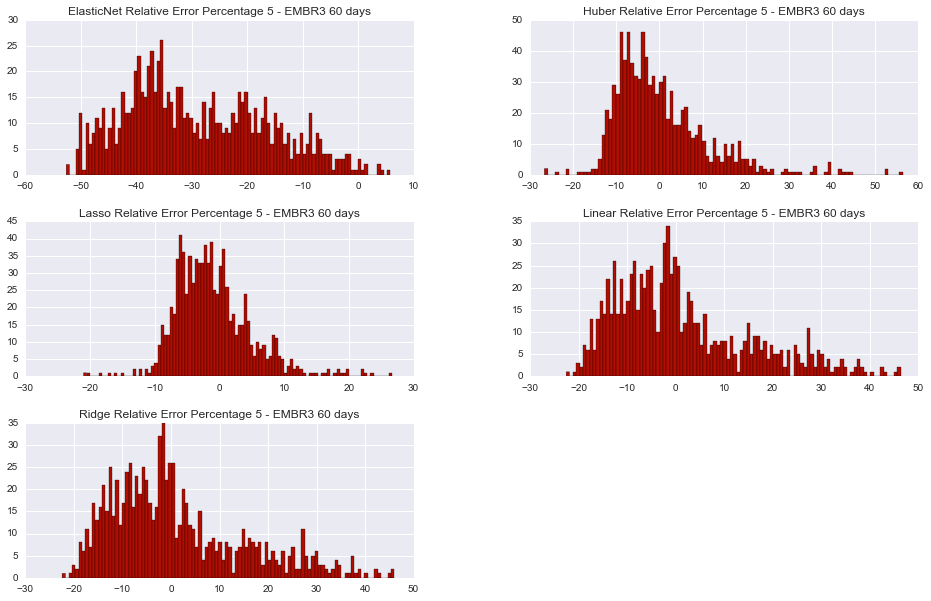
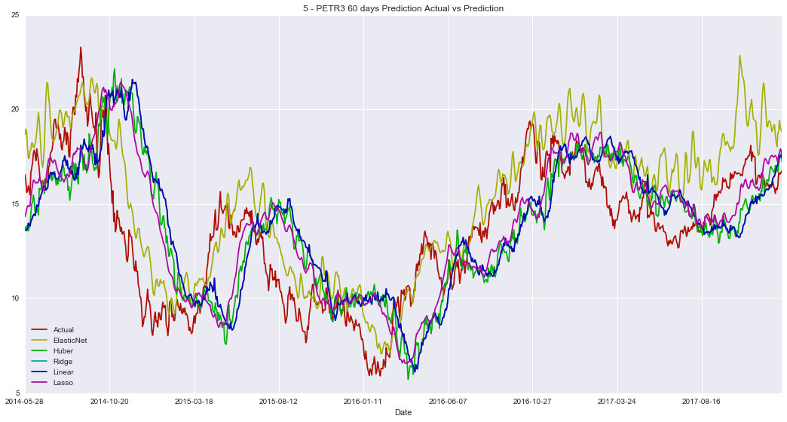
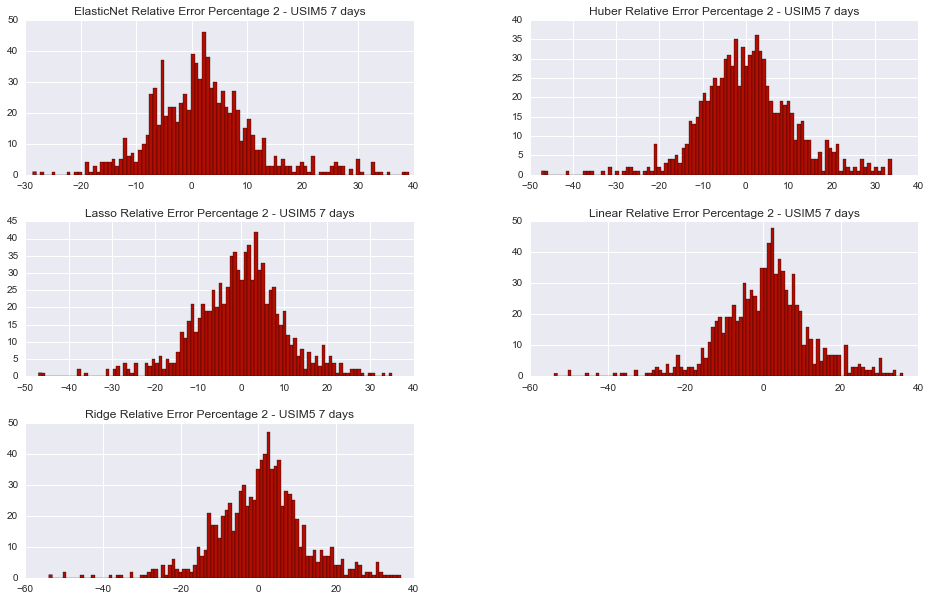
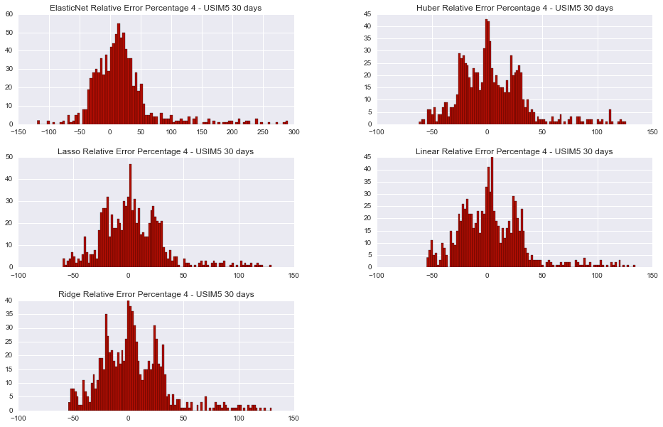
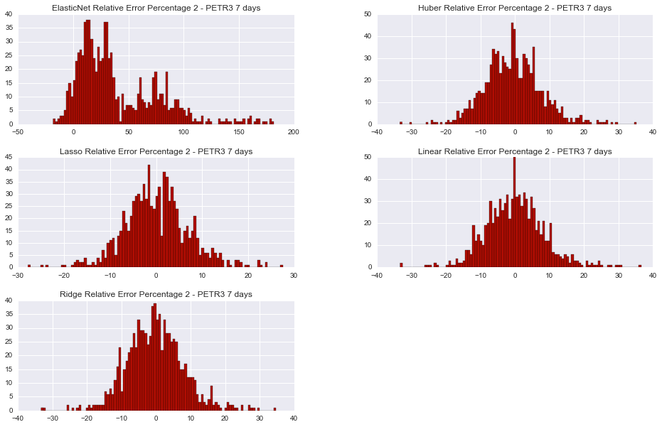
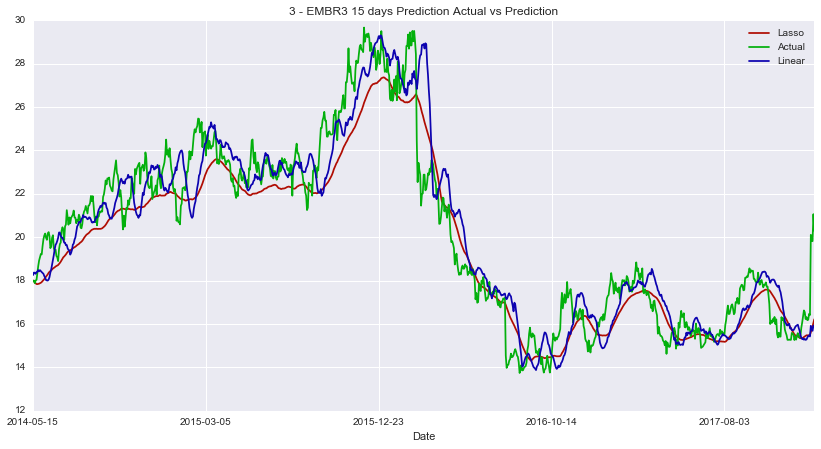
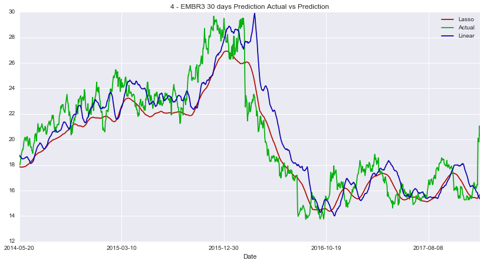
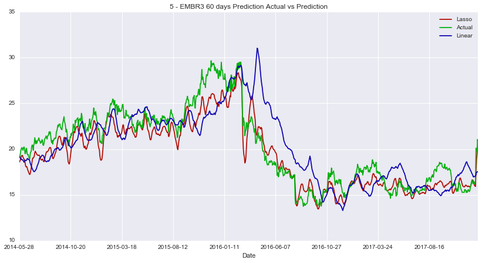
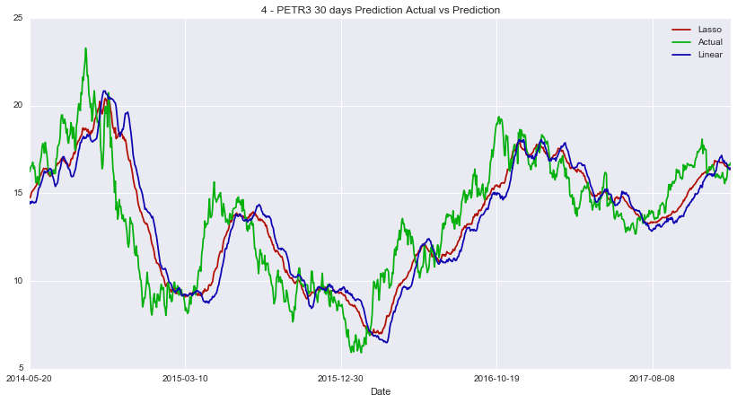

# Machine Learning Engineer Nanodegree
## Capstone Project: Building a Stock Price Predictor
Gabriel Augusto  
December 29th, 2017

## I. Definition

### Project Overview
<p>The main objective for this project is to be capable to predict the <b>price of a given set stock</b> in a future time interval in days. In order to achieve the goal, Machine Learning techniques will be applied on the historical <b>adjusted close prices</b> for different stocks. </p>

#### What is a stock?

<p> According to Investopedia: <br>

"<i>A stock is a type of security that signifies ownership in a corporation and represents a claim on part of the corporation's assets and earnings. <br>
There are two main types of stock: common and preferred. Common stock usually entitles the owner to vote at shareholders' meetings and to receive dividends. Preferred stock generally does not have voting rights, but has a higher claim on assets and earnings than the common shares. For example, owners of preferred stock receive dividends before common shareholders and have priority in the event that a company goes bankrupt and is liquidated.</i>" [1] </p>

#### What is an exchange? <br>

<p>According to Investopedia: <br>

"<i>An exchange is a marketplace in which securities, commodities, derivatives and other financial instruments are traded. The core function of an exchange is to ensure fair and orderly trading, as well as efficient dissemination of price information for any securities trading on that exchange. Exchanges give companies, governments and other groups a platform to sell securities to the investing public. <br>
A stock exchange is used to raise capital for companies seeking to grow and expand their operations.</i>"[3]</p>

#### What is a company's worth, and who determines its stock price? <br>

<p> "<i> A company's worth, that is its total value,is its market capitalization, and it is represented by the company's stock price. Market cap (as it is commonly referred to) is equal to the stock price multiplied by the number of shares outstanding.</i> </p> 
<p> <i>For example, Microsoft (MSFT) is trading for 71.41 USD, as of August 10th 2017, and has 7.7 billion shares outstanding/trading. Therefore, the company is valued at 71.14 USD x 7.7 billion = 550 billion USD. Thus, the stock price is a relative and proportional value of a company's worth and only represents percentage changes in market cap at any given point in time. Any percentage changes in a stock price will result in an equal percentage change in a company's value. This is the reason why investors are so concerned with stock prices and any changes that may occur since a 0.10 USD drop in a stock can result in a 100,000 USD loss for shareholders with one million shares.</i> </p>
<p> <i>The next logical question is: Who sets stock prices and how are they calculated? In simple terms, the stock price of a company is calculated when a company goes public, an event called an initial public offering (IPO). This is when a company pays an investment bank lots of money to use very complex formulas and valuation techniques to derive a company's value and to determine how many shares will be offered to the public and at what price. </i></p>
<p> <i>After a company goes public and starts trading on the exchange, its price is determined by supply and demand for its shares in the market. If there is a high demand for its shares due to favorable factors, the price would increase. If the company's future growth potential doesn't look good, short sellers could drive down its price."</i> [4] </p>

#### What is an Adjusted Closing Price <br>
<p> "<i>An adjusted closing price is a stock's closing price on any given day of trading that has been amended to include any distributions and corporate actions such as __stock splits__, __dividends payments__ and __rights offerings__ that occurred at any time prior to the next day's open. The adjusted closing price is often used when examining historical returns or performing a detailed analysis on historical returns.</i> </p>

<p><i>A __stock split__ is a corporate action that is usually done by companies to make their share prices more marketable. A stock split does not affect a company's total market capitalization, but it does affect the company's stock price. Consequently, a company undergoing a stock split must adjust its closing price to depict the effect of the corporate action.</i>
</p>

<p><i>Common distributions that affect a stock's price include __cash dividends and stock dividends__. The difference between cash dividends and stock dividends is shareholders are entitled to a predetermined price per share and additional shares, respectively. For example, assume a company declared a 1 USD cash dividend and is trading at 51 USD per share on the ex-dividend date. On the ex-dividend date, the stock price is reduced by 1 USD and the adjusted closing price is 50 USD.</i>
</p>

<p><i>A stock's adjusted closing price also reflects __rights offerings__ that may occur. A rights offering is an issue of rights given to existing shareholders, which entitles the shareholders to subscribe to the rights issue in proportion to their shares. For example assume a company declares a rights offering, in which existing shareholders are entitled to one additional share for every two shares owned. Assume the stock is trading at 50 USD and existing shareholders are able to purchase additional shares at a subscription price of 45 USD. On the ex-date, the adjusted closing price is calculated based on the adjusting factor and the closing price.</i>"[5] </p>

#### The beginning <br>

<p>Back in the 15th century people already negotiated foreign currencies and valuable metals. At that time, some stock exchanges were created in Europe such as the "bourse" of Antwerp in Belgium (1561) and The Royal Exchange in England (1571).
The Dutch East India Company in Netherlands issued the first known stock certificate in 1606. This company traded spices between Amsterdam and East India (Indonesia) and operated similarly companies operate nowadays, with directors controlling company's operations and shareholders receiving a dividend of 16% per year. As the company issued shares on paper, investors also began to sell their shares to other investors. [2] </p>
<p>In the United States, the fisrt stock price was established in Philadelphia in 1790 and was called "The Board of Brokers". Now it is a part of NASDAQ, known as NASDAQ OMX PHLX. 
Shortly after the establisment of the Philadelphia Stock Exchange, the stock markert started to grow in New York, moved by 24 stock brokers outside of 68 Wall Street. As the market became more structured, in 1817 the New York Stock and Exchange Board was established.[2] </p>


### Problem Statement

<p>Given historical data for different stocks, is it possible to predict those stock prices for the future?
In order to implement this task, a data set with the <b>adjusted closed prices</b> is needed.<b>Adjusted closed prices</b> adjusts the close prices based on corporate actions (described in previous section) <br>
We will also calculate some <i>technical indicators</i> [7] for data, using them as input for the model. The following indicators are calculated: </p>
<p>
<b>Overlap Studies</b> <br>
<ul>
  <li>Bollinger Bands [7]</li>
  <li>Exponential Moving Average (EMA) [8]</li>
  <li>Simple Moving Average (SMA) [9]</li>
</ul>  
</p>
<p>
<b>Momentum Indicators</b>
<ul>
  <li>Moving Average Convergence/Divergence (MACD) [10]</li>
  <li>Momentum [11]</li>
  <li>Relative Strength Index (RSI) [12]</li>
  <li>Stochastic Oscillator [21]</li>
</ul> 
<br>
</p>

<p>For those tasks, TA-LIB library (http://mrjbq7.github.io/ta-lib/) will be used. <br> </p>
<p>
Thus the expected input for the <b>training algorithm</b> is: <br>
<ul>
  <li>A list of trade dates with its respectly high, low and adjusted closing prices</li>
  <li>A set of technical indicators calculated based on the input list described above.</li>
</ul> 
</p>

<p>The expected input for the <b>Predictor</b> is: <br>
A list of stock symbols (aka companies tickers) and the number of days n ahead the price should be preditect.
<b>The expected output</b> is the price for each stock after n days. </p>

#### Problem Domain
<p>Since the problem consists in <b> to estimate the value </b> of future prices, which are <b>continuous quantitative data</b>, <b>a regressor is the right tool</b> to try to achieve this goal. </p>

<p>Althougth there are some challenges to tackle:
<ul>
  <li>Missing price values for different stocks and as well as in different dates</li>
  <li>Training cost, since there will be a fairly amount of historical data (almost 18 years)</li>
  <li>Response time: The algorithm should return an answer in a feasibile time</li>
  <li>Feature Engineering: Which features should be used?</li>
  <li>The estimative itself: Since the market is a very uncertain environment, how to fit a regressor in order to estimate stock prices?</li>
</ul> </p>

#### Task List
<p>In order to successfully estimate the prices, the following tasks are required:
<ul>
    <li>Download pricing data regarding the symbols queried</li>
    <li>Clean Data, which includes some strategy to fill missing values</li>
    <li>Calculate different technical indicators on data over the time</li>
    <li> Perform a model tuning in order to have the best model amongst different initial setups</li>
</ul></p>

### Metrics 
<p>Since the proposed solution for this problem is a regression, the model metric chosen is the <b>coefficient of determination, also known as $R^2$ Score</b>. <br>
The coefficient of determination is widely used to evaulate the goodness of fit of a model. It explains how well the predictions os a model approximates to the real data. <br>
$R^2$ Score is scaled from 0 to 1, which 1 indicating a perfect fit of the model to data. </p>
<p> The <b>Mean Squared Error (MSE) </b> will also be computed, but only for comparision reasons. </p>

## II. Analysis
### Data Exploration and Exploratory Visualization
Data is downloaded from Yahoo Finance Website. In this analysis, we focus on stocks from B3 Exchange (former Bovespa) from Brazil. Data filename includes its provider, according with this source (https://help.yahoo.com/kb/SLN2310.html). For B3, the provider identifier is SA.
Historical data for the follow companies will be analyzed: <br>
- Embraer SA - EMBR3 (EMBR3.SA)
- Petrobras SA - PETR3 (PETR3.SA)
- Usiminas SA - USIM5 (USIM5.SA)


```python
#Imports
import sys
sys.path.insert(0, '..\src') #Used to include the path in python's search
from Util import Util
import pandas as pd
import datetime as dt
import matplotlib.pyplot as plt
import seaborn as sns
from IPython.display import display
import ntpath
sns.set(style="darkgrid")
%matplotlib inline  
```


```python
filenames = Util().GetFilesFromFolder('.\Data\Download\Historical\Yahoo','.csv')
dfs = []
headers = ['Ticker','Min Date','Max Date','Count','Mean','Std','Min','25%','50%','75%','Max']
rows = []
for file in filenames:
    df = pd.read_csv(file)
    row = [df['Ticker'][0],df['Date'][0],df['Date'][df.shape[0]-1],]
    row.extend(df['Adjusted_Close'].describe(percentiles = [.25,.50,.75]).values)
    rows.append(row)
    print "Sample of file {}".format(file)
    display(df.head())
    display(df.tail())
    dfs.append(df.copy())

dfDescriptive = pd.DataFrame(rows,columns = headers)    
print "Basic Descriptive Statistics for Data"
dfDescriptive


```

    Getting .csv files from .\Data\Download\Historical\Yahoo
    3 files found
    Sample of file .\Data\Download\Historical\Yahoo\EMBR3.SA.csv
    


<div>
<style>
    .dataframe thead tr:only-child th {
        text-align: right;
    }

    .dataframe thead th {
        text-align: left;
    }

    .dataframe tbody tr th {
        vertical-align: top;
    }
</style>
<table border="1" class="dataframe">
  <thead>
    <tr style="text-align: right;">
      <th></th>
      <th>Date</th>
      <th>Ticker</th>
      <th>Open</th>
      <th>High</th>
      <th>Low</th>
      <th>Close</th>
      <th>Adjusted_Close</th>
      <th>Volume</th>
    </tr>
  </thead>
  <tbody>
    <tr>
      <th>0</th>
      <td>2000-01-03</td>
      <td>EMBR3</td>
      <td>7.75832</td>
      <td>7.75832</td>
      <td>7.00525</td>
      <td>7.16287</td>
      <td>6.364808</td>
      <td>1121444.0</td>
    </tr>
    <tr>
      <th>1</th>
      <td>2000-01-04</td>
      <td>EMBR3</td>
      <td>6.83012</td>
      <td>6.83012</td>
      <td>6.30473</td>
      <td>6.30473</td>
      <td>5.602277</td>
      <td>1432068.0</td>
    </tr>
    <tr>
      <th>2</th>
      <td>2000-01-05</td>
      <td>EMBR3</td>
      <td>6.45359</td>
      <td>6.59370</td>
      <td>6.21716</td>
      <td>6.54116</td>
      <td>5.812367</td>
      <td>1100888.0</td>
    </tr>
    <tr>
      <th>3</th>
      <td>2000-01-06</td>
      <td>EMBR3</td>
      <td>6.47986</td>
      <td>6.47986</td>
      <td>6.30473</td>
      <td>6.33100</td>
      <td>5.625621</td>
      <td>523036.0</td>
    </tr>
    <tr>
      <th>4</th>
      <td>2000-01-07</td>
      <td>EMBR3</td>
      <td>6.55867</td>
      <td>6.56743</td>
      <td>6.34851</td>
      <td>6.52364</td>
      <td>5.796801</td>
      <td>480782.0</td>
    </tr>
  </tbody>
</table>
</div>


<div>
<style>
    .dataframe thead tr:only-child th {
        text-align: right;
    }

    .dataframe thead th {
        text-align: left;
    }

    .dataframe tbody tr th {
        vertical-align: top;
    }
</style>
<table border="1" class="dataframe">
  <thead>
    <tr style="text-align: right;">
      <th></th>
      <th>Date</th>
      <th>Ticker</th>
      <th>Open</th>
      <th>High</th>
      <th>Low</th>
      <th>Close</th>
      <th>Adjusted_Close</th>
      <th>Volume</th>
    </tr>
  </thead>
  <tbody>
    <tr>
      <th>4533</th>
      <td>2017-12-21</td>
      <td>EMBR3</td>
      <td>16.490000</td>
      <td>23.000000</td>
      <td>16.370001</td>
      <td>20.200001</td>
      <td>20.108690</td>
      <td>16687800.0</td>
    </tr>
    <tr>
      <th>4534</th>
      <td>2017-12-22</td>
      <td>EMBR3</td>
      <td>20.000000</td>
      <td>21.700001</td>
      <td>19.120001</td>
      <td>19.910000</td>
      <td>19.820000</td>
      <td>24817800.0</td>
    </tr>
    <tr>
      <th>4535</th>
      <td>2017-12-25</td>
      <td>EMBR3</td>
      <td>19.910000</td>
      <td>19.910000</td>
      <td>19.910000</td>
      <td>19.910000</td>
      <td>19.820000</td>
      <td>0.0</td>
    </tr>
    <tr>
      <th>4536</th>
      <td>2017-12-26</td>
      <td>EMBR3</td>
      <td>19.719999</td>
      <td>21.260000</td>
      <td>19.660000</td>
      <td>21.059999</td>
      <td>21.059999</td>
      <td>11824700.0</td>
    </tr>
    <tr>
      <th>4537</th>
      <td>2017-12-27</td>
      <td>EMBR3</td>
      <td>21.200001</td>
      <td>21.700001</td>
      <td>20.209999</td>
      <td>20.299999</td>
      <td>20.299999</td>
      <td>8180600.0</td>
    </tr>
  </tbody>
</table>
</div>


    Sample of file .\Data\Download\Historical\Yahoo\PETR3.SA.csv
    


<div>
<style>
    .dataframe thead tr:only-child th {
        text-align: right;
    }

    .dataframe thead th {
        text-align: left;
    }

    .dataframe tbody tr th {
        vertical-align: top;
    }
</style>
<table border="1" class="dataframe">
  <thead>
    <tr style="text-align: right;">
      <th></th>
      <th>Date</th>
      <th>Ticker</th>
      <th>Open</th>
      <th>High</th>
      <th>Low</th>
      <th>Close</th>
      <th>Adjusted_Close</th>
      <th>Volume</th>
    </tr>
  </thead>
  <tbody>
    <tr>
      <th>0</th>
      <td>2000-01-03</td>
      <td>PETR3</td>
      <td>3.06250</td>
      <td>3.06250</td>
      <td>3.06250</td>
      <td>3.06250</td>
      <td>2.809258</td>
      <td>3.998720e+09</td>
    </tr>
    <tr>
      <th>1</th>
      <td>2000-01-04</td>
      <td>PETR3</td>
      <td>2.89063</td>
      <td>2.89063</td>
      <td>2.89063</td>
      <td>2.89063</td>
      <td>2.651600</td>
      <td>3.098880e+09</td>
    </tr>
    <tr>
      <th>2</th>
      <td>2000-01-05</td>
      <td>PETR3</td>
      <td>2.92969</td>
      <td>2.92969</td>
      <td>2.92969</td>
      <td>2.92969</td>
      <td>2.687430</td>
      <td>6.645760e+09</td>
    </tr>
    <tr>
      <th>3</th>
      <td>2000-01-06</td>
      <td>PETR3</td>
      <td>2.90625</td>
      <td>2.90625</td>
      <td>2.90625</td>
      <td>2.90625</td>
      <td>2.665929</td>
      <td>3.303680e+09</td>
    </tr>
    <tr>
      <th>4</th>
      <td>2000-01-07</td>
      <td>PETR3</td>
      <td>2.92969</td>
      <td>2.92969</td>
      <td>2.92969</td>
      <td>2.92969</td>
      <td>2.687430</td>
      <td>2.506240e+09</td>
    </tr>
  </tbody>
</table>
</div>


<div>
<style>
    .dataframe thead tr:only-child th {
        text-align: right;
    }

    .dataframe thead th {
        text-align: left;
    }

    .dataframe tbody tr th {
        vertical-align: top;
    }
</style>
<table border="1" class="dataframe">
  <thead>
    <tr style="text-align: right;">
      <th></th>
      <th>Date</th>
      <th>Ticker</th>
      <th>Open</th>
      <th>High</th>
      <th>Low</th>
      <th>Close</th>
      <th>Adjusted_Close</th>
      <th>Volume</th>
    </tr>
  </thead>
  <tbody>
    <tr>
      <th>4533</th>
      <td>2017-12-21</td>
      <td>PETR3</td>
      <td>16.000000</td>
      <td>16.650000</td>
      <td>15.990000</td>
      <td>16.650000</td>
      <td>16.650000</td>
      <td>5998700.0</td>
    </tr>
    <tr>
      <th>4534</th>
      <td>2017-12-22</td>
      <td>PETR3</td>
      <td>16.629999</td>
      <td>16.740000</td>
      <td>16.440001</td>
      <td>16.590000</td>
      <td>16.590000</td>
      <td>3666900.0</td>
    </tr>
    <tr>
      <th>4535</th>
      <td>2017-12-25</td>
      <td>PETR3</td>
      <td>16.590000</td>
      <td>16.590000</td>
      <td>16.590000</td>
      <td>16.590000</td>
      <td>16.590000</td>
      <td>0.0</td>
    </tr>
    <tr>
      <th>4536</th>
      <td>2017-12-26</td>
      <td>PETR3</td>
      <td>16.500000</td>
      <td>16.780001</td>
      <td>16.500000</td>
      <td>16.700001</td>
      <td>16.700001</td>
      <td>4180900.0</td>
    </tr>
    <tr>
      <th>4537</th>
      <td>2017-12-27</td>
      <td>PETR3</td>
      <td>16.799999</td>
      <td>16.980000</td>
      <td>16.730000</td>
      <td>16.760000</td>
      <td>16.760000</td>
      <td>4113900.0</td>
    </tr>
  </tbody>
</table>
</div>


    Sample of file .\Data\Download\Historical\Yahoo\USIM5.SA.csv
    


<div>
<style>
    .dataframe thead tr:only-child th {
        text-align: right;
    }

    .dataframe thead th {
        text-align: left;
    }

    .dataframe tbody tr th {
        vertical-align: top;
    }
</style>
<table border="1" class="dataframe">
  <thead>
    <tr style="text-align: right;">
      <th></th>
      <th>Date</th>
      <th>Ticker</th>
      <th>Open</th>
      <th>High</th>
      <th>Low</th>
      <th>Close</th>
      <th>Adjusted_Close</th>
      <th>Volume</th>
    </tr>
  </thead>
  <tbody>
    <tr>
      <th>0</th>
      <td>2000-01-03</td>
      <td>USIM5</td>
      <td>2.17778</td>
      <td>2.18000</td>
      <td>2.12222</td>
      <td>2.13333</td>
      <td>1.922614</td>
      <td>571500.0</td>
    </tr>
    <tr>
      <th>1</th>
      <td>2000-01-04</td>
      <td>USIM5</td>
      <td>2.11111</td>
      <td>2.11111</td>
      <td>2.05556</td>
      <td>2.05556</td>
      <td>1.852526</td>
      <td>1121400.0</td>
    </tr>
    <tr>
      <th>2</th>
      <td>2000-01-05</td>
      <td>USIM5</td>
      <td>2.06667</td>
      <td>2.25556</td>
      <td>2.05556</td>
      <td>2.25111</td>
      <td>2.028761</td>
      <td>1602450.0</td>
    </tr>
    <tr>
      <th>3</th>
      <td>2000-01-06</td>
      <td>USIM5</td>
      <td>2.22222</td>
      <td>2.45556</td>
      <td>2.22222</td>
      <td>2.45556</td>
      <td>2.213016</td>
      <td>3084300.0</td>
    </tr>
    <tr>
      <th>4</th>
      <td>2000-01-07</td>
      <td>USIM5</td>
      <td>2.45556</td>
      <td>2.57778</td>
      <td>2.44444</td>
      <td>2.55333</td>
      <td>2.301129</td>
      <td>2871000.0</td>
    </tr>
  </tbody>
</table>
</div>


<div>
<style>
    .dataframe thead tr:only-child th {
        text-align: right;
    }

    .dataframe thead th {
        text-align: left;
    }

    .dataframe tbody tr th {
        vertical-align: top;
    }
</style>
<table border="1" class="dataframe">
  <thead>
    <tr style="text-align: right;">
      <th></th>
      <th>Date</th>
      <th>Ticker</th>
      <th>Open</th>
      <th>High</th>
      <th>Low</th>
      <th>Close</th>
      <th>Adjusted_Close</th>
      <th>Volume</th>
    </tr>
  </thead>
  <tbody>
    <tr>
      <th>4533</th>
      <td>2017-12-21</td>
      <td>USIM5</td>
      <td>9.01</td>
      <td>9.20</td>
      <td>8.92</td>
      <td>9.05</td>
      <td>9.05</td>
      <td>15418500.0</td>
    </tr>
    <tr>
      <th>4534</th>
      <td>2017-12-22</td>
      <td>USIM5</td>
      <td>9.04</td>
      <td>9.09</td>
      <td>8.90</td>
      <td>8.95</td>
      <td>8.95</td>
      <td>6906500.0</td>
    </tr>
    <tr>
      <th>4535</th>
      <td>2017-12-25</td>
      <td>USIM5</td>
      <td>8.95</td>
      <td>8.95</td>
      <td>8.95</td>
      <td>8.95</td>
      <td>8.95</td>
      <td>0.0</td>
    </tr>
    <tr>
      <th>4536</th>
      <td>2017-12-26</td>
      <td>USIM5</td>
      <td>8.88</td>
      <td>9.06</td>
      <td>8.82</td>
      <td>8.99</td>
      <td>8.99</td>
      <td>6293200.0</td>
    </tr>
    <tr>
      <th>4537</th>
      <td>2017-12-27</td>
      <td>USIM5</td>
      <td>9.06</td>
      <td>9.15</td>
      <td>9.04</td>
      <td>9.10</td>
      <td>9.10</td>
      <td>5571400.0</td>
    </tr>
  </tbody>
</table>
</div>


    Basic Descriptive Statistics for Data
    


<div>
<style>
    .dataframe thead tr:only-child th {
        text-align: right;
    }

    .dataframe thead th {
        text-align: left;
    }

    .dataframe tbody tr th {
        vertical-align: top;
    }
</style>
<table border="1" class="dataframe">
  <thead>
    <tr style="text-align: right;">
      <th></th>
      <th>Ticker</th>
      <th>Min Date</th>
      <th>Max Date</th>
      <th>Count</th>
      <th>Mean</th>
      <th>Std</th>
      <th>Min</th>
      <th>25%</th>
      <th>50%</th>
      <th>75%</th>
      <th>Max</th>
    </tr>
  </thead>
  <tbody>
    <tr>
      <th>0</th>
      <td>EMBR3</td>
      <td>2000-01-03</td>
      <td>2017-12-27</td>
      <td>4508.0</td>
      <td>14.263077</td>
      <td>4.941146</td>
      <td>5.267701</td>
      <td>10.396428</td>
      <td>13.554510</td>
      <td>17.771664</td>
      <td>29.660055</td>
    </tr>
    <tr>
      <th>1</th>
      <td>PETR3</td>
      <td>2000-01-03</td>
      <td>2017-12-27</td>
      <td>4505.0</td>
      <td>17.817948</td>
      <td>10.820841</td>
      <td>2.393607</td>
      <td>9.040000</td>
      <td>15.893916</td>
      <td>23.597769</td>
      <td>69.811775</td>
    </tr>
    <tr>
      <th>2</th>
      <td>USIM5</td>
      <td>2000-01-03</td>
      <td>2017-12-27</td>
      <td>4411.0</td>
      <td>10.315084</td>
      <td>8.308640</td>
      <td>0.730994</td>
      <td>3.340772</td>
      <td>8.900000</td>
      <td>14.529757</td>
      <td>44.150383</td>
    </tr>
  </tbody>
</table>
</div>


<p>Despite the three stocks have the same date range, they do not have the same row count (EMBR3 has the higher number of records and USIM5 has the lower number of records). </p>
<p>Given the fact above, it is very likely that these quotes miss data about some days over the years.</p>
<p>Below, the plot of adjusted close prices: </p>


```python
dates = dfs[0]['Date'].values
dates_list = [dt.datetime.strptime(date, "%Y-%m-%d") for date in dates]
df = pd.DataFrame(index=dates_list)

for dfStock in dfs:
    dfTemp = Util().FilterDataFrameByDate(dfStock.copy(),dates_list[0],dates_list[-1])
    df[dfStock['Ticker'][0]] = dfTemp['Adjusted_Close'].values

df.plot(title="Ajusted Close Prices",figsize=(18,9)).set(xlabel='Date', ylabel='Price')
#plt.tight_layout()

```

    Filtering Dataframe by Date
    4538 dates loaded.
    Filtering Dataframe by Date
    4538 dates loaded.
    Filtering Dataframe by Date
    4538 dates loaded.
    


    [<matplotlib.text.Text at 0xf02f828>, <matplotlib.text.Text at 0xd4e1470>]


Let's try to find out whether there are missing values


```python
df = pd.DataFrame()
entries = {}
for dfStock in dfs:
    entries[dfStock['Ticker'][0]] = sum(dfStock.isnull().values.ravel())

df = df.append(entries,ignore_index=True)
print "Missing value count for each stock"
display(df)
df.plot(kind='bar',title="Missing Value Cells",figsize=(18,9)).set(xlabel='Ticker', ylabel='Count')
```

    Missing value count for each stock
    


<div>
<style>
    .dataframe thead tr:only-child th {
        text-align: right;
    }

    .dataframe thead th {
        text-align: left;
    }

    .dataframe tbody tr th {
        vertical-align: top;
    }
</style>
<table border="1" class="dataframe">
  <thead>
    <tr style="text-align: right;">
      <th></th>
      <th>EMBR3</th>
      <th>PETR3</th>
      <th>USIM5</th>
    </tr>
  </thead>
  <tbody>
    <tr>
      <th>0</th>
      <td>180.0</td>
      <td>198.0</td>
      <td>762.0</td>
    </tr>
  </tbody>
</table>
</div>


    [<matplotlib.text.Text at 0xbb60a90>, <matplotlib.text.Text at 0xd4e5908>]


Data shows that USIM5 has the highest number of missing values, which explains why it has lower counting value than EMBR3, for instance. <br>

### Algorithm and Techniques
As mentioned earlier, this is a <b> regression problem </b>. Hence, we are looking for models which approximate functions.
The following models may be considered (from simplest to the more complex):
<ol>
    <li><b>Generelized Linear Models</b> </li>
    <p> The simplest type of models, they are used when the result is expected to be a linear combination of the input. [13] </p>
    <li><b>Support Vector Machines with non-linear kernels</b> </li>
    <p> Support Vector Machines (SVM) and kernels provide us the ability of trying to fit data in a non-linear regression model.
        SVMs are very effective on High Dimensional Data and they are memory efficient as well. [14] </p>
</ol>
<br>
<p>Usually, the more complex the model is, the more is the likelihood of overfitting. Moreover, more complex models usually tends to take more time on training. Thus, the models used in this work will be chosen from the <b>Generelized Linear Models</b>. </p>
<p> The following models will be trained and tested</p>
<ul>
    <li>Ordinary Least Squares [15]</li>
    <li>Ridge Regression [16] </li>
    <li>Lasso [17] </li>
    <li>Elastic Net [18] </li>
    <li>Huber Regression [19] </li>
</ul>

<p>Before fitting the models, the input data will be preprocessed in order to handle missing values. Preprocessing also includes normalizing ajusted close prices and calculating the technical indicators described earlier. <br>
One more step is to tune the model in order to find the best parameters for each one. A Grid Search routine will perform this task as well as perform the model cross validation. </p>
<p> The final step is test the model predicting prices for 1, 7, 15, 30, 60 and 120 days ahead. </p>

### Benchmark
<p><b> Relative Error (also known as Approximation Error) </b> [20] will be used as benchmark for the predicted prices. <br> 
The goal is to achieve a error of +-5 % of the original price within 7 days.


## III. Methodology
### Data Preprocessing
<p>In order to make easier to have the code well organized, data pre-processing is made right after downloading. The function <b> DownloadData</b> from <b> StockHistoricalDataDownloader </b> module/class peforms the following tasks:</p>
<p>
<ol>
    <li>Download historical data from Yahoo Finance for the given stocks</li>
    <li>Fill Values Forward</li>
    <li>Fill Values Backward </li>
    <li>Sort rows by ascending date </li>
    <li>Normalize High, Low and Adjusted Closing Prices dividing all values by the first observation </li>
</ol>
</p>
<p>One might ask why does fill values forward and backwards instead filling with zeroes or interpoling. <br>
In this case, filling missing values with values with zeroes or interpoling might drastically change the result of calculation of technical indicators, as well as inserting new relationships that are not presenting in the original data.</p>
<p>Another question that might be arise is why does fill forward and then backward. The simple answer is that when missing values are found, we assume the last value known as valid. <br></p>
<p> Normalizing data is necessary because all data is re-scaled, and only the price variation is observed rather than the absolute values
</p>
<p> Below the comparision between original data and pre-processed data. For implemention details, please refer to <b>StockHistoricalDataDownloader</b> code.


```python
filenames = Util().GetFilesFromFolder('.\Data\Quotes\Normalized','.csv')
dfsProcessed = []
headers = ['Ticker','Min Date','Max Date','Count','Mean','Std','Min','25%','50%','75%','Max']
rows = []
for file in filenames:
    df = pd.read_csv(file)
    row = [df['Ticker'][0],df['Date'][0],df['Date'][df.shape[0]-1],]
    row.extend(df['Adjusted_Close'].describe(percentiles = [.25,.50,.75]).values)
    rows.append(row)
    print "Sample of file {}".format(file)
    display(df.head())
    display(df.tail())
    dfsProcessed.append(df.copy())

dfDescriptive = pd.DataFrame(rows,columns = headers)    
print "Basic Descriptive Statistics for Pre-Processed Data (Adjusted_Close Column)"
dfDescriptive
```

    Getting .csv files from .\Data\Quotes\Normalized
    3 files found
    Sample of file .\Data\Quotes\Normalized\EMBR3.SA.csv
    


<div>
<style>
    .dataframe thead tr:only-child th {
        text-align: right;
    }

    .dataframe thead th {
        text-align: left;
    }

    .dataframe tbody tr th {
        vertical-align: top;
    }
</style>
<table border="1" class="dataframe">
  <thead>
    <tr style="text-align: right;">
      <th></th>
      <th>Date</th>
      <th>Ticker</th>
      <th>Open</th>
      <th>High</th>
      <th>Low</th>
      <th>Close</th>
      <th>Adjusted_Close</th>
      <th>Volume</th>
      <th>Norm_High</th>
      <th>Norm_Low</th>
      <th>Norm_Adjusted_Close</th>
    </tr>
  </thead>
  <tbody>
    <tr>
      <th>0</th>
      <td>2000-01-03</td>
      <td>EMBR3</td>
      <td>7.75832</td>
      <td>7.75832</td>
      <td>7.00525</td>
      <td>7.16287</td>
      <td>6.364808</td>
      <td>1121444.0</td>
      <td>1.000000</td>
      <td>1.000000</td>
      <td>1.000000</td>
    </tr>
    <tr>
      <th>1</th>
      <td>2000-01-04</td>
      <td>EMBR3</td>
      <td>6.83012</td>
      <td>6.83012</td>
      <td>6.30473</td>
      <td>6.30473</td>
      <td>5.602277</td>
      <td>1432068.0</td>
      <td>0.880361</td>
      <td>0.900001</td>
      <td>0.880196</td>
    </tr>
    <tr>
      <th>2</th>
      <td>2000-01-05</td>
      <td>EMBR3</td>
      <td>6.45359</td>
      <td>6.59370</td>
      <td>6.21716</td>
      <td>6.54116</td>
      <td>5.812367</td>
      <td>1100888.0</td>
      <td>0.849888</td>
      <td>0.887500</td>
      <td>0.913204</td>
    </tr>
    <tr>
      <th>3</th>
      <td>2000-01-06</td>
      <td>EMBR3</td>
      <td>6.47986</td>
      <td>6.47986</td>
      <td>6.30473</td>
      <td>6.33100</td>
      <td>5.625621</td>
      <td>523036.0</td>
      <td>0.835214</td>
      <td>0.900001</td>
      <td>0.883863</td>
    </tr>
    <tr>
      <th>4</th>
      <td>2000-01-07</td>
      <td>EMBR3</td>
      <td>6.55867</td>
      <td>6.56743</td>
      <td>6.34851</td>
      <td>6.52364</td>
      <td>5.796801</td>
      <td>480782.0</td>
      <td>0.846502</td>
      <td>0.906250</td>
      <td>0.910758</td>
    </tr>
  </tbody>
</table>
</div>


<div>
<style>
    .dataframe thead tr:only-child th {
        text-align: right;
    }

    .dataframe thead th {
        text-align: left;
    }

    .dataframe tbody tr th {
        vertical-align: top;
    }
</style>
<table border="1" class="dataframe">
  <thead>
    <tr style="text-align: right;">
      <th></th>
      <th>Date</th>
      <th>Ticker</th>
      <th>Open</th>
      <th>High</th>
      <th>Low</th>
      <th>Close</th>
      <th>Adjusted_Close</th>
      <th>Volume</th>
      <th>Norm_High</th>
      <th>Norm_Low</th>
      <th>Norm_Adjusted_Close</th>
    </tr>
  </thead>
  <tbody>
    <tr>
      <th>4533</th>
      <td>2017-12-21</td>
      <td>EMBR3</td>
      <td>16.490000</td>
      <td>23.000000</td>
      <td>16.370001</td>
      <td>20.200001</td>
      <td>20.108690</td>
      <td>16687800.0</td>
      <td>2.964559</td>
      <td>2.336819</td>
      <td>3.159355</td>
    </tr>
    <tr>
      <th>4534</th>
      <td>2017-12-22</td>
      <td>EMBR3</td>
      <td>20.000000</td>
      <td>21.700001</td>
      <td>19.120001</td>
      <td>19.910000</td>
      <td>19.820000</td>
      <td>24817800.0</td>
      <td>2.796997</td>
      <td>2.729382</td>
      <td>3.113998</td>
    </tr>
    <tr>
      <th>4535</th>
      <td>2017-12-25</td>
      <td>EMBR3</td>
      <td>19.910000</td>
      <td>19.910000</td>
      <td>19.910000</td>
      <td>19.910000</td>
      <td>19.820000</td>
      <td>0.0</td>
      <td>2.566277</td>
      <td>2.842154</td>
      <td>3.113998</td>
    </tr>
    <tr>
      <th>4536</th>
      <td>2017-12-26</td>
      <td>EMBR3</td>
      <td>19.719999</td>
      <td>21.260000</td>
      <td>19.660000</td>
      <td>21.059999</td>
      <td>21.059999</td>
      <td>11824700.0</td>
      <td>2.740284</td>
      <td>2.806467</td>
      <td>3.308819</td>
    </tr>
    <tr>
      <th>4537</th>
      <td>2017-12-27</td>
      <td>EMBR3</td>
      <td>21.200001</td>
      <td>21.700001</td>
      <td>20.209999</td>
      <td>20.299999</td>
      <td>20.299999</td>
      <td>8180600.0</td>
      <td>2.796997</td>
      <td>2.884979</td>
      <td>3.189413</td>
    </tr>
  </tbody>
</table>
</div>


    Sample of file .\Data\Quotes\Normalized\PETR3.SA.csv
    


<div>
<style>
    .dataframe thead tr:only-child th {
        text-align: right;
    }

    .dataframe thead th {
        text-align: left;
    }

    .dataframe tbody tr th {
        vertical-align: top;
    }
</style>
<table border="1" class="dataframe">
  <thead>
    <tr style="text-align: right;">
      <th></th>
      <th>Date</th>
      <th>Ticker</th>
      <th>Open</th>
      <th>High</th>
      <th>Low</th>
      <th>Close</th>
      <th>Adjusted_Close</th>
      <th>Volume</th>
      <th>Norm_High</th>
      <th>Norm_Low</th>
      <th>Norm_Adjusted_Close</th>
    </tr>
  </thead>
  <tbody>
    <tr>
      <th>0</th>
      <td>2000-01-03</td>
      <td>PETR3</td>
      <td>3.06250</td>
      <td>3.06250</td>
      <td>3.06250</td>
      <td>3.06250</td>
      <td>2.809258</td>
      <td>3.998720e+09</td>
      <td>1.000000</td>
      <td>1.000000</td>
      <td>1.000000</td>
    </tr>
    <tr>
      <th>1</th>
      <td>2000-01-04</td>
      <td>PETR3</td>
      <td>2.89063</td>
      <td>2.89063</td>
      <td>2.89063</td>
      <td>2.89063</td>
      <td>2.651600</td>
      <td>3.098880e+09</td>
      <td>0.943879</td>
      <td>0.943879</td>
      <td>0.943879</td>
    </tr>
    <tr>
      <th>2</th>
      <td>2000-01-05</td>
      <td>PETR3</td>
      <td>2.92969</td>
      <td>2.92969</td>
      <td>2.92969</td>
      <td>2.92969</td>
      <td>2.687430</td>
      <td>6.645760e+09</td>
      <td>0.956633</td>
      <td>0.956633</td>
      <td>0.956633</td>
    </tr>
    <tr>
      <th>3</th>
      <td>2000-01-06</td>
      <td>PETR3</td>
      <td>2.90625</td>
      <td>2.90625</td>
      <td>2.90625</td>
      <td>2.90625</td>
      <td>2.665929</td>
      <td>3.303680e+09</td>
      <td>0.948980</td>
      <td>0.948980</td>
      <td>0.948980</td>
    </tr>
    <tr>
      <th>4</th>
      <td>2000-01-07</td>
      <td>PETR3</td>
      <td>2.92969</td>
      <td>2.92969</td>
      <td>2.92969</td>
      <td>2.92969</td>
      <td>2.687430</td>
      <td>2.506240e+09</td>
      <td>0.956633</td>
      <td>0.956633</td>
      <td>0.956633</td>
    </tr>
  </tbody>
</table>
</div>


<div>
<style>
    .dataframe thead tr:only-child th {
        text-align: right;
    }

    .dataframe thead th {
        text-align: left;
    }

    .dataframe tbody tr th {
        vertical-align: top;
    }
</style>
<table border="1" class="dataframe">
  <thead>
    <tr style="text-align: right;">
      <th></th>
      <th>Date</th>
      <th>Ticker</th>
      <th>Open</th>
      <th>High</th>
      <th>Low</th>
      <th>Close</th>
      <th>Adjusted_Close</th>
      <th>Volume</th>
      <th>Norm_High</th>
      <th>Norm_Low</th>
      <th>Norm_Adjusted_Close</th>
    </tr>
  </thead>
  <tbody>
    <tr>
      <th>4533</th>
      <td>2017-12-21</td>
      <td>PETR3</td>
      <td>16.000000</td>
      <td>16.650000</td>
      <td>15.990000</td>
      <td>16.650000</td>
      <td>16.650000</td>
      <td>5998700.0</td>
      <td>5.436735</td>
      <td>5.221224</td>
      <td>5.926832</td>
    </tr>
    <tr>
      <th>4534</th>
      <td>2017-12-22</td>
      <td>PETR3</td>
      <td>16.629999</td>
      <td>16.740000</td>
      <td>16.440001</td>
      <td>16.590000</td>
      <td>16.590000</td>
      <td>3666900.0</td>
      <td>5.466122</td>
      <td>5.368164</td>
      <td>5.905474</td>
    </tr>
    <tr>
      <th>4535</th>
      <td>2017-12-25</td>
      <td>PETR3</td>
      <td>16.590000</td>
      <td>16.590000</td>
      <td>16.590000</td>
      <td>16.590000</td>
      <td>16.590000</td>
      <td>0.0</td>
      <td>5.417143</td>
      <td>5.417143</td>
      <td>5.905474</td>
    </tr>
    <tr>
      <th>4536</th>
      <td>2017-12-26</td>
      <td>PETR3</td>
      <td>16.500000</td>
      <td>16.780001</td>
      <td>16.500000</td>
      <td>16.700001</td>
      <td>16.700001</td>
      <td>4180900.0</td>
      <td>5.479184</td>
      <td>5.387755</td>
      <td>5.944631</td>
    </tr>
    <tr>
      <th>4537</th>
      <td>2017-12-27</td>
      <td>PETR3</td>
      <td>16.799999</td>
      <td>16.980000</td>
      <td>16.730000</td>
      <td>16.760000</td>
      <td>16.760000</td>
      <td>4113900.0</td>
      <td>5.544490</td>
      <td>5.462857</td>
      <td>5.965988</td>
    </tr>
  </tbody>
</table>
</div>


    Sample of file .\Data\Quotes\Normalized\USIM5.SA.csv
    


<div>
<style>
    .dataframe thead tr:only-child th {
        text-align: right;
    }

    .dataframe thead th {
        text-align: left;
    }

    .dataframe tbody tr th {
        vertical-align: top;
    }
</style>
<table border="1" class="dataframe">
  <thead>
    <tr style="text-align: right;">
      <th></th>
      <th>Date</th>
      <th>Ticker</th>
      <th>Open</th>
      <th>High</th>
      <th>Low</th>
      <th>Close</th>
      <th>Adjusted_Close</th>
      <th>Volume</th>
      <th>Norm_High</th>
      <th>Norm_Low</th>
      <th>Norm_Adjusted_Close</th>
    </tr>
  </thead>
  <tbody>
    <tr>
      <th>0</th>
      <td>2000-01-03</td>
      <td>USIM5</td>
      <td>2.17778</td>
      <td>2.18000</td>
      <td>2.12222</td>
      <td>2.13333</td>
      <td>1.922614</td>
      <td>571500.0</td>
      <td>1.000000</td>
      <td>1.000000</td>
      <td>1.000000</td>
    </tr>
    <tr>
      <th>1</th>
      <td>2000-01-04</td>
      <td>USIM5</td>
      <td>2.11111</td>
      <td>2.11111</td>
      <td>2.05556</td>
      <td>2.05556</td>
      <td>1.852526</td>
      <td>1121400.0</td>
      <td>0.968399</td>
      <td>0.968589</td>
      <td>0.963545</td>
    </tr>
    <tr>
      <th>2</th>
      <td>2000-01-05</td>
      <td>USIM5</td>
      <td>2.06667</td>
      <td>2.25556</td>
      <td>2.05556</td>
      <td>2.25111</td>
      <td>2.028761</td>
      <td>1602450.0</td>
      <td>1.034661</td>
      <td>0.968589</td>
      <td>1.055210</td>
    </tr>
    <tr>
      <th>3</th>
      <td>2000-01-06</td>
      <td>USIM5</td>
      <td>2.22222</td>
      <td>2.45556</td>
      <td>2.22222</td>
      <td>2.45556</td>
      <td>2.213016</td>
      <td>3084300.0</td>
      <td>1.126404</td>
      <td>1.047120</td>
      <td>1.151045</td>
    </tr>
    <tr>
      <th>4</th>
      <td>2000-01-07</td>
      <td>USIM5</td>
      <td>2.45556</td>
      <td>2.57778</td>
      <td>2.44444</td>
      <td>2.55333</td>
      <td>2.301129</td>
      <td>2871000.0</td>
      <td>1.182468</td>
      <td>1.151832</td>
      <td>1.196875</td>
    </tr>
  </tbody>
</table>
</div>


<div>
<style>
    .dataframe thead tr:only-child th {
        text-align: right;
    }

    .dataframe thead th {
        text-align: left;
    }

    .dataframe tbody tr th {
        vertical-align: top;
    }
</style>
<table border="1" class="dataframe">
  <thead>
    <tr style="text-align: right;">
      <th></th>
      <th>Date</th>
      <th>Ticker</th>
      <th>Open</th>
      <th>High</th>
      <th>Low</th>
      <th>Close</th>
      <th>Adjusted_Close</th>
      <th>Volume</th>
      <th>Norm_High</th>
      <th>Norm_Low</th>
      <th>Norm_Adjusted_Close</th>
    </tr>
  </thead>
  <tbody>
    <tr>
      <th>4533</th>
      <td>2017-12-21</td>
      <td>USIM5</td>
      <td>9.01</td>
      <td>9.20</td>
      <td>8.92</td>
      <td>9.05</td>
      <td>9.05</td>
      <td>15418500.0</td>
      <td>4.220183</td>
      <td>4.203146</td>
      <td>4.707133</td>
    </tr>
    <tr>
      <th>4534</th>
      <td>2017-12-22</td>
      <td>USIM5</td>
      <td>9.04</td>
      <td>9.09</td>
      <td>8.90</td>
      <td>8.95</td>
      <td>8.95</td>
      <td>6906500.0</td>
      <td>4.169725</td>
      <td>4.193722</td>
      <td>4.655121</td>
    </tr>
    <tr>
      <th>4535</th>
      <td>2017-12-25</td>
      <td>USIM5</td>
      <td>8.95</td>
      <td>8.95</td>
      <td>8.95</td>
      <td>8.95</td>
      <td>8.95</td>
      <td>0.0</td>
      <td>4.105505</td>
      <td>4.217282</td>
      <td>4.655121</td>
    </tr>
    <tr>
      <th>4536</th>
      <td>2017-12-26</td>
      <td>USIM5</td>
      <td>8.88</td>
      <td>9.06</td>
      <td>8.82</td>
      <td>8.99</td>
      <td>8.99</td>
      <td>6293200.0</td>
      <td>4.155963</td>
      <td>4.156025</td>
      <td>4.675926</td>
    </tr>
    <tr>
      <th>4537</th>
      <td>2017-12-27</td>
      <td>USIM5</td>
      <td>9.06</td>
      <td>9.15</td>
      <td>9.04</td>
      <td>9.10</td>
      <td>9.10</td>
      <td>5571400.0</td>
      <td>4.197248</td>
      <td>4.259690</td>
      <td>4.733139</td>
    </tr>
  </tbody>
</table>
</div>


    Basic Descriptive Statistics for Pre-Processed Data (Adjusted_Close Column)
    


<div>
<style>
    .dataframe thead tr:only-child th {
        text-align: right;
    }

    .dataframe thead th {
        text-align: left;
    }

    .dataframe tbody tr th {
        vertical-align: top;
    }
</style>
<table border="1" class="dataframe">
  <thead>
    <tr style="text-align: right;">
      <th></th>
      <th>Ticker</th>
      <th>Min Date</th>
      <th>Max Date</th>
      <th>Count</th>
      <th>Mean</th>
      <th>Std</th>
      <th>Min</th>
      <th>25%</th>
      <th>50%</th>
      <th>75%</th>
      <th>Max</th>
    </tr>
  </thead>
  <tbody>
    <tr>
      <th>0</th>
      <td>EMBR3</td>
      <td>2000-01-03</td>
      <td>2017-12-27</td>
      <td>4538.0</td>
      <td>14.281463</td>
      <td>4.955458</td>
      <td>5.267701</td>
      <td>10.415070</td>
      <td>13.554510</td>
      <td>17.777296</td>
      <td>29.660055</td>
    </tr>
    <tr>
      <th>1</th>
      <td>PETR3</td>
      <td>2000-01-03</td>
      <td>2017-12-27</td>
      <td>4538.0</td>
      <td>17.807229</td>
      <td>10.806457</td>
      <td>2.393607</td>
      <td>9.094619</td>
      <td>15.884347</td>
      <td>23.592885</td>
      <td>69.811775</td>
    </tr>
    <tr>
      <th>2</th>
      <td>USIM5</td>
      <td>2000-01-03</td>
      <td>2017-12-27</td>
      <td>4538.0</td>
      <td>10.221101</td>
      <td>8.274228</td>
      <td>0.730994</td>
      <td>3.168312</td>
      <td>8.791636</td>
      <td>14.451115</td>
      <td>44.150383</td>
    </tr>
  </tbody>
</table>
</div>


<p>In the pre-processed data, the new columns <b>Norm_High, Norm_Low and Norm_Adjusted_Close</b> is inserted. The first values are always 1 for all data because the first observations are the reference value. All other values represent the variation of the price between the current date and the first observed date. </p>
<p> Another difference is that now all stocks have no missing values. Stocks with data in the same date range now have the same counting number. <br>
Values for descriptive statistics also changed.</p>
<p>Below we verify the missing data counting: </p>


```python
df = pd.DataFrame()
entries = {}
for dfStock in dfsProcessed:
    entries[dfStock['Ticker'][0]] = sum(dfStock.isnull().values.ravel())

df = df.append(entries,ignore_index=True)
print "Missing value count for each stock - Pre-processed dataset"
display(df)
#df.plot(kind='bar',title="Missing Value Cells - Pre-processed dataset",figsize=(18,9)).set(xlabel='Ticker', ylabel='Count')
```

    Missing value count for each stock - Pre-processed dataset
    


<div>
<style>
    .dataframe thead tr:only-child th {
        text-align: right;
    }

    .dataframe thead th {
        text-align: left;
    }

    .dataframe tbody tr th {
        vertical-align: top;
    }
</style>
<table border="1" class="dataframe">
  <thead>
    <tr style="text-align: right;">
      <th></th>
      <th>EMBR3</th>
      <th>PETR3</th>
      <th>USIM5</th>
    </tr>
  </thead>
  <tbody>
    <tr>
      <th>0</th>
      <td>0.0</td>
      <td>0.0</td>
      <td>0.0</td>
    </tr>
  </tbody>
</table>
</div>


The below figure shows the prices behaviour after pre-processing data:


```python
dates = dfs[0]['Date'].values
dates_list = [dt.datetime.strptime(date, "%Y-%m-%d") for date in dates]
df = pd.DataFrame(index=dates_list)
dfNormalized = pd.DataFrame(index=dates_list)
for dfStock in dfsProcessed:
    dfTemp = Util().FilterDataFrameByDate(dfStock.copy(),dates_list[0],dates_list[-1])
    df[dfStock['Ticker'][0]] = dfTemp['Adjusted_Close'].values
    dfNormalized[dfStock['Ticker'][0]] = dfTemp['Norm_Adjusted_Close'].values

df.plot(title="Ajusted Close Prices",figsize=(18,9)).set(xlabel='Date', ylabel='Price')
dfNormalized.plot(title="Normalized Ajusted Close Prices",figsize=(18,9)).set(xlabel='Date', ylabel='Price Variation')
#display(df.ix[df["Adjusted_Close"].idxmax])
```

    Filtering Dataframe by Date
    4538 dates loaded.
    Filtering Dataframe by Date
    4538 dates loaded.
    Filtering Dataframe by Date
    4538 dates loaded.
    


    [<matplotlib.text.Text at 0xd33dc88>, <matplotlib.text.Text at 0xce49390>]


<p> One might ask what the 'bar' in the plot for PETR3 stocks. It is a price peak in that specific day. Below, the information about the peak value:


```python
dfPETR = dfsProcessed[1][2500:3000].reset_index()
display(dfPETR.iloc[dfPETR['Norm_Adjusted_Close'].argmax()])
dfPETR = dfPETR[['Date','Adjusted_Close']].set_index('Date')
dfPETR.plot(title="Adjusted Close Prices - PETR3",figsize=(18,9)).set(xlabel='Date', ylabel='Price')

```


    index                        2891
    Date                   2011-05-16
    Ticker                      PETR3
    Open                         73.6
    High                        75.55
    Low                          73.5
    Close                          74
    Adjusted_Close            69.8118
    Volume                      36511
    Norm_High                 24.6694
    Norm_Low                       24
    Norm_Adjusted_Close       24.8506
    Name: 391, dtype: object


    [<matplotlib.text.Text at 0xcf57400>, <matplotlib.text.Text at 0xbb60390>]


<p>After data cleaned, technical indicators are calculated for each ticker on Normalized High, Low and Price. Indicators parameters are informed in the code.</p>
<p>Below, the plots for a few indicators calculated: <p>


```python
filenames = Util().GetFilesFromFolder('.\Data\Indicators\Non-Normalized','.csv')
dfsIndicators = []
specList = ['Date','Norm_Adjusted','Middle','Std_']
pattern = '|'.join(specList)
sns.set_palette(sns.hls_palette(10, l=.35, s=.97))
for file in filenames:
    df = pd.read_csv(file)
    ticker = df["Ticker"][0]
    df = df[df.columns[df.columns.to_series().str.contains(pattern)]]
    df.drop('Std_RSI',axis=1,inplace=True)
    df = df.set_index("Date")
    dfsIndicators.append(df.copy())
    df.plot(title="Price and Indicators - " + ticker,figsize=(18,9)).set(xlabel='Date', ylabel='Variation')

```

    Getting .csv files from .\Data\Indicators\Non-Normalized
    3 files found
    


### Model Tuning
<p> In order to get the best parameters for each model, grid search was part of implementation pipeline. <br>
Below are the hyperparameters and their ranges for each model. The best combination for each model is present in results section.


```python
models = {}
models['Linear'] = {'normalize': [True, False],'fit_intercept': [True, False],'n_jobs':[-1]}
models['Ridge'] = {'alpha': [0.01,0.02,0.0095,0.015], 'normalize': [True, False],'fit_intercept': [True, False], 'random_state':[0]}
models['Huber'] = {'alpha': [0.01,0.02,0.0095,0.015], 'epsilon': [1.1,1.35,1.5,1.75],'fit_intercept': [False]}
models['Lasso'] = {'alpha': [0.01,0.02,0.0095,0.015], 'normalize': [True, False],'fit_intercept': [True, False], 'random_state':[0],'selection':['cyclic','random']}
models['ElasticNet'] = {'alpha': [1.0,1.1, 1.5,1.75], 'normalize': [True, False],'fit_intercept': [True, False], 'random_state':[0],'selection':['cyclic','random'],'l1_ratio':[0.25,0.5,1]}
```

### Implementation
<p><b>Implementation Pipeline:</b><br>
<ol>
<li><b>Data Download</b></li>
Data is downloaded from Yahoo Finance website and salved as a csv file.
For doing that, it was necessary write a function that mimics a Web Browser in order to automatically download the data.
<li><b>Data Pre-processing</b></li>
After downloaded, all missing values are eliminated following the strategy forward-backward fill and prices are normalized by being divided by the first value observed.
<li><b>Feature Engineering </b></li>
Techinal indicators below are calculated on the Normalized Adjusted Price using TA-Lib library. Results are append into the source dataset: <br>
<b>Overlap Studies</b> <br>
<ul>
  <li>Bollinger Bands [7]</li>
  <li>Exponential Moving Average (EMA) [8]</li>
  <li>Simple Moving Average (SMA) [9]</li>
</ul>  
<b>Momentum Indicators</b>
<ul>
  <li>Moving Average Convergence/Divergence (MACD) [10]</li>
  <li>Momentum [11]</li>
  <li>Relative Strength Index (RSI) [12]</li>
  <li>Stochastic Oscillator [21]</li>
</ul> 
</ol>
<li><b>Data splitting</b></li>
Data is splitted into training and testing datasets in ratio 80/20
<li><b> Cross Valitation </b></li>
Training data is shuffled and splitted again into training and testing datasets in ratio 80/20 by ShuffleSplit() Sklearn function
<li><b>Model Tuning </b> </li>
A Grid Search is performed for each model in order to find the best parameter combination
<li><b>Price Prediction </b> </li>
Prediction is performed with the testing dataset. Metrics and Benchmarks are computed for evaluation.
</p>

### Initial Results
<p> For the first implementation, the <b>Normalized High, Normalized Low, Normalized Adjusted Prices and the indicators</b> were considered as features. Below are the benchmarks for each model for predicting 1, 7, 15, 30, 60 and 120 days ahead:


```python
filenames = Util().GetFilesFromFolder('.\Data\Indicators and Normalized Prices\Benchmarks\EMBR3','.csv')
pd.set_option('display.max_colwidth', -1)
for file in filenames:
    plotId = ntpath.basename(file)[:-4]
    df = pd.read_csv(file)
    dfParams = df[['Model','Params']].copy()
    df.drop('Params',axis = 1, inplace = True)
    print "Scores for {}".format(plotId)
    display(df)
    print "Best Hyperparameters for {}".format(plotId)
    display(dfParams)
```

    Getting .csv files from .\Data\Indicators and Normalized Prices\Benchmarks\EMBR3
    6 files found
    Scores for 1 - Scores EMBR3 1 days
    


<div>
<style>
    .dataframe thead tr:only-child th {
        text-align: right;
    }

    .dataframe thead th {
        text-align: left;
    }

    .dataframe tbody tr th {
        vertical-align: top;
    }
</style>
<table border="1" class="dataframe">
  <thead>
    <tr style="text-align: right;">
      <th></th>
      <th>Model</th>
      <th>R2 Training Score</th>
      <th>R2 Test Score</th>
      <th>MSE Train Score</th>
      <th>MSE Test Score</th>
      <th>Max Relative Error Percentage</th>
      <th>Min Relative Error Percentage</th>
      <th>Mean Relative Error Percentage</th>
      <th>Std Relative Error Percentage</th>
      <th>Q1 Relative Error Percentage</th>
      <th>Q2 Relative Error Percentage</th>
      <th>Q3 Relative Error Percentage</th>
      <th>IQR Relative Error Percentage</th>
    </tr>
  </thead>
  <tbody>
    <tr>
      <th>0</th>
      <td>ElasticNet</td>
      <td>0.606253</td>
      <td>-0.595685</td>
      <td>0.150525</td>
      <td>0.656453</td>
      <td>-0.859632</td>
      <td>-36.277581</td>
      <td>-21.769928</td>
      <td>7.923385</td>
      <td>-28.050807</td>
      <td>-23.447941</td>
      <td>-16.034524</td>
      <td>12.016283</td>
    </tr>
    <tr>
      <th>1</th>
      <td>Huber</td>
      <td>0.989568</td>
      <td>0.959201</td>
      <td>0.003988</td>
      <td>0.016784</td>
      <td>12.544381</td>
      <td>-14.610999</td>
      <td>-2.574060</td>
      <td>2.823207</td>
      <td>-4.344945</td>
      <td>-2.715493</td>
      <td>-1.201628</td>
      <td>3.143317</td>
    </tr>
    <tr>
      <th>2</th>
      <td>Ridge</td>
      <td>0.998078</td>
      <td>0.993438</td>
      <td>0.000735</td>
      <td>0.002700</td>
      <td>9.188537</td>
      <td>-11.160331</td>
      <td>-1.083479</td>
      <td>1.434037</td>
      <td>-1.918718</td>
      <td>-1.090074</td>
      <td>-0.274582</td>
      <td>1.644136</td>
    </tr>
    <tr>
      <th>3</th>
      <td>Linear</td>
      <td>0.998590</td>
      <td>0.996660</td>
      <td>0.000539</td>
      <td>0.001374</td>
      <td>12.980063</td>
      <td>-15.732731</td>
      <td>-0.529423</td>
      <td>1.780635</td>
      <td>-1.530918</td>
      <td>-0.519557</td>
      <td>0.390318</td>
      <td>1.921236</td>
    </tr>
    <tr>
      <th>4</th>
      <td>Lasso</td>
      <td>0.994947</td>
      <td>0.975305</td>
      <td>0.001932</td>
      <td>0.010159</td>
      <td>2.541191</td>
      <td>-9.157449</td>
      <td>-2.366555</td>
      <td>0.955355</td>
      <td>-2.915854</td>
      <td>-2.406783</td>
      <td>-1.874137</td>
      <td>1.041718</td>
    </tr>
  </tbody>
</table>
</div>


    Best Hyperparameters for 1 - Scores EMBR3 1 days
    


<div>
<style>
    .dataframe thead tr:only-child th {
        text-align: right;
    }

    .dataframe thead th {
        text-align: left;
    }

    .dataframe tbody tr th {
        vertical-align: top;
    }
</style>
<table border="1" class="dataframe">
  <thead>
    <tr style="text-align: right;">
      <th></th>
      <th>Model</th>
      <th>Params</th>
    </tr>
  </thead>
  <tbody>
    <tr>
      <th>0</th>
      <td>ElasticNet</td>
      <td>{'normalize': True, 'selection': 'random', 'fit_intercept': False, 'l1_ratio': 0.25, 'random_state': 0, 'alpha': 1.0}</td>
    </tr>
    <tr>
      <th>1</th>
      <td>Huber</td>
      <td>{'alpha': 0.02, 'fit_intercept': False, 'epsilon': 1.75}</td>
    </tr>
    <tr>
      <th>2</th>
      <td>Ridge</td>
      <td>{'normalize': True, 'alpha': 0.0095, 'random_state': 0, 'fit_intercept': True}</td>
    </tr>
    <tr>
      <th>3</th>
      <td>Linear</td>
      <td>{'normalize': True, 'n_jobs': -1, 'fit_intercept': False}</td>
    </tr>
    <tr>
      <th>4</th>
      <td>Lasso</td>
      <td>{'normalize': False, 'alpha': 0.0095, 'random_state': 0, 'selection': 'random', 'fit_intercept': True}</td>
    </tr>
  </tbody>
</table>
</div>


    Scores for 2 - Scores EMBR3 7 days
    


<div>
<style>
    .dataframe thead tr:only-child th {
        text-align: right;
    }

    .dataframe thead th {
        text-align: left;
    }

    .dataframe tbody tr th {
        vertical-align: top;
    }
</style>
<table border="1" class="dataframe">
  <thead>
    <tr style="text-align: right;">
      <th></th>
      <th>Model</th>
      <th>R2 Training Score</th>
      <th>R2 Test Score</th>
      <th>MSE Train Score</th>
      <th>MSE Test Score</th>
      <th>Max Relative Error Percentage</th>
      <th>Min Relative Error Percentage</th>
      <th>Mean Relative Error Percentage</th>
      <th>Std Relative Error Percentage</th>
      <th>Q1 Relative Error Percentage</th>
      <th>Q2 Relative Error Percentage</th>
      <th>Q3 Relative Error Percentage</th>
      <th>IQR Relative Error Percentage</th>
    </tr>
  </thead>
  <tbody>
    <tr>
      <th>0</th>
      <td>ElasticNet</td>
      <td>0.593052</td>
      <td>-0.488590</td>
      <td>0.155327</td>
      <td>0.612437</td>
      <td>-2.294828</td>
      <td>-32.955747</td>
      <td>-20.448803</td>
      <td>6.892421</td>
      <td>-25.876736</td>
      <td>-21.879951</td>
      <td>-15.265860</td>
      <td>10.610875</td>
    </tr>
    <tr>
      <th>1</th>
      <td>Huber</td>
      <td>0.989359</td>
      <td>0.977969</td>
      <td>0.004061</td>
      <td>0.009064</td>
      <td>26.517229</td>
      <td>-21.137388</td>
      <td>-0.712050</td>
      <td>5.146360</td>
      <td>-4.144721</td>
      <td>-0.905044</td>
      <td>1.756174</td>
      <td>5.900895</td>
    </tr>
    <tr>
      <th>2</th>
      <td>Ridge</td>
      <td>0.996019</td>
      <td>0.993763</td>
      <td>0.001520</td>
      <td>0.002566</td>
      <td>30.743859</td>
      <td>-21.824577</td>
      <td>0.201776</td>
      <td>5.207437</td>
      <td>-2.976977</td>
      <td>0.033445</td>
      <td>2.664591</td>
      <td>5.641569</td>
    </tr>
    <tr>
      <th>3</th>
      <td>Linear</td>
      <td>0.996091</td>
      <td>0.994009</td>
      <td>0.001492</td>
      <td>0.002465</td>
      <td>30.425646</td>
      <td>-22.310353</td>
      <td>0.101248</td>
      <td>5.265861</td>
      <td>-3.167058</td>
      <td>-0.104792</td>
      <td>2.585857</td>
      <td>5.752915</td>
    </tr>
    <tr>
      <th>4</th>
      <td>Lasso</td>
      <td>0.989303</td>
      <td>0.977834</td>
      <td>0.004083</td>
      <td>0.009120</td>
      <td>24.154492</td>
      <td>-19.220301</td>
      <td>-0.556520</td>
      <td>4.697608</td>
      <td>-3.569216</td>
      <td>-0.702046</td>
      <td>1.767827</td>
      <td>5.337043</td>
    </tr>
  </tbody>
</table>
</div>


    Best Hyperparameters for 2 - Scores EMBR3 7 days
    


<div>
<style>
    .dataframe thead tr:only-child th {
        text-align: right;
    }

    .dataframe thead th {
        text-align: left;
    }

    .dataframe tbody tr th {
        vertical-align: top;
    }
</style>
<table border="1" class="dataframe">
  <thead>
    <tr style="text-align: right;">
      <th></th>
      <th>Model</th>
      <th>Params</th>
    </tr>
  </thead>
  <tbody>
    <tr>
      <th>0</th>
      <td>ElasticNet</td>
      <td>{'normalize': True, 'selection': 'random', 'fit_intercept': False, 'l1_ratio': 0.25, 'random_state': 0, 'alpha': 1.0}</td>
    </tr>
    <tr>
      <th>1</th>
      <td>Huber</td>
      <td>{'alpha': 0.02, 'fit_intercept': False, 'epsilon': 1.5}</td>
    </tr>
    <tr>
      <th>2</th>
      <td>Ridge</td>
      <td>{'normalize': True, 'alpha': 0.0095, 'random_state': 0, 'fit_intercept': False}</td>
    </tr>
    <tr>
      <th>3</th>
      <td>Linear</td>
      <td>{'normalize': True, 'n_jobs': -1, 'fit_intercept': False}</td>
    </tr>
    <tr>
      <th>4</th>
      <td>Lasso</td>
      <td>{'normalize': False, 'alpha': 0.0095, 'random_state': 0, 'selection': 'random', 'fit_intercept': True}</td>
    </tr>
  </tbody>
</table>
</div>


    Scores for 3 - Scores EMBR3 15 days
    


<div>
<style>
    .dataframe thead tr:only-child th {
        text-align: right;
    }

    .dataframe thead th {
        text-align: left;
    }

    .dataframe tbody tr th {
        vertical-align: top;
    }
</style>
<table border="1" class="dataframe">
  <thead>
    <tr style="text-align: right;">
      <th></th>
      <th>Model</th>
      <th>R2 Training Score</th>
      <th>R2 Test Score</th>
      <th>MSE Train Score</th>
      <th>MSE Test Score</th>
      <th>Max Relative Error Percentage</th>
      <th>Min Relative Error Percentage</th>
      <th>Mean Relative Error Percentage</th>
      <th>Std Relative Error Percentage</th>
      <th>Q1 Relative Error Percentage</th>
      <th>Q2 Relative Error Percentage</th>
      <th>Q3 Relative Error Percentage</th>
      <th>IQR Relative Error Percentage</th>
    </tr>
  </thead>
  <tbody>
    <tr>
      <th>0</th>
      <td>ElasticNet</td>
      <td>0.576442</td>
      <td>-0.430693</td>
      <td>0.161405</td>
      <td>0.585989</td>
      <td>-3.487894</td>
      <td>-30.459152</td>
      <td>-19.500022</td>
      <td>6.115767</td>
      <td>-24.327867</td>
      <td>-21.041992</td>
      <td>-14.703725</td>
      <td>9.624142</td>
    </tr>
    <tr>
      <th>1</th>
      <td>Huber</td>
      <td>0.989023</td>
      <td>0.978518</td>
      <td>0.004183</td>
      <td>0.008799</td>
      <td>37.864290</td>
      <td>-24.704970</td>
      <td>0.920757</td>
      <td>7.212496</td>
      <td>-4.070931</td>
      <td>0.464036</td>
      <td>4.431691</td>
      <td>8.502622</td>
    </tr>
    <tr>
      <th>2</th>
      <td>Ridge</td>
      <td>0.995810</td>
      <td>0.992955</td>
      <td>0.001597</td>
      <td>0.002886</td>
      <td>34.780125</td>
      <td>-26.304617</td>
      <td>0.294627</td>
      <td>7.632500</td>
      <td>-4.951681</td>
      <td>0.087525</td>
      <td>3.993608</td>
      <td>8.945289</td>
    </tr>
    <tr>
      <th>3</th>
      <td>Linear</td>
      <td>0.995818</td>
      <td>0.993006</td>
      <td>0.001594</td>
      <td>0.002865</td>
      <td>34.776624</td>
      <td>-26.155788</td>
      <td>0.313598</td>
      <td>7.646369</td>
      <td>-4.954386</td>
      <td>0.109644</td>
      <td>4.044654</td>
      <td>8.999040</td>
    </tr>
    <tr>
      <th>4</th>
      <td>Lasso</td>
      <td>0.987476</td>
      <td>0.973963</td>
      <td>0.004772</td>
      <td>0.010665</td>
      <td>27.748467</td>
      <td>-21.761972</td>
      <td>0.376818</td>
      <td>6.160319</td>
      <td>-3.921373</td>
      <td>-0.149979</td>
      <td>3.539965</td>
      <td>7.461338</td>
    </tr>
  </tbody>
</table>
</div>


    Best Hyperparameters for 3 - Scores EMBR3 15 days
    


<div>
<style>
    .dataframe thead tr:only-child th {
        text-align: right;
    }

    .dataframe thead th {
        text-align: left;
    }

    .dataframe tbody tr th {
        vertical-align: top;
    }
</style>
<table border="1" class="dataframe">
  <thead>
    <tr style="text-align: right;">
      <th></th>
      <th>Model</th>
      <th>Params</th>
    </tr>
  </thead>
  <tbody>
    <tr>
      <th>0</th>
      <td>ElasticNet</td>
      <td>{'normalize': True, 'selection': 'random', 'fit_intercept': False, 'l1_ratio': 0.25, 'random_state': 0, 'alpha': 1.0}</td>
    </tr>
    <tr>
      <th>1</th>
      <td>Huber</td>
      <td>{'alpha': 0.0095, 'fit_intercept': False, 'epsilon': 1.75}</td>
    </tr>
    <tr>
      <th>2</th>
      <td>Ridge</td>
      <td>{'normalize': True, 'alpha': 0.0095, 'random_state': 0, 'fit_intercept': False}</td>
    </tr>
    <tr>
      <th>3</th>
      <td>Linear</td>
      <td>{'normalize': True, 'n_jobs': -1, 'fit_intercept': False}</td>
    </tr>
    <tr>
      <th>4</th>
      <td>Lasso</td>
      <td>{'normalize': True, 'alpha': 0.0095, 'random_state': 0, 'selection': 'cyclic', 'fit_intercept': False}</td>
    </tr>
  </tbody>
</table>
</div>


    Scores for 4 - Scores EMBR3 30 days
    


<div>
<style>
    .dataframe thead tr:only-child th {
        text-align: right;
    }

    .dataframe thead th {
        text-align: left;
    }

    .dataframe tbody tr th {
        vertical-align: top;
    }
</style>
<table border="1" class="dataframe">
  <thead>
    <tr style="text-align: right;">
      <th></th>
      <th>Model</th>
      <th>R2 Training Score</th>
      <th>R2 Test Score</th>
      <th>MSE Train Score</th>
      <th>MSE Test Score</th>
      <th>Max Relative Error Percentage</th>
      <th>Min Relative Error Percentage</th>
      <th>Mean Relative Error Percentage</th>
      <th>Std Relative Error Percentage</th>
      <th>Q1 Relative Error Percentage</th>
      <th>Q2 Relative Error Percentage</th>
      <th>Q3 Relative Error Percentage</th>
      <th>IQR Relative Error Percentage</th>
    </tr>
  </thead>
  <tbody>
    <tr>
      <th>0</th>
      <td>ElasticNet</td>
      <td>0.512149</td>
      <td>-0.531545</td>
      <td>0.185195</td>
      <td>0.616316</td>
      <td>-3.696650</td>
      <td>-29.463888</td>
      <td>-19.356452</td>
      <td>5.697240</td>
      <td>-23.891765</td>
      <td>-20.815207</td>
      <td>-14.760365</td>
      <td>9.131401</td>
    </tr>
    <tr>
      <th>1</th>
      <td>Huber</td>
      <td>0.955155</td>
      <td>0.898425</td>
      <td>0.017024</td>
      <td>0.040875</td>
      <td>51.261293</td>
      <td>-27.491762</td>
      <td>1.989245</td>
      <td>9.818515</td>
      <td>-5.013486</td>
      <td>0.457718</td>
      <td>6.705716</td>
      <td>11.719202</td>
    </tr>
    <tr>
      <th>2</th>
      <td>Ridge</td>
      <td>0.987566</td>
      <td>0.974934</td>
      <td>0.004720</td>
      <td>0.010087</td>
      <td>28.780120</td>
      <td>-25.935688</td>
      <td>1.245203</td>
      <td>10.227657</td>
      <td>-6.081178</td>
      <td>-0.368245</td>
      <td>6.729880</td>
      <td>12.811058</td>
    </tr>
    <tr>
      <th>3</th>
      <td>Linear</td>
      <td>0.987568</td>
      <td>0.974984</td>
      <td>0.004719</td>
      <td>0.010067</td>
      <td>28.927679</td>
      <td>-26.017343</td>
      <td>1.231942</td>
      <td>10.230496</td>
      <td>-6.061820</td>
      <td>-0.357487</td>
      <td>6.758111</td>
      <td>12.819932</td>
    </tr>
    <tr>
      <th>4</th>
      <td>Lasso</td>
      <td>0.959150</td>
      <td>0.915089</td>
      <td>0.015507</td>
      <td>0.034169</td>
      <td>30.035257</td>
      <td>-28.873652</td>
      <td>-1.059247</td>
      <td>8.317055</td>
      <td>-7.084311</td>
      <td>-1.719427</td>
      <td>3.781890</td>
      <td>10.866201</td>
    </tr>
  </tbody>
</table>
</div>


    Best Hyperparameters for 4 - Scores EMBR3 30 days
    


<div>
<style>
    .dataframe thead tr:only-child th {
        text-align: right;
    }

    .dataframe thead th {
        text-align: left;
    }

    .dataframe tbody tr th {
        vertical-align: top;
    }
</style>
<table border="1" class="dataframe">
  <thead>
    <tr style="text-align: right;">
      <th></th>
      <th>Model</th>
      <th>Params</th>
    </tr>
  </thead>
  <tbody>
    <tr>
      <th>0</th>
      <td>ElasticNet</td>
      <td>{'normalize': True, 'selection': 'random', 'fit_intercept': False, 'l1_ratio': 0.25, 'random_state': 0, 'alpha': 1.0}</td>
    </tr>
    <tr>
      <th>1</th>
      <td>Huber</td>
      <td>{'alpha': 0.015, 'fit_intercept': False, 'epsilon': 1.5}</td>
    </tr>
    <tr>
      <th>2</th>
      <td>Ridge</td>
      <td>{'normalize': True, 'alpha': 0.0095, 'random_state': 0, 'fit_intercept': False}</td>
    </tr>
    <tr>
      <th>3</th>
      <td>Linear</td>
      <td>{'normalize': True, 'n_jobs': -1, 'fit_intercept': False}</td>
    </tr>
    <tr>
      <th>4</th>
      <td>Lasso</td>
      <td>{'normalize': False, 'alpha': 0.0095, 'random_state': 0, 'selection': 'random', 'fit_intercept': True}</td>
    </tr>
  </tbody>
</table>
</div>


    Scores for 5 - Scores EMBR3 60 days
    


<div>
<style>
    .dataframe thead tr:only-child th {
        text-align: right;
    }

    .dataframe thead th {
        text-align: left;
    }

    .dataframe tbody tr th {
        vertical-align: top;
    }
</style>
<table border="1" class="dataframe">
  <thead>
    <tr style="text-align: right;">
      <th></th>
      <th>Model</th>
      <th>R2 Training Score</th>
      <th>R2 Test Score</th>
      <th>MSE Train Score</th>
      <th>MSE Test Score</th>
      <th>Max Relative Error Percentage</th>
      <th>Min Relative Error Percentage</th>
      <th>Mean Relative Error Percentage</th>
      <th>Std Relative Error Percentage</th>
      <th>Q1 Relative Error Percentage</th>
      <th>Q2 Relative Error Percentage</th>
      <th>Q3 Relative Error Percentage</th>
      <th>IQR Relative Error Percentage</th>
    </tr>
  </thead>
  <tbody>
    <tr>
      <th>0</th>
      <td>ElasticNet</td>
      <td>0.285567</td>
      <td>-2.391596</td>
      <td>0.267957</td>
      <td>1.329338</td>
      <td>5.782547</td>
      <td>-52.651101</td>
      <td>-28.934196</td>
      <td>12.681929</td>
      <td>-38.832429</td>
      <td>-31.230941</td>
      <td>-19.425946</td>
      <td>19.406483</td>
    </tr>
    <tr>
      <th>1</th>
      <td>Huber</td>
      <td>0.827686</td>
      <td>0.715139</td>
      <td>0.064628</td>
      <td>0.111651</td>
      <td>56.412156</td>
      <td>-26.694265</td>
      <td>0.260719</td>
      <td>10.886737</td>
      <td>-7.188330</td>
      <td>-2.203281</td>
      <td>5.139939</td>
      <td>12.328269</td>
    </tr>
    <tr>
      <th>2</th>
      <td>Ridge</td>
      <td>0.954937</td>
      <td>0.900995</td>
      <td>0.016901</td>
      <td>0.038805</td>
      <td>46.025565</td>
      <td>-22.450769</td>
      <td>0.959988</td>
      <td>13.739042</td>
      <td>-8.988618</td>
      <td>-1.795165</td>
      <td>8.097179</td>
      <td>17.085796</td>
    </tr>
    <tr>
      <th>3</th>
      <td>Linear</td>
      <td>0.954948</td>
      <td>0.900380</td>
      <td>0.016897</td>
      <td>0.039046</td>
      <td>46.347039</td>
      <td>-22.562503</td>
      <td>0.985725</td>
      <td>13.781169</td>
      <td>-9.018518</td>
      <td>-1.848468</td>
      <td>8.000821</td>
      <td>17.019339</td>
    </tr>
    <tr>
      <th>4</th>
      <td>Lasso</td>
      <td>0.800686</td>
      <td>0.644236</td>
      <td>0.074755</td>
      <td>0.139442</td>
      <td>26.665692</td>
      <td>-21.021344</td>
      <td>-1.026436</td>
      <td>5.857345</td>
      <td>-5.144666</td>
      <td>-1.830168</td>
      <td>1.852144</td>
      <td>6.996810</td>
    </tr>
  </tbody>
</table>
</div>


    Best Hyperparameters for 5 - Scores EMBR3 60 days
    


<div>
<style>
    .dataframe thead tr:only-child th {
        text-align: right;
    }

    .dataframe thead th {
        text-align: left;
    }

    .dataframe tbody tr th {
        vertical-align: top;
    }
</style>
<table border="1" class="dataframe">
  <thead>
    <tr style="text-align: right;">
      <th></th>
      <th>Model</th>
      <th>Params</th>
    </tr>
  </thead>
  <tbody>
    <tr>
      <th>0</th>
      <td>ElasticNet</td>
      <td>{'normalize': False, 'selection': 'cyclic', 'fit_intercept': True, 'l1_ratio': 0.25, 'random_state': 0, 'alpha': 1.0}</td>
    </tr>
    <tr>
      <th>1</th>
      <td>Huber</td>
      <td>{'alpha': 0.02, 'fit_intercept': False, 'epsilon': 1.75}</td>
    </tr>
    <tr>
      <th>2</th>
      <td>Ridge</td>
      <td>{'normalize': True, 'alpha': 0.0095, 'random_state': 0, 'fit_intercept': False}</td>
    </tr>
    <tr>
      <th>3</th>
      <td>Linear</td>
      <td>{'normalize': True, 'n_jobs': -1, 'fit_intercept': False}</td>
    </tr>
    <tr>
      <th>4</th>
      <td>Lasso</td>
      <td>{'normalize': True, 'alpha': 0.0095, 'random_state': 0, 'selection': 'random', 'fit_intercept': False}</td>
    </tr>
  </tbody>
</table>
</div>


    Scores for 6 - Scores EMBR3 120 days
    


<div>
<style>
    .dataframe thead tr:only-child th {
        text-align: right;
    }

    .dataframe thead th {
        text-align: left;
    }

    .dataframe tbody tr th {
        vertical-align: top;
    }
</style>
<table border="1" class="dataframe">
  <thead>
    <tr style="text-align: right;">
      <th></th>
      <th>Model</th>
      <th>R2 Training Score</th>
      <th>R2 Test Score</th>
      <th>MSE Train Score</th>
      <th>MSE Test Score</th>
      <th>Max Relative Error Percentage</th>
      <th>Min Relative Error Percentage</th>
      <th>Mean Relative Error Percentage</th>
      <th>Std Relative Error Percentage</th>
      <th>Q1 Relative Error Percentage</th>
      <th>Q2 Relative Error Percentage</th>
      <th>Q3 Relative Error Percentage</th>
      <th>IQR Relative Error Percentage</th>
    </tr>
  </thead>
  <tbody>
    <tr>
      <th>0</th>
      <td>ElasticNet</td>
      <td>0.114577</td>
      <td>-2.248021</td>
      <td>0.326983</td>
      <td>1.238328</td>
      <td>-2.203480</td>
      <td>-39.480016</td>
      <td>-25.397161</td>
      <td>7.757944</td>
      <td>-31.505046</td>
      <td>-27.049740</td>
      <td>-19.843234</td>
      <td>11.661813</td>
    </tr>
    <tr>
      <th>1</th>
      <td>Huber</td>
      <td>0.505717</td>
      <td>-0.253652</td>
      <td>0.182537</td>
      <td>0.477963</td>
      <td>13.034586</td>
      <td>-21.248307</td>
      <td>-6.374799</td>
      <td>3.868290</td>
      <td>-8.863252</td>
      <td>-6.649525</td>
      <td>-4.389717</td>
      <td>4.473535</td>
    </tr>
    <tr>
      <th>2</th>
      <td>Ridge</td>
      <td>0.674727</td>
      <td>0.125008</td>
      <td>0.120122</td>
      <td>0.333596</td>
      <td>28.801536</td>
      <td>-26.903796</td>
      <td>-7.269047</td>
      <td>11.423373</td>
      <td>-16.131203</td>
      <td>-10.046937</td>
      <td>-0.610343</td>
      <td>15.520859</td>
    </tr>
    <tr>
      <th>3</th>
      <td>Linear</td>
      <td>0.704074</td>
      <td>0.248636</td>
      <td>0.109284</td>
      <td>0.286462</td>
      <td>36.959902</td>
      <td>-31.289444</td>
      <td>-5.763622</td>
      <td>13.828171</td>
      <td>-16.141576</td>
      <td>-9.337304</td>
      <td>1.972561</td>
      <td>18.114136</td>
    </tr>
    <tr>
      <th>4</th>
      <td>Lasso</td>
      <td>0.538636</td>
      <td>-0.160895</td>
      <td>0.170380</td>
      <td>0.442599</td>
      <td>20.869523</td>
      <td>-20.042152</td>
      <td>-5.494380</td>
      <td>4.820202</td>
      <td>-8.625729</td>
      <td>-6.409263</td>
      <td>-3.463251</td>
      <td>5.162478</td>
    </tr>
  </tbody>
</table>
</div>


    Best Hyperparameters for 6 - Scores EMBR3 120 days
    


<div>
<style>
    .dataframe thead tr:only-child th {
        text-align: right;
    }

    .dataframe thead th {
        text-align: left;
    }

    .dataframe tbody tr th {
        vertical-align: top;
    }
</style>
<table border="1" class="dataframe">
  <thead>
    <tr style="text-align: right;">
      <th></th>
      <th>Model</th>
      <th>Params</th>
    </tr>
  </thead>
  <tbody>
    <tr>
      <th>0</th>
      <td>ElasticNet</td>
      <td>{'normalize': True, 'selection': 'cyclic', 'fit_intercept': False, 'l1_ratio': 0.25, 'random_state': 0, 'alpha': 1.0}</td>
    </tr>
    <tr>
      <th>1</th>
      <td>Huber</td>
      <td>{'alpha': 0.02, 'fit_intercept': False, 'epsilon': 1.5}</td>
    </tr>
    <tr>
      <th>2</th>
      <td>Ridge</td>
      <td>{'normalize': True, 'alpha': 0.02, 'random_state': 0, 'fit_intercept': True}</td>
    </tr>
    <tr>
      <th>3</th>
      <td>Linear</td>
      <td>{'normalize': True, 'n_jobs': -1, 'fit_intercept': False}</td>
    </tr>
    <tr>
      <th>4</th>
      <td>Lasso</td>
      <td>{'normalize': True, 'alpha': 0.0095, 'random_state': 0, 'selection': 'random', 'fit_intercept': False}</td>
    </tr>
  </tbody>
</table>
</div>


```python
filenames = Util().GetFilesFromFolder('.\Data\Indicators and Normalized Prices\Predictions\EMBR3','.csv')
specList = ['Relative Error']
pattern = '|'.join(specList)
sns.set_palette(sns.hls_palette(5, l=.35, s=.97))
for file in filenames:
    plotId = ntpath.basename(file)[:-4]
    df = pd.read_csv(file)
    df = df[df.columns[df.columns.to_series().str.contains(pattern)]]
    df.columns = [str(col) +" "+ plotId for col in df.columns]
    ax = df.hist(figsize=(16,10),bins=100)
```

    Getting .csv files from .\Data\Indicators and Normalized Prices\Predictions\EMBR3
    6 files found
    





```python
filenames = Util().GetFilesFromFolder('.\Data\Indicators and Normalized Prices\Predictions\EMBR3','.csv')
sns.set_palette(sns.hls_palette(6, l=.35, s=.97))
for file in filenames:
    df = pd.read_csv(file)
    cols = [c for c in df.columns.values if c.lower().find('relative') == -1]
    df=df[cols]
    df= df.set_index('Date')
    plotId = ntpath.basename(file)[:-4]
    df.plot(title="{} Prediction Actual vs Prediction".format(plotId),figsize=(18,9))
```

    Getting .csv files from .\Data\Indicators and Normalized Prices\Predictions\EMBR3
    6 files found
    


<p><b>Ordinary Least Squares (named Linear) and Rigde </b> were the <b>best models, technically tied (except fot the last situation when Linear Model perfomed better) </b> when looking at R2 Test Score whereas <b>Elastic Net</b>  was the worse</p>
<p>The error variation was higher than the benchmark (+- 5%) for all models and all intervals for<b> EMBR3 </b>, according to the plots. 
</p>


```python
filenames = Util().GetFilesFromFolder('.\Data\Indicators and Normalized Prices\Benchmarks\PETR3','.csv')
pd.set_option('display.max_colwidth', -1)
for file in filenames:
    plotId = ntpath.basename(file)[:-4]
    df = pd.read_csv(file)
    dfParams = df[['Model','Params']].copy()
    df.drop('Params',axis = 1, inplace = True)
    print "Scores for {}".format(plotId)
    display(df)
    print "Best Hyperparameters for {}".format(plotId)
    display(dfParams)
```

    Getting .csv files from .\Data\Indicators and Normalized Prices\Benchmarks\PETR3
    6 files found
    Scores for 1 - Scores PETR3 1 days
    


<div>
<style>
    .dataframe thead tr:only-child th {
        text-align: right;
    }

    .dataframe thead th {
        text-align: left;
    }

    .dataframe tbody tr th {
        vertical-align: top;
    }
</style>
<table border="1" class="dataframe">
  <thead>
    <tr style="text-align: right;">
      <th></th>
      <th>Model</th>
      <th>R2 Training Score</th>
      <th>R2 Test Score</th>
      <th>MSE Train Score</th>
      <th>MSE Test Score</th>
      <th>Max Relative Error Percentage</th>
      <th>Min Relative Error Percentage</th>
      <th>Mean Relative Error Percentage</th>
      <th>Std Relative Error Percentage</th>
      <th>Q1 Relative Error Percentage</th>
      <th>Q2 Relative Error Percentage</th>
      <th>Q3 Relative Error Percentage</th>
      <th>IQR Relative Error Percentage</th>
    </tr>
  </thead>
  <tbody>
    <tr>
      <th>0</th>
      <td>ElasticNet</td>
      <td>0.991617</td>
      <td>0.969536</td>
      <td>0.145959</td>
      <td>0.047643</td>
      <td>21.203360</td>
      <td>-9.321567</td>
      <td>2.954255</td>
      <td>4.409150</td>
      <td>0.143705</td>
      <td>2.790689</td>
      <td>5.591936</td>
      <td>5.448231</td>
    </tr>
    <tr>
      <th>1</th>
      <td>Huber</td>
      <td>0.992807</td>
      <td>0.987782</td>
      <td>0.125238</td>
      <td>0.019108</td>
      <td>7.840047</td>
      <td>-9.583768</td>
      <td>-0.389468</td>
      <td>2.746244</td>
      <td>-2.100945</td>
      <td>-0.371751</td>
      <td>1.394661</td>
      <td>3.495606</td>
    </tr>
    <tr>
      <th>2</th>
      <td>Ridge</td>
      <td>0.997913</td>
      <td>0.994796</td>
      <td>0.036347</td>
      <td>0.008139</td>
      <td>11.794117</td>
      <td>-15.110638</td>
      <td>-0.191813</td>
      <td>3.442542</td>
      <td>-2.170889</td>
      <td>0.063680</td>
      <td>1.959371</td>
      <td>4.130260</td>
    </tr>
    <tr>
      <th>3</th>
      <td>Linear</td>
      <td>0.997914</td>
      <td>0.994785</td>
      <td>0.036320</td>
      <td>0.008156</td>
      <td>11.697999</td>
      <td>-15.123598</td>
      <td>-0.222764</td>
      <td>3.423622</td>
      <td>-2.167292</td>
      <td>0.012658</td>
      <td>1.955003</td>
      <td>4.122296</td>
    </tr>
    <tr>
      <th>4</th>
      <td>Lasso</td>
      <td>0.993650</td>
      <td>0.983640</td>
      <td>0.110571</td>
      <td>0.025586</td>
      <td>12.128139</td>
      <td>-8.775983</td>
      <td>1.282742</td>
      <td>3.485472</td>
      <td>-1.063300</td>
      <td>1.213124</td>
      <td>3.536993</td>
      <td>4.600293</td>
    </tr>
  </tbody>
</table>
</div>


    Best Hyperparameters for 1 - Scores PETR3 1 days
    


<div>
<style>
    .dataframe thead tr:only-child th {
        text-align: right;
    }

    .dataframe thead th {
        text-align: left;
    }

    .dataframe tbody tr th {
        vertical-align: top;
    }
</style>
<table border="1" class="dataframe">
  <thead>
    <tr style="text-align: right;">
      <th></th>
      <th>Model</th>
      <th>Params</th>
    </tr>
  </thead>
  <tbody>
    <tr>
      <th>0</th>
      <td>ElasticNet</td>
      <td>{'normalize': True, 'selection': 'random', 'fit_intercept': False, 'l1_ratio': 0.25, 'random_state': 0, 'alpha': 1.0}</td>
    </tr>
    <tr>
      <th>1</th>
      <td>Huber</td>
      <td>{'alpha': 0.015, 'fit_intercept': False, 'epsilon': 1.75}</td>
    </tr>
    <tr>
      <th>2</th>
      <td>Ridge</td>
      <td>{'normalize': True, 'alpha': 0.0095, 'random_state': 0, 'fit_intercept': False}</td>
    </tr>
    <tr>
      <th>3</th>
      <td>Linear</td>
      <td>{'normalize': True, 'n_jobs': -1, 'fit_intercept': True}</td>
    </tr>
    <tr>
      <th>4</th>
      <td>Lasso</td>
      <td>{'normalize': True, 'alpha': 0.0095, 'random_state': 0, 'selection': 'random', 'fit_intercept': False}</td>
    </tr>
  </tbody>
</table>
</div>


    Scores for 2 - Scores PETR3 7 days
    


<div>
<style>
    .dataframe thead tr:only-child th {
        text-align: right;
    }

    .dataframe thead th {
        text-align: left;
    }

    .dataframe tbody tr th {
        vertical-align: top;
    }
</style>
<table border="1" class="dataframe">
  <thead>
    <tr style="text-align: right;">
      <th></th>
      <th>Model</th>
      <th>R2 Training Score</th>
      <th>R2 Test Score</th>
      <th>MSE Train Score</th>
      <th>MSE Test Score</th>
      <th>Max Relative Error Percentage</th>
      <th>Min Relative Error Percentage</th>
      <th>Mean Relative Error Percentage</th>
      <th>Std Relative Error Percentage</th>
      <th>Q1 Relative Error Percentage</th>
      <th>Q2 Relative Error Percentage</th>
      <th>Q3 Relative Error Percentage</th>
      <th>IQR Relative Error Percentage</th>
    </tr>
  </thead>
  <tbody>
    <tr>
      <th>0</th>
      <td>ElasticNet</td>
      <td>0.990842</td>
      <td>0.948428</td>
      <td>0.159664</td>
      <td>0.080775</td>
      <td>28.517916</td>
      <td>-22.573908</td>
      <td>-2.431973</td>
      <td>6.893146</td>
      <td>-7.181820</td>
      <td>-3.427413</td>
      <td>1.090610</td>
      <td>8.272430</td>
    </tr>
    <tr>
      <th>1</th>
      <td>Huber</td>
      <td>0.992744</td>
      <td>0.970260</td>
      <td>0.126504</td>
      <td>0.046581</td>
      <td>27.855240</td>
      <td>-32.541463</td>
      <td>-1.922465</td>
      <td>7.907526</td>
      <td>-6.902359</td>
      <td>-2.451469</td>
      <td>2.439121</td>
      <td>9.341480</td>
    </tr>
    <tr>
      <th>2</th>
      <td>Ridge</td>
      <td>0.995330</td>
      <td>0.990127</td>
      <td>0.081422</td>
      <td>0.015464</td>
      <td>36.363258</td>
      <td>-32.722157</td>
      <td>0.172658</td>
      <td>8.476270</td>
      <td>-5.407480</td>
      <td>0.113367</td>
      <td>5.027573</td>
      <td>10.435053</td>
    </tr>
    <tr>
      <th>3</th>
      <td>Linear</td>
      <td>0.995332</td>
      <td>0.990156</td>
      <td>0.081387</td>
      <td>0.015418</td>
      <td>36.528838</td>
      <td>-32.995573</td>
      <td>0.175300</td>
      <td>8.476617</td>
      <td>-5.402370</td>
      <td>0.124416</td>
      <td>5.043491</td>
      <td>10.445861</td>
    </tr>
    <tr>
      <th>4</th>
      <td>Lasso</td>
      <td>0.993415</td>
      <td>0.965295</td>
      <td>0.114814</td>
      <td>0.054357</td>
      <td>30.464276</td>
      <td>-32.631160</td>
      <td>-2.243691</td>
      <td>7.987164</td>
      <td>-7.672353</td>
      <td>-2.889936</td>
      <td>2.537556</td>
      <td>10.209909</td>
    </tr>
  </tbody>
</table>
</div>


    Best Hyperparameters for 2 - Scores PETR3 7 days
    


<div>
<style>
    .dataframe thead tr:only-child th {
        text-align: right;
    }

    .dataframe thead th {
        text-align: left;
    }

    .dataframe tbody tr th {
        vertical-align: top;
    }
</style>
<table border="1" class="dataframe">
  <thead>
    <tr style="text-align: right;">
      <th></th>
      <th>Model</th>
      <th>Params</th>
    </tr>
  </thead>
  <tbody>
    <tr>
      <th>0</th>
      <td>ElasticNet</td>
      <td>{'normalize': True, 'selection': 'cyclic', 'fit_intercept': False, 'l1_ratio': 0.25, 'random_state': 0, 'alpha': 1.0}</td>
    </tr>
    <tr>
      <th>1</th>
      <td>Huber</td>
      <td>{'alpha': 0.0095, 'fit_intercept': False, 'epsilon': 1.1}</td>
    </tr>
    <tr>
      <th>2</th>
      <td>Ridge</td>
      <td>{'normalize': False, 'alpha': 0.0095, 'random_state': 0, 'fit_intercept': True}</td>
    </tr>
    <tr>
      <th>3</th>
      <td>Linear</td>
      <td>{'normalize': True, 'n_jobs': -1, 'fit_intercept': True}</td>
    </tr>
    <tr>
      <th>4</th>
      <td>Lasso</td>
      <td>{'normalize': False, 'alpha': 0.0095, 'random_state': 0, 'selection': 'cyclic', 'fit_intercept': True}</td>
    </tr>
  </tbody>
</table>
</div>


    Scores for 3 - Scores PETR3 15 days
    


<div>
<style>
    .dataframe thead tr:only-child th {
        text-align: right;
    }

    .dataframe thead th {
        text-align: left;
    }

    .dataframe tbody tr th {
        vertical-align: top;
    }
</style>
<table border="1" class="dataframe">
  <thead>
    <tr style="text-align: right;">
      <th></th>
      <th>Model</th>
      <th>R2 Training Score</th>
      <th>R2 Test Score</th>
      <th>MSE Train Score</th>
      <th>MSE Test Score</th>
      <th>Max Relative Error Percentage</th>
      <th>Min Relative Error Percentage</th>
      <th>Mean Relative Error Percentage</th>
      <th>Std Relative Error Percentage</th>
      <th>Q1 Relative Error Percentage</th>
      <th>Q2 Relative Error Percentage</th>
      <th>Q3 Relative Error Percentage</th>
      <th>IQR Relative Error Percentage</th>
    </tr>
  </thead>
  <tbody>
    <tr>
      <th>0</th>
      <td>ElasticNet</td>
      <td>0.989125</td>
      <td>0.948467</td>
      <td>0.189898</td>
      <td>0.080744</td>
      <td>37.743080</td>
      <td>-25.977372</td>
      <td>1.136151</td>
      <td>8.405528</td>
      <td>-3.819798</td>
      <td>0.572830</td>
      <td>5.360962</td>
      <td>9.180761</td>
    </tr>
    <tr>
      <th>1</th>
      <td>Huber</td>
      <td>0.992570</td>
      <td>0.977598</td>
      <td>0.129736</td>
      <td>0.035099</td>
      <td>51.122127</td>
      <td>-43.538457</td>
      <td>2.306309</td>
      <td>12.541376</td>
      <td>-4.693567</td>
      <td>2.189177</td>
      <td>9.298117</td>
      <td>13.991684</td>
    </tr>
    <tr>
      <th>2</th>
      <td>Ridge</td>
      <td>0.994823</td>
      <td>0.989246</td>
      <td>0.090400</td>
      <td>0.016850</td>
      <td>49.940284</td>
      <td>-35.763912</td>
      <td>0.928956</td>
      <td>12.954456</td>
      <td>-6.773492</td>
      <td>0.319380</td>
      <td>7.895894</td>
      <td>14.669386</td>
    </tr>
    <tr>
      <th>3</th>
      <td>Linear</td>
      <td>0.994826</td>
      <td>0.989182</td>
      <td>0.090355</td>
      <td>0.016950</td>
      <td>49.847118</td>
      <td>-35.915451</td>
      <td>0.877264</td>
      <td>12.906148</td>
      <td>-6.735439</td>
      <td>0.251166</td>
      <td>7.747241</td>
      <td>14.482679</td>
    </tr>
    <tr>
      <th>4</th>
      <td>Lasso</td>
      <td>0.992482</td>
      <td>0.973150</td>
      <td>0.131285</td>
      <td>0.042069</td>
      <td>52.266337</td>
      <td>-36.404087</td>
      <td>1.981711</td>
      <td>12.143530</td>
      <td>-5.397458</td>
      <td>0.982202</td>
      <td>8.385076</td>
      <td>13.782534</td>
    </tr>
  </tbody>
</table>
</div>


    Best Hyperparameters for 3 - Scores PETR3 15 days
    


<div>
<style>
    .dataframe thead tr:only-child th {
        text-align: right;
    }

    .dataframe thead th {
        text-align: left;
    }

    .dataframe tbody tr th {
        vertical-align: top;
    }
</style>
<table border="1" class="dataframe">
  <thead>
    <tr style="text-align: right;">
      <th></th>
      <th>Model</th>
      <th>Params</th>
    </tr>
  </thead>
  <tbody>
    <tr>
      <th>0</th>
      <td>ElasticNet</td>
      <td>{'normalize': True, 'selection': 'cyclic', 'fit_intercept': False, 'l1_ratio': 0.25, 'random_state': 0, 'alpha': 1.0}</td>
    </tr>
    <tr>
      <th>1</th>
      <td>Huber</td>
      <td>{'alpha': 0.01, 'fit_intercept': False, 'epsilon': 1.5}</td>
    </tr>
    <tr>
      <th>2</th>
      <td>Ridge</td>
      <td>{'normalize': True, 'alpha': 0.0095, 'random_state': 0, 'fit_intercept': False}</td>
    </tr>
    <tr>
      <th>3</th>
      <td>Linear</td>
      <td>{'normalize': True, 'n_jobs': -1, 'fit_intercept': True}</td>
    </tr>
    <tr>
      <th>4</th>
      <td>Lasso</td>
      <td>{'normalize': False, 'alpha': 0.0095, 'random_state': 0, 'selection': 'random', 'fit_intercept': True}</td>
    </tr>
  </tbody>
</table>
</div>


    Scores for 4 - Scores PETR3 30 days
    


<div>
<style>
    .dataframe thead tr:only-child th {
        text-align: right;
    }

    .dataframe thead th {
        text-align: left;
    }

    .dataframe tbody tr th {
        vertical-align: top;
    }
</style>
<table border="1" class="dataframe">
  <thead>
    <tr style="text-align: right;">
      <th></th>
      <th>Model</th>
      <th>R2 Training Score</th>
      <th>R2 Test Score</th>
      <th>MSE Train Score</th>
      <th>MSE Test Score</th>
      <th>Max Relative Error Percentage</th>
      <th>Min Relative Error Percentage</th>
      <th>Mean Relative Error Percentage</th>
      <th>Std Relative Error Percentage</th>
      <th>Q1 Relative Error Percentage</th>
      <th>Q2 Relative Error Percentage</th>
      <th>Q3 Relative Error Percentage</th>
      <th>IQR Relative Error Percentage</th>
    </tr>
  </thead>
  <tbody>
    <tr>
      <th>0</th>
      <td>ElasticNet</td>
      <td>0.970325</td>
      <td>0.744570</td>
      <td>0.519739</td>
      <td>0.398927</td>
      <td>43.020816</td>
      <td>-25.987948</td>
      <td>5.258946</td>
      <td>9.527010</td>
      <td>-0.242253</td>
      <td>5.336149</td>
      <td>10.915979</td>
      <td>11.158232</td>
    </tr>
    <tr>
      <th>1</th>
      <td>Huber</td>
      <td>0.988738</td>
      <td>0.949791</td>
      <td>0.197252</td>
      <td>0.078415</td>
      <td>75.752453</td>
      <td>-40.727024</td>
      <td>1.984471</td>
      <td>19.282972</td>
      <td>-10.988910</td>
      <td>-0.646473</td>
      <td>9.918834</td>
      <td>20.907744</td>
    </tr>
    <tr>
      <th>2</th>
      <td>Ridge</td>
      <td>0.990974</td>
      <td>0.958860</td>
      <td>0.158087</td>
      <td>0.064251</td>
      <td>74.734144</td>
      <td>-42.863275</td>
      <td>0.546194</td>
      <td>19.744658</td>
      <td>-12.264033</td>
      <td>-1.718350</td>
      <td>8.707629</td>
      <td>20.971662</td>
    </tr>
    <tr>
      <th>3</th>
      <td>Linear</td>
      <td>0.990990</td>
      <td>0.958659</td>
      <td>0.157811</td>
      <td>0.064565</td>
      <td>74.413525</td>
      <td>-42.561746</td>
      <td>0.554421</td>
      <td>19.773491</td>
      <td>-12.499633</td>
      <td>-1.686109</td>
      <td>8.669493</td>
      <td>21.169126</td>
    </tr>
    <tr>
      <th>4</th>
      <td>Lasso</td>
      <td>0.989108</td>
      <td>0.949599</td>
      <td>0.190770</td>
      <td>0.078716</td>
      <td>74.873684</td>
      <td>-39.567426</td>
      <td>1.733919</td>
      <td>18.834946</td>
      <td>-10.446025</td>
      <td>-0.557333</td>
      <td>9.784211</td>
      <td>20.230235</td>
    </tr>
  </tbody>
</table>
</div>


    Best Hyperparameters for 4 - Scores PETR3 30 days
    


<div>
<style>
    .dataframe thead tr:only-child th {
        text-align: right;
    }

    .dataframe thead th {
        text-align: left;
    }

    .dataframe tbody tr th {
        vertical-align: top;
    }
</style>
<table border="1" class="dataframe">
  <thead>
    <tr style="text-align: right;">
      <th></th>
      <th>Model</th>
      <th>Params</th>
    </tr>
  </thead>
  <tbody>
    <tr>
      <th>0</th>
      <td>ElasticNet</td>
      <td>{'normalize': True, 'selection': 'cyclic', 'fit_intercept': False, 'l1_ratio': 0.25, 'random_state': 0, 'alpha': 1.0}</td>
    </tr>
    <tr>
      <th>1</th>
      <td>Huber</td>
      <td>{'alpha': 0.02, 'fit_intercept': False, 'epsilon': 1.35}</td>
    </tr>
    <tr>
      <th>2</th>
      <td>Ridge</td>
      <td>{'normalize': False, 'alpha': 0.02, 'random_state': 0, 'fit_intercept': True}</td>
    </tr>
    <tr>
      <th>3</th>
      <td>Linear</td>
      <td>{'normalize': True, 'n_jobs': -1, 'fit_intercept': True}</td>
    </tr>
    <tr>
      <th>4</th>
      <td>Lasso</td>
      <td>{'normalize': False, 'alpha': 0.0095, 'random_state': 0, 'selection': 'random', 'fit_intercept': True}</td>
    </tr>
  </tbody>
</table>
</div>


    Scores for 5 - Scores PETR3 60 days
    


<div>
<style>
    .dataframe thead tr:only-child th {
        text-align: right;
    }

    .dataframe thead th {
        text-align: left;
    }

    .dataframe tbody tr th {
        vertical-align: top;
    }
</style>
<table border="1" class="dataframe">
  <thead>
    <tr style="text-align: right;">
      <th></th>
      <th>Model</th>
      <th>R2 Training Score</th>
      <th>R2 Test Score</th>
      <th>MSE Train Score</th>
      <th>MSE Test Score</th>
      <th>Max Relative Error Percentage</th>
      <th>Min Relative Error Percentage</th>
      <th>Mean Relative Error Percentage</th>
      <th>Std Relative Error Percentage</th>
      <th>Q1 Relative Error Percentage</th>
      <th>Q2 Relative Error Percentage</th>
      <th>Q3 Relative Error Percentage</th>
      <th>IQR Relative Error Percentage</th>
    </tr>
  </thead>
  <tbody>
    <tr>
      <th>0</th>
      <td>ElasticNet</td>
      <td>0.914067</td>
      <td>-0.214063</td>
      <td>1.512438</td>
      <td>1.851515</td>
      <td>47.315378</td>
      <td>-18.461845</td>
      <td>12.518378</td>
      <td>10.932850</td>
      <td>5.394142</td>
      <td>12.365796</td>
      <td>19.735478</td>
      <td>14.341336</td>
    </tr>
    <tr>
      <th>1</th>
      <td>Huber</td>
      <td>0.968982</td>
      <td>0.823562</td>
      <td>0.545920</td>
      <td>0.269078</td>
      <td>107.516878</td>
      <td>-49.029382</td>
      <td>5.236096</td>
      <td>27.718182</td>
      <td>-14.187420</td>
      <td>1.575371</td>
      <td>15.504440</td>
      <td>29.691859</td>
    </tr>
    <tr>
      <th>2</th>
      <td>Ridge</td>
      <td>0.978903</td>
      <td>0.865448</td>
      <td>0.371301</td>
      <td>0.205199</td>
      <td>122.323211</td>
      <td>-46.618949</td>
      <td>6.385839</td>
      <td>29.265800</td>
      <td>-14.501902</td>
      <td>1.422569</td>
      <td>17.812421</td>
      <td>32.314323</td>
    </tr>
    <tr>
      <th>3</th>
      <td>Linear</td>
      <td>0.978906</td>
      <td>0.865382</td>
      <td>0.371259</td>
      <td>0.205301</td>
      <td>122.467646</td>
      <td>-46.665660</td>
      <td>6.439164</td>
      <td>29.324411</td>
      <td>-14.533633</td>
      <td>1.473634</td>
      <td>17.871902</td>
      <td>32.405535</td>
    </tr>
    <tr>
      <th>4</th>
      <td>Lasso</td>
      <td>0.965057</td>
      <td>0.715079</td>
      <td>0.615005</td>
      <td>0.434521</td>
      <td>95.829682</td>
      <td>-44.173786</td>
      <td>6.021269</td>
      <td>24.416581</td>
      <td>-10.386276</td>
      <td>3.815805</td>
      <td>15.879314</td>
      <td>26.265589</td>
    </tr>
  </tbody>
</table>
</div>


    Best Hyperparameters for 5 - Scores PETR3 60 days
    


<div>
<style>
    .dataframe thead tr:only-child th {
        text-align: right;
    }

    .dataframe thead th {
        text-align: left;
    }

    .dataframe tbody tr th {
        vertical-align: top;
    }
</style>
<table border="1" class="dataframe">
  <thead>
    <tr style="text-align: right;">
      <th></th>
      <th>Model</th>
      <th>Params</th>
    </tr>
  </thead>
  <tbody>
    <tr>
      <th>0</th>
      <td>ElasticNet</td>
      <td>{'normalize': True, 'selection': 'cyclic', 'fit_intercept': False, 'l1_ratio': 0.25, 'random_state': 0, 'alpha': 1.0}</td>
    </tr>
    <tr>
      <th>1</th>
      <td>Huber</td>
      <td>{'alpha': 0.02, 'fit_intercept': False, 'epsilon': 1.5}</td>
    </tr>
    <tr>
      <th>2</th>
      <td>Ridge</td>
      <td>{'normalize': True, 'alpha': 0.0095, 'random_state': 0, 'fit_intercept': False}</td>
    </tr>
    <tr>
      <th>3</th>
      <td>Linear</td>
      <td>{'normalize': True, 'n_jobs': -1, 'fit_intercept': True}</td>
    </tr>
    <tr>
      <th>4</th>
      <td>Lasso</td>
      <td>{'normalize': False, 'alpha': 0.0095, 'random_state': 0, 'selection': 'cyclic', 'fit_intercept': True}</td>
    </tr>
  </tbody>
</table>
</div>


    Scores for 6 - Scores PETR3 120 days
    


<div>
<style>
    .dataframe thead tr:only-child th {
        text-align: right;
    }

    .dataframe thead th {
        text-align: left;
    }

    .dataframe tbody tr th {
        vertical-align: top;
    }
</style>
<table border="1" class="dataframe">
  <thead>
    <tr style="text-align: right;">
      <th></th>
      <th>Model</th>
      <th>R2 Training Score</th>
      <th>R2 Test Score</th>
      <th>MSE Train Score</th>
      <th>MSE Test Score</th>
      <th>Max Relative Error Percentage</th>
      <th>Min Relative Error Percentage</th>
      <th>Mean Relative Error Percentage</th>
      <th>Std Relative Error Percentage</th>
      <th>Q1 Relative Error Percentage</th>
      <th>Q2 Relative Error Percentage</th>
      <th>Q3 Relative Error Percentage</th>
      <th>IQR Relative Error Percentage</th>
    </tr>
  </thead>
  <tbody>
    <tr>
      <th>0</th>
      <td>ElasticNet</td>
      <td>0.798756</td>
      <td>-2.143439</td>
      <td>3.581045</td>
      <td>4.819753</td>
      <td>105.571881</td>
      <td>-22.258197</td>
      <td>29.636684</td>
      <td>21.072220</td>
      <td>14.696369</td>
      <td>28.844923</td>
      <td>43.291214</td>
      <td>28.594846</td>
    </tr>
    <tr>
      <th>1</th>
      <td>Huber</td>
      <td>0.870816</td>
      <td>-1.386536</td>
      <td>2.298777</td>
      <td>3.659213</td>
      <td>131.900179</td>
      <td>-24.853290</td>
      <td>27.660259</td>
      <td>26.373294</td>
      <td>9.043403</td>
      <td>23.172863</td>
      <td>38.364104</td>
      <td>29.320702</td>
    </tr>
    <tr>
      <th>2</th>
      <td>Ridge</td>
      <td>0.880691</td>
      <td>-1.100533</td>
      <td>2.123060</td>
      <td>3.220692</td>
      <td>153.995214</td>
      <td>-30.349073</td>
      <td>27.578923</td>
      <td>32.205957</td>
      <td>4.325552</td>
      <td>21.492743</td>
      <td>40.542274</td>
      <td>36.216723</td>
    </tr>
    <tr>
      <th>3</th>
      <td>Linear</td>
      <td>0.881065</td>
      <td>-1.102243</td>
      <td>2.116393</td>
      <td>3.223313</td>
      <td>153.382409</td>
      <td>-29.240512</td>
      <td>27.627311</td>
      <td>32.278353</td>
      <td>3.879399</td>
      <td>21.537452</td>
      <td>40.942407</td>
      <td>37.063007</td>
    </tr>
    <tr>
      <th>4</th>
      <td>Lasso</td>
      <td>0.851462</td>
      <td>-0.963131</td>
      <td>2.643177</td>
      <td>3.010017</td>
      <td>108.715319</td>
      <td>-39.723816</td>
      <td>20.443688</td>
      <td>26.752686</td>
      <td>2.209509</td>
      <td>18.423731</td>
      <td>33.993862</td>
      <td>31.784353</td>
    </tr>
  </tbody>
</table>
</div>


    Best Hyperparameters for 6 - Scores PETR3 120 days
    


<div>
<style>
    .dataframe thead tr:only-child th {
        text-align: right;
    }

    .dataframe thead th {
        text-align: left;
    }

    .dataframe tbody tr th {
        vertical-align: top;
    }
</style>
<table border="1" class="dataframe">
  <thead>
    <tr style="text-align: right;">
      <th></th>
      <th>Model</th>
      <th>Params</th>
    </tr>
  </thead>
  <tbody>
    <tr>
      <th>0</th>
      <td>ElasticNet</td>
      <td>{'normalize': False, 'selection': 'cyclic', 'fit_intercept': True, 'l1_ratio': 0.25, 'random_state': 0, 'alpha': 1.0}</td>
    </tr>
    <tr>
      <th>1</th>
      <td>Huber</td>
      <td>{'alpha': 0.0095, 'fit_intercept': False, 'epsilon': 1.35}</td>
    </tr>
    <tr>
      <th>2</th>
      <td>Ridge</td>
      <td>{'normalize': True, 'alpha': 0.0095, 'random_state': 0, 'fit_intercept': False}</td>
    </tr>
    <tr>
      <th>3</th>
      <td>Linear</td>
      <td>{'normalize': True, 'n_jobs': -1, 'fit_intercept': True}</td>
    </tr>
    <tr>
      <th>4</th>
      <td>Lasso</td>
      <td>{'normalize': True, 'alpha': 0.0095, 'random_state': 0, 'selection': 'random', 'fit_intercept': False}</td>
    </tr>
  </tbody>
</table>
</div>


```python
filenames = Util().GetFilesFromFolder('.\Data\Indicators and Normalized Prices\Predictions\PETR3','.csv')
specList = ['Relative Error']
pattern = '|'.join(specList)
sns.set_palette(sns.hls_palette(5, l=.35, s=.97))
for file in filenames:
    plotId = ntpath.basename(file)[:-4]
    df = pd.read_csv(file)
    df = df[df.columns[df.columns.to_series().str.contains(pattern)]]
    df.columns = [str(col) +" "+ plotId for col in df.columns]
    ax = df.hist(figsize=(16,10),bins=100)
```

    Getting .csv files from .\Data\Indicators and Normalized Prices\Predictions\PETR3
    6 files found
    


```python
filenames = Util().GetFilesFromFolder('.\Data\Indicators and Normalized Prices\Predictions\PETR3','.csv')
sns.set_palette(sns.hls_palette(6, l=.35, s=.97))
for file in filenames:
    df = pd.read_csv(file)
    cols = [c for c in df.columns.values if c.lower().find('relative') == -1]
    df=df[cols]
    df= df.set_index('Date')
    plotId = ntpath.basename(file)[:-4]
    df.plot(title="{} Prediction Actual vs Prediction".format(plotId),figsize=(18,9))
```

    Getting .csv files from .\Data\Indicators and Normalized Prices\Predictions\PETR3
    6 files found
    





<p>Again, <b>Ordinary Least Squares (named Linear) and Rigde </b> were the <b>best models </b> when looking at R2 Score test whereas <b>Elastic Net</b>  was the worse</p>
<p> Differently from <b>EMBR3 </b>, for <b>PETR4 Elastic Net</b> performed relatively well (> 0.79 R2 Score) for the first 3 tests (1, 7 and 15 days) <p> 
<p> Even tough the R2 scores were similar, the relative error for <b>Huber</b> were closer to the benchmark than Ordinary Least Squares when predicting 1 day ahead.


```python
filenames = Util().GetFilesFromFolder('.\Data\Indicators and Normalized Prices\Benchmarks\USIM5','.csv')
pd.set_option('display.max_colwidth', -1)
for file in filenames:
    plotId = ntpath.basename(file)[:-4]
    df = pd.read_csv(file)
    dfParams = df[['Model','Params']].copy()
    df.drop('Params',axis = 1, inplace = True)
    print "Scores for {}".format(plotId)
    display(df)
    print "Best Hyperparameters for {}".format(plotId)
    display(dfParams)
```

    Getting .csv files from .\Data\Indicators and Normalized Prices\Benchmarks\USIM5
    6 files found
    Scores for 1- Scores USIM5 1 days
    


<div>
<style>
    .dataframe thead tr:only-child th {
        text-align: right;
    }

    .dataframe thead th {
        text-align: left;
    }

    .dataframe tbody tr th {
        vertical-align: top;
    }
</style>
<table border="1" class="dataframe">
  <thead>
    <tr style="text-align: right;">
      <th></th>
      <th>Model</th>
      <th>R2 Training Score</th>
      <th>R2 Test Score</th>
      <th>MSE Train Score</th>
      <th>MSE Test Score</th>
      <th>Max Relative Error Percentage</th>
      <th>Min Relative Error Percentage</th>
      <th>Mean Relative Error Percentage</th>
      <th>Std Relative Error Percentage</th>
      <th>Q1 Relative Error Percentage</th>
      <th>Q2 Relative Error Percentage</th>
      <th>Q3 Relative Error Percentage</th>
      <th>IQR Relative Error Percentage</th>
    </tr>
  </thead>
  <tbody>
    <tr>
      <th>0</th>
      <td>ElasticNet</td>
      <td>0.996748</td>
      <td>0.948618</td>
      <td>0.065974</td>
      <td>0.070522</td>
      <td>43.638689</td>
      <td>-77.714724</td>
      <td>7.556993</td>
      <td>9.164123</td>
      <td>2.694799</td>
      <td>6.384057</td>
      <td>10.692951</td>
      <td>7.998152</td>
    </tr>
    <tr>
      <th>1</th>
      <td>Huber</td>
      <td>0.998665</td>
      <td>0.973825</td>
      <td>0.027080</td>
      <td>0.035925</td>
      <td>35.405630</td>
      <td>-62.049093</td>
      <td>1.134821</td>
      <td>5.532103</td>
      <td>-1.237448</td>
      <td>0.815879</td>
      <td>3.010321</td>
      <td>4.247769</td>
    </tr>
    <tr>
      <th>2</th>
      <td>Ridge</td>
      <td>0.999489</td>
      <td>0.995027</td>
      <td>0.010366</td>
      <td>0.006825</td>
      <td>19.817922</td>
      <td>-22.635367</td>
      <td>0.286446</td>
      <td>4.007213</td>
      <td>-1.608710</td>
      <td>0.259129</td>
      <td>2.533127</td>
      <td>4.141837</td>
    </tr>
    <tr>
      <th>3</th>
      <td>Linear</td>
      <td>0.999490</td>
      <td>0.995012</td>
      <td>0.010354</td>
      <td>0.006846</td>
      <td>19.906027</td>
      <td>-23.022162</td>
      <td>0.281776</td>
      <td>4.014943</td>
      <td>-1.625998</td>
      <td>0.270208</td>
      <td>2.489704</td>
      <td>4.115702</td>
    </tr>
    <tr>
      <th>4</th>
      <td>Lasso</td>
      <td>0.998169</td>
      <td>0.937402</td>
      <td>0.037153</td>
      <td>0.085916</td>
      <td>53.230821</td>
      <td>-107.495492</td>
      <td>1.392153</td>
      <td>8.521890</td>
      <td>-2.268761</td>
      <td>0.505288</td>
      <td>3.936519</td>
      <td>6.205280</td>
    </tr>
  </tbody>
</table>
</div>


    Best Hyperparameters for 1- Scores USIM5 1 days
    


<div>
<style>
    .dataframe thead tr:only-child th {
        text-align: right;
    }

    .dataframe thead th {
        text-align: left;
    }

    .dataframe tbody tr th {
        vertical-align: top;
    }
</style>
<table border="1" class="dataframe">
  <thead>
    <tr style="text-align: right;">
      <th></th>
      <th>Model</th>
      <th>Params</th>
    </tr>
  </thead>
  <tbody>
    <tr>
      <th>0</th>
      <td>ElasticNet</td>
      <td>{'normalize': True, 'selection': 'random', 'fit_intercept': False, 'l1_ratio': 0.25, 'random_state': 0, 'alpha': 1.0}</td>
    </tr>
    <tr>
      <th>1</th>
      <td>Huber</td>
      <td>{'alpha': 0.015, 'fit_intercept': False, 'epsilon': 1.35}</td>
    </tr>
    <tr>
      <th>2</th>
      <td>Ridge</td>
      <td>{'normalize': True, 'alpha': 0.015, 'random_state': 0, 'fit_intercept': False}</td>
    </tr>
    <tr>
      <th>3</th>
      <td>Linear</td>
      <td>{'normalize': True, 'n_jobs': -1, 'fit_intercept': False}</td>
    </tr>
    <tr>
      <th>4</th>
      <td>Lasso</td>
      <td>{'normalize': True, 'alpha': 0.0095, 'random_state': 0, 'selection': 'random', 'fit_intercept': False}</td>
    </tr>
  </tbody>
</table>
</div>


    Scores for 2 - Scores USIM5 7 days
    


<div>
<style>
    .dataframe thead tr:only-child th {
        text-align: right;
    }

    .dataframe thead th {
        text-align: left;
    }

    .dataframe tbody tr th {
        vertical-align: top;
    }
</style>
<table border="1" class="dataframe">
  <thead>
    <tr style="text-align: right;">
      <th></th>
      <th>Model</th>
      <th>R2 Training Score</th>
      <th>R2 Test Score</th>
      <th>MSE Train Score</th>
      <th>MSE Test Score</th>
      <th>Max Relative Error Percentage</th>
      <th>Min Relative Error Percentage</th>
      <th>Mean Relative Error Percentage</th>
      <th>Std Relative Error Percentage</th>
      <th>Q1 Relative Error Percentage</th>
      <th>Q2 Relative Error Percentage</th>
      <th>Q3 Relative Error Percentage</th>
      <th>IQR Relative Error Percentage</th>
    </tr>
  </thead>
  <tbody>
    <tr>
      <th>0</th>
      <td>ElasticNet</td>
      <td>0.994695</td>
      <td>0.983101</td>
      <td>0.107764</td>
      <td>0.023101</td>
      <td>39.183955</td>
      <td>-28.695555</td>
      <td>1.992152</td>
      <td>9.395533</td>
      <td>-4.242867</td>
      <td>1.552141</td>
      <td>6.829949</td>
      <td>11.072816</td>
    </tr>
    <tr>
      <th>1</th>
      <td>Huber</td>
      <td>0.996646</td>
      <td>0.989464</td>
      <td>0.068127</td>
      <td>0.014402</td>
      <td>33.912475</td>
      <td>-47.376070</td>
      <td>0.379792</td>
      <td>11.080188</td>
      <td>-6.317271</td>
      <td>0.059551</td>
      <td>6.553978</td>
      <td>12.871250</td>
    </tr>
    <tr>
      <th>2</th>
      <td>Ridge</td>
      <td>0.998684</td>
      <td>0.993506</td>
      <td>0.026732</td>
      <td>0.008878</td>
      <td>36.627473</td>
      <td>-53.974271</td>
      <td>0.624984</td>
      <td>11.695105</td>
      <td>-5.929044</td>
      <td>1.302285</td>
      <td>7.065030</td>
      <td>12.994074</td>
    </tr>
    <tr>
      <th>3</th>
      <td>Linear</td>
      <td>0.998685</td>
      <td>0.993518</td>
      <td>0.026716</td>
      <td>0.008860</td>
      <td>36.176037</td>
      <td>-53.832329</td>
      <td>0.580603</td>
      <td>11.637795</td>
      <td>-5.858679</td>
      <td>1.317217</td>
      <td>7.010850</td>
      <td>12.869529</td>
    </tr>
    <tr>
      <th>4</th>
      <td>Lasso</td>
      <td>0.996219</td>
      <td>0.986150</td>
      <td>0.076804</td>
      <td>0.018934</td>
      <td>35.098539</td>
      <td>-47.010288</td>
      <td>-0.252856</td>
      <td>10.559299</td>
      <td>-6.427152</td>
      <td>0.365448</td>
      <td>5.864919</td>
      <td>12.292071</td>
    </tr>
  </tbody>
</table>
</div>


    Best Hyperparameters for 2 - Scores USIM5 7 days
    


<div>
<style>
    .dataframe thead tr:only-child th {
        text-align: right;
    }

    .dataframe thead th {
        text-align: left;
    }

    .dataframe tbody tr th {
        vertical-align: top;
    }
</style>
<table border="1" class="dataframe">
  <thead>
    <tr style="text-align: right;">
      <th></th>
      <th>Model</th>
      <th>Params</th>
    </tr>
  </thead>
  <tbody>
    <tr>
      <th>0</th>
      <td>ElasticNet</td>
      <td>{'normalize': True, 'selection': 'random', 'fit_intercept': False, 'l1_ratio': 0.25, 'random_state': 0, 'alpha': 1.0}</td>
    </tr>
    <tr>
      <th>1</th>
      <td>Huber</td>
      <td>{'alpha': 0.0095, 'fit_intercept': False, 'epsilon': 1.35}</td>
    </tr>
    <tr>
      <th>2</th>
      <td>Ridge</td>
      <td>{'normalize': False, 'alpha': 0.0095, 'random_state': 0, 'fit_intercept': True}</td>
    </tr>
    <tr>
      <th>3</th>
      <td>Linear</td>
      <td>{'normalize': True, 'n_jobs': -1, 'fit_intercept': False}</td>
    </tr>
    <tr>
      <th>4</th>
      <td>Lasso</td>
      <td>{'normalize': True, 'alpha': 0.0095, 'random_state': 0, 'selection': 'random', 'fit_intercept': False}</td>
    </tr>
  </tbody>
</table>
</div>


    Scores for 3 - Scores USIM5 15 days
    


<div>
<style>
    .dataframe thead tr:only-child th {
        text-align: right;
    }

    .dataframe thead th {
        text-align: left;
    }

    .dataframe tbody tr th {
        vertical-align: top;
    }
</style>
<table border="1" class="dataframe">
  <thead>
    <tr style="text-align: right;">
      <th></th>
      <th>Model</th>
      <th>R2 Training Score</th>
      <th>R2 Test Score</th>
      <th>MSE Train Score</th>
      <th>MSE Test Score</th>
      <th>Max Relative Error Percentage</th>
      <th>Min Relative Error Percentage</th>
      <th>Mean Relative Error Percentage</th>
      <th>Std Relative Error Percentage</th>
      <th>Q1 Relative Error Percentage</th>
      <th>Q2 Relative Error Percentage</th>
      <th>Q3 Relative Error Percentage</th>
      <th>IQR Relative Error Percentage</th>
    </tr>
  </thead>
  <tbody>
    <tr>
      <th>0</th>
      <td>ElasticNet</td>
      <td>0.993542</td>
      <td>0.965336</td>
      <td>0.131379</td>
      <td>0.047304</td>
      <td>154.391832</td>
      <td>-75.055454</td>
      <td>9.541244</td>
      <td>29.435995</td>
      <td>-7.949901</td>
      <td>6.310561</td>
      <td>18.602469</td>
      <td>26.552370</td>
    </tr>
    <tr>
      <th>1</th>
      <td>Huber</td>
      <td>0.995989</td>
      <td>0.981424</td>
      <td>0.081592</td>
      <td>0.025350</td>
      <td>61.034226</td>
      <td>-64.693934</td>
      <td>0.660626</td>
      <td>17.815390</td>
      <td>-10.764370</td>
      <td>1.563910</td>
      <td>10.939524</td>
      <td>21.703894</td>
    </tr>
    <tr>
      <th>2</th>
      <td>Ridge</td>
      <td>0.998357</td>
      <td>0.995187</td>
      <td>0.033428</td>
      <td>0.006569</td>
      <td>63.904203</td>
      <td>-58.479136</td>
      <td>1.965894</td>
      <td>18.539928</td>
      <td>-8.888380</td>
      <td>2.043435</td>
      <td>12.179287</td>
      <td>21.067667</td>
    </tr>
    <tr>
      <th>3</th>
      <td>Linear</td>
      <td>0.998361</td>
      <td>0.995178</td>
      <td>0.033340</td>
      <td>0.006580</td>
      <td>64.421030</td>
      <td>-59.079147</td>
      <td>2.080738</td>
      <td>18.722302</td>
      <td>-8.906541</td>
      <td>2.112656</td>
      <td>12.361640</td>
      <td>21.268181</td>
    </tr>
    <tr>
      <th>4</th>
      <td>Lasso</td>
      <td>0.996057</td>
      <td>0.985378</td>
      <td>0.080207</td>
      <td>0.019954</td>
      <td>62.297153</td>
      <td>-60.814365</td>
      <td>0.903075</td>
      <td>16.959718</td>
      <td>-9.750672</td>
      <td>1.801757</td>
      <td>10.765842</td>
      <td>20.516514</td>
    </tr>
  </tbody>
</table>
</div>


    Best Hyperparameters for 3 - Scores USIM5 15 days
    


<div>
<style>
    .dataframe thead tr:only-child th {
        text-align: right;
    }

    .dataframe thead th {
        text-align: left;
    }

    .dataframe tbody tr th {
        vertical-align: top;
    }
</style>
<table border="1" class="dataframe">
  <thead>
    <tr style="text-align: right;">
      <th></th>
      <th>Model</th>
      <th>Params</th>
    </tr>
  </thead>
  <tbody>
    <tr>
      <th>0</th>
      <td>ElasticNet</td>
      <td>{'normalize': False, 'selection': 'random', 'fit_intercept': True, 'l1_ratio': 0.25, 'random_state': 0, 'alpha': 1.0}</td>
    </tr>
    <tr>
      <th>1</th>
      <td>Huber</td>
      <td>{'alpha': 0.015, 'fit_intercept': False, 'epsilon': 1.1}</td>
    </tr>
    <tr>
      <th>2</th>
      <td>Ridge</td>
      <td>{'normalize': True, 'alpha': 0.0095, 'random_state': 0, 'fit_intercept': False}</td>
    </tr>
    <tr>
      <th>3</th>
      <td>Linear</td>
      <td>{'normalize': False, 'n_jobs': -1, 'fit_intercept': True}</td>
    </tr>
    <tr>
      <th>4</th>
      <td>Lasso</td>
      <td>{'normalize': True, 'alpha': 0.0095, 'random_state': 0, 'selection': 'random', 'fit_intercept': False}</td>
    </tr>
  </tbody>
</table>
</div>


    Scores for 4 - Scores USIM5 30 days
    


<div>
<style>
    .dataframe thead tr:only-child th {
        text-align: right;
    }

    .dataframe thead th {
        text-align: left;
    }

    .dataframe tbody tr th {
        vertical-align: top;
    }
</style>
<table border="1" class="dataframe">
  <thead>
    <tr style="text-align: right;">
      <th></th>
      <th>Model</th>
      <th>R2 Training Score</th>
      <th>R2 Test Score</th>
      <th>MSE Train Score</th>
      <th>MSE Test Score</th>
      <th>Max Relative Error Percentage</th>
      <th>Min Relative Error Percentage</th>
      <th>Mean Relative Error Percentage</th>
      <th>Std Relative Error Percentage</th>
      <th>Q1 Relative Error Percentage</th>
      <th>Q2 Relative Error Percentage</th>
      <th>Q3 Relative Error Percentage</th>
      <th>IQR Relative Error Percentage</th>
    </tr>
  </thead>
  <tbody>
    <tr>
      <th>0</th>
      <td>ElasticNet</td>
      <td>0.975056</td>
      <td>0.841494</td>
      <td>0.509008</td>
      <td>0.216721</td>
      <td>290.213112</td>
      <td>-118.808494</td>
      <td>19.571257</td>
      <td>51.875553</td>
      <td>-10.272727</td>
      <td>13.066111</td>
      <td>33.228376</td>
      <td>43.501103</td>
    </tr>
    <tr>
      <th>1</th>
      <td>Huber</td>
      <td>0.993737</td>
      <td>0.978214</td>
      <td>0.127792</td>
      <td>0.029787</td>
      <td>125.820941</td>
      <td>-61.662790</td>
      <td>4.267925</td>
      <td>30.581155</td>
      <td>-17.169860</td>
      <td>0.948129</td>
      <td>21.648563</td>
      <td>38.818423</td>
    </tr>
    <tr>
      <th>2</th>
      <td>Ridge</td>
      <td>0.994850</td>
      <td>0.982186</td>
      <td>0.105083</td>
      <td>0.024357</td>
      <td>129.934864</td>
      <td>-54.461774</td>
      <td>3.987489</td>
      <td>30.082215</td>
      <td>-16.922636</td>
      <td>1.175013</td>
      <td>21.890029</td>
      <td>38.812666</td>
    </tr>
    <tr>
      <th>3</th>
      <td>Linear</td>
      <td>0.994849</td>
      <td>0.982241</td>
      <td>0.105102</td>
      <td>0.024281</td>
      <td>134.396420</td>
      <td>-54.660089</td>
      <td>4.282487</td>
      <td>30.760910</td>
      <td>-17.140415</td>
      <td>1.292541</td>
      <td>22.298751</td>
      <td>39.439165</td>
    </tr>
    <tr>
      <th>4</th>
      <td>Lasso</td>
      <td>0.993473</td>
      <td>0.970516</td>
      <td>0.133193</td>
      <td>0.040312</td>
      <td>129.405549</td>
      <td>-59.503613</td>
      <td>3.795342</td>
      <td>29.763478</td>
      <td>-16.571377</td>
      <td>1.768298</td>
      <td>20.402745</td>
      <td>36.974123</td>
    </tr>
  </tbody>
</table>
</div>


    Best Hyperparameters for 4 - Scores USIM5 30 days
    


<div>
<style>
    .dataframe thead tr:only-child th {
        text-align: right;
    }

    .dataframe thead th {
        text-align: left;
    }

    .dataframe tbody tr th {
        vertical-align: top;
    }
</style>
<table border="1" class="dataframe">
  <thead>
    <tr style="text-align: right;">
      <th></th>
      <th>Model</th>
      <th>Params</th>
    </tr>
  </thead>
  <tbody>
    <tr>
      <th>0</th>
      <td>ElasticNet</td>
      <td>{'normalize': False, 'selection': 'cyclic', 'fit_intercept': True, 'l1_ratio': 0.25, 'random_state': 0, 'alpha': 1.0}</td>
    </tr>
    <tr>
      <th>1</th>
      <td>Huber</td>
      <td>{'alpha': 0.02, 'fit_intercept': False, 'epsilon': 1.35}</td>
    </tr>
    <tr>
      <th>2</th>
      <td>Ridge</td>
      <td>{'normalize': False, 'alpha': 0.02, 'random_state': 0, 'fit_intercept': True}</td>
    </tr>
    <tr>
      <th>3</th>
      <td>Linear</td>
      <td>{'normalize': True, 'n_jobs': -1, 'fit_intercept': False}</td>
    </tr>
    <tr>
      <th>4</th>
      <td>Lasso</td>
      <td>{'normalize': True, 'alpha': 0.0095, 'random_state': 0, 'selection': 'cyclic', 'fit_intercept': False}</td>
    </tr>
  </tbody>
</table>
</div>


    Scores for 5 - Scores USIM5 60 days
    


<div>
<style>
    .dataframe thead tr:only-child th {
        text-align: right;
    }

    .dataframe thead th {
        text-align: left;
    }

    .dataframe tbody tr th {
        vertical-align: top;
    }
</style>
<table border="1" class="dataframe">
  <thead>
    <tr style="text-align: right;">
      <th></th>
      <th>Model</th>
      <th>R2 Training Score</th>
      <th>R2 Test Score</th>
      <th>MSE Train Score</th>
      <th>MSE Test Score</th>
      <th>Max Relative Error Percentage</th>
      <th>Min Relative Error Percentage</th>
      <th>Mean Relative Error Percentage</th>
      <th>Std Relative Error Percentage</th>
      <th>Q1 Relative Error Percentage</th>
      <th>Q2 Relative Error Percentage</th>
      <th>Q3 Relative Error Percentage</th>
      <th>IQR Relative Error Percentage</th>
    </tr>
  </thead>
  <tbody>
    <tr>
      <th>0</th>
      <td>ElasticNet</td>
      <td>0.897885</td>
      <td>0.545574</td>
      <td>2.096822</td>
      <td>0.616817</td>
      <td>424.738969</td>
      <td>-136.107087</td>
      <td>32.027523</td>
      <td>73.088288</td>
      <td>-7.610705</td>
      <td>19.092895</td>
      <td>46.239129</td>
      <td>53.849834</td>
    </tr>
    <tr>
      <th>1</th>
      <td>Huber</td>
      <td>0.956490</td>
      <td>0.848655</td>
      <td>0.893421</td>
      <td>0.205429</td>
      <td>192.111538</td>
      <td>-59.691285</td>
      <td>10.448983</td>
      <td>41.817212</td>
      <td>-17.331354</td>
      <td>1.925508</td>
      <td>30.049456</td>
      <td>47.380810</td>
    </tr>
    <tr>
      <th>2</th>
      <td>Ridge</td>
      <td>0.982793</td>
      <td>0.944704</td>
      <td>0.353331</td>
      <td>0.075056</td>
      <td>249.066503</td>
      <td>-73.135645</td>
      <td>11.998185</td>
      <td>50.891636</td>
      <td>-18.885975</td>
      <td>1.347543</td>
      <td>32.707672</td>
      <td>51.593647</td>
    </tr>
    <tr>
      <th>3</th>
      <td>Linear</td>
      <td>0.982812</td>
      <td>0.944759</td>
      <td>0.352945</td>
      <td>0.074982</td>
      <td>249.336418</td>
      <td>-72.940431</td>
      <td>12.004951</td>
      <td>50.918696</td>
      <td>-18.688209</td>
      <td>1.357644</td>
      <td>32.768548</td>
      <td>51.456757</td>
    </tr>
    <tr>
      <th>4</th>
      <td>Lasso</td>
      <td>0.963443</td>
      <td>0.868429</td>
      <td>0.750657</td>
      <td>0.178588</td>
      <td>208.666766</td>
      <td>-47.873915</td>
      <td>13.789064</td>
      <td>42.886909</td>
      <td>-15.203467</td>
      <td>3.684110</td>
      <td>31.550070</td>
      <td>46.753537</td>
    </tr>
  </tbody>
</table>
</div>


    Best Hyperparameters for 5 - Scores USIM5 60 days
    


<div>
<style>
    .dataframe thead tr:only-child th {
        text-align: right;
    }

    .dataframe thead th {
        text-align: left;
    }

    .dataframe tbody tr th {
        vertical-align: top;
    }
</style>
<table border="1" class="dataframe">
  <thead>
    <tr style="text-align: right;">
      <th></th>
      <th>Model</th>
      <th>Params</th>
    </tr>
  </thead>
  <tbody>
    <tr>
      <th>0</th>
      <td>ElasticNet</td>
      <td>{'normalize': False, 'selection': 'cyclic', 'fit_intercept': True, 'l1_ratio': 0.25, 'random_state': 0, 'alpha': 1.0}</td>
    </tr>
    <tr>
      <th>1</th>
      <td>Huber</td>
      <td>{'alpha': 0.01, 'fit_intercept': False, 'epsilon': 1.5}</td>
    </tr>
    <tr>
      <th>2</th>
      <td>Ridge</td>
      <td>{'normalize': True, 'alpha': 0.0095, 'random_state': 0, 'fit_intercept': False}</td>
    </tr>
    <tr>
      <th>3</th>
      <td>Linear</td>
      <td>{'normalize': True, 'n_jobs': -1, 'fit_intercept': False}</td>
    </tr>
    <tr>
      <th>4</th>
      <td>Lasso</td>
      <td>{'normalize': True, 'alpha': 0.0095, 'random_state': 0, 'selection': 'random', 'fit_intercept': False}</td>
    </tr>
  </tbody>
</table>
</div>


    Scores for 6 - Scores USIM5 120 days
    


<div>
<style>
    .dataframe thead tr:only-child th {
        text-align: right;
    }

    .dataframe thead th {
        text-align: left;
    }

    .dataframe tbody tr th {
        vertical-align: top;
    }
</style>
<table border="1" class="dataframe">
  <thead>
    <tr style="text-align: right;">
      <th></th>
      <th>Model</th>
      <th>R2 Training Score</th>
      <th>R2 Test Score</th>
      <th>MSE Train Score</th>
      <th>MSE Test Score</th>
      <th>Max Relative Error Percentage</th>
      <th>Min Relative Error Percentage</th>
      <th>Mean Relative Error Percentage</th>
      <th>Std Relative Error Percentage</th>
      <th>Q1 Relative Error Percentage</th>
      <th>Q2 Relative Error Percentage</th>
      <th>Q3 Relative Error Percentage</th>
      <th>IQR Relative Error Percentage</th>
    </tr>
  </thead>
  <tbody>
    <tr>
      <th>0</th>
      <td>ElasticNet</td>
      <td>0.706263</td>
      <td>0.132029</td>
      <td>6.110615</td>
      <td>1.886567</td>
      <td>574.497615</td>
      <td>-104.028729</td>
      <td>58.828806</td>
      <td>94.909241</td>
      <td>7.517033</td>
      <td>40.028969</td>
      <td>73.701389</td>
      <td>66.184356</td>
    </tr>
    <tr>
      <th>1</th>
      <td>Huber</td>
      <td>0.778003</td>
      <td>0.445430</td>
      <td>4.618209</td>
      <td>1.205379</td>
      <td>215.671665</td>
      <td>-46.871845</td>
      <td>25.563442</td>
      <td>42.826468</td>
      <td>-0.963325</td>
      <td>18.688315</td>
      <td>41.208204</td>
      <td>42.171529</td>
    </tr>
    <tr>
      <th>2</th>
      <td>Ridge</td>
      <td>0.797162</td>
      <td>0.486324</td>
      <td>4.219626</td>
      <td>1.116493</td>
      <td>448.535897</td>
      <td>-59.275747</td>
      <td>41.957696</td>
      <td>80.152663</td>
      <td>-3.216846</td>
      <td>22.794582</td>
      <td>61.170296</td>
      <td>64.387142</td>
    </tr>
    <tr>
      <th>3</th>
      <td>Linear</td>
      <td>0.831547</td>
      <td>0.521276</td>
      <td>3.504320</td>
      <td>1.040525</td>
      <td>295.543694</td>
      <td>-52.081743</td>
      <td>35.648702</td>
      <td>59.283103</td>
      <td>0.516548</td>
      <td>20.320230</td>
      <td>56.626363</td>
      <td>56.109815</td>
    </tr>
    <tr>
      <th>4</th>
      <td>Lasso</td>
      <td>0.811154</td>
      <td>0.411924</td>
      <td>3.928560</td>
      <td>1.278204</td>
      <td>412.424238</td>
      <td>-32.291639</td>
      <td>46.703794</td>
      <td>71.055084</td>
      <td>8.026923</td>
      <td>27.981411</td>
      <td>62.498092</td>
      <td>54.471169</td>
    </tr>
  </tbody>
</table>
</div>


    Best Hyperparameters for 6 - Scores USIM5 120 days
    


<div>
<style>
    .dataframe thead tr:only-child th {
        text-align: right;
    }

    .dataframe thead th {
        text-align: left;
    }

    .dataframe tbody tr th {
        vertical-align: top;
    }
</style>
<table border="1" class="dataframe">
  <thead>
    <tr style="text-align: right;">
      <th></th>
      <th>Model</th>
      <th>Params</th>
    </tr>
  </thead>
  <tbody>
    <tr>
      <th>0</th>
      <td>ElasticNet</td>
      <td>{'normalize': False, 'selection': 'random', 'fit_intercept': True, 'l1_ratio': 0.25, 'random_state': 0, 'alpha': 1.0}</td>
    </tr>
    <tr>
      <th>1</th>
      <td>Huber</td>
      <td>{'alpha': 0.0095, 'fit_intercept': False, 'epsilon': 1.5}</td>
    </tr>
    <tr>
      <th>2</th>
      <td>Ridge</td>
      <td>{'normalize': True, 'alpha': 0.02, 'random_state': 0, 'fit_intercept': True}</td>
    </tr>
    <tr>
      <th>3</th>
      <td>Linear</td>
      <td>{'normalize': True, 'n_jobs': -1, 'fit_intercept': False}</td>
    </tr>
    <tr>
      <th>4</th>
      <td>Lasso</td>
      <td>{'normalize': False, 'alpha': 0.0095, 'random_state': 0, 'selection': 'random', 'fit_intercept': True}</td>
    </tr>
  </tbody>
</table>
</div>


```python
filenames = Util().GetFilesFromFolder('.\Data\Indicators and Normalized Prices\Predictions\USIM5','.csv')
specList = ['Relative Error']
pattern = '|'.join(specList)
sns.set_palette(sns.hls_palette(5, l=.35, s=.97))
for file in filenames:
    plotId = ntpath.basename(file)[:-4]
    df = pd.read_csv(file)
    df = df[df.columns[df.columns.to_series().str.contains(pattern)]]
    df.columns = [str(col) +" "+ plotId for col in df.columns]
    ax = df.hist(figsize=(16,10),bins=100)
```

    Getting .csv files from .\Data\Indicators and Normalized Prices\Predictions\USIM5
    6 files found
    








```python
filenames = Util().GetFilesFromFolder('.\Data\Indicators and Normalized Prices\Predictions\USIM5','.csv')
sns.set_palette(sns.hls_palette(6, l=.35, s=.97))
for file in filenames:
    df = pd.read_csv(file)
    cols = [c for c in df.columns.values if c.lower().find('relative') == -1]
    df=df[cols]
    df= df.set_index('Date')
    plotId = ntpath.basename(file)[:-4]
    df.plot(title="{} Prediction Actual vs Prediction".format(plotId),figsize=(18,9))
```

    Getting .csv files from .\Data\Indicators and Normalized Prices\Predictions\USIM5
    6 files found
    


<p>For the last stock, <b> USIM5 </b> the behaviour is consistent with the previous stocks</p>

<p>Observing all plots we can note that the relative error percentage increases when the time to predict increases and the R2 score decreases in the same situation. The error behaves usually like a normal distribution and each pair (model, days to predict) has different best models for the most times.</p>

### Refinement
<p> In order to get better results, we removed <b>Norm_High, Norm_Low and Norm_Adjusted_Close</b> as input features, leaving only the indicators calculated. <br>Another change was that indicators now are scaled between 0 and 1 before training the model. <br>
The results are discussed in the next section </p>


## IV. Results
### Model Evaluation and Validation
<p>For the new input, below are the benchmark plots: </p>


```python
filenames = Util().GetFilesFromFolder('.\Data\Only Normalized Indicators\Benchmarks\EMBR3','.csv')
pd.set_option('display.max_colwidth', -1)
for file in filenames:
    plotId = ntpath.basename(file)[:-4]
    df = pd.read_csv(file)
    dfParams = df[['Model','Params']].copy()
    df.drop('Params',axis = 1, inplace = True)
    print "Scores for {}".format(plotId)
    display(df)
    print "Best Hyperparameters for {}".format(plotId)
    display(dfParams)
```

    Getting .csv files from .\Data\Only Normalized Indicators\Benchmarks\EMBR3
    6 files found
    Scores for 1 - Scores EMBR3 1 days
    


<div>
<style>
    .dataframe thead tr:only-child th {
        text-align: right;
    }

    .dataframe thead th {
        text-align: left;
    }

    .dataframe tbody tr th {
        vertical-align: top;
    }
</style>
<table border="1" class="dataframe">
  <thead>
    <tr style="text-align: right;">
      <th></th>
      <th>Model</th>
      <th>R2 Training Score</th>
      <th>R2 Test Score</th>
      <th>MSE Train Score</th>
      <th>MSE Test Score</th>
      <th>Max Relative Error Percentage</th>
      <th>Min Relative Error Percentage</th>
      <th>Mean Relative Error Percentage</th>
      <th>Std Relative Error Percentage</th>
      <th>Q1 Relative Error Percentage</th>
      <th>Q2 Relative Error Percentage</th>
      <th>Q3 Relative Error Percentage</th>
      <th>IQR Relative Error Percentage</th>
    </tr>
  </thead>
  <tbody>
    <tr>
      <th>0</th>
      <td>ElasticNet</td>
      <td>0.000000</td>
      <td>-3.308189</td>
      <td>0.382290</td>
      <td>1.772357</td>
      <td>-6.902010</td>
      <td>-56.864165</td>
      <td>-34.139030</td>
      <td>13.066614</td>
      <td>-44.797165</td>
      <td>-36.505533</td>
      <td>-22.684503</td>
      <td>22.112662</td>
    </tr>
    <tr>
      <th>1</th>
      <td>Huber</td>
      <td>0.998328</td>
      <td>0.996764</td>
      <td>0.000639</td>
      <td>0.001331</td>
      <td>12.643920</td>
      <td>-12.899973</td>
      <td>0.017314</td>
      <td>1.705887</td>
      <td>-0.929669</td>
      <td>-0.020578</td>
      <td>0.906711</td>
      <td>1.836380</td>
    </tr>
    <tr>
      <th>2</th>
      <td>Ridge</td>
      <td>0.998460</td>
      <td>0.996976</td>
      <td>0.000589</td>
      <td>0.001244</td>
      <td>12.334171</td>
      <td>-12.191879</td>
      <td>0.032994</td>
      <td>1.608640</td>
      <td>-0.879094</td>
      <td>-0.022339</td>
      <td>0.871691</td>
      <td>1.750786</td>
    </tr>
    <tr>
      <th>3</th>
      <td>Linear</td>
      <td>0.998489</td>
      <td>0.997009</td>
      <td>0.000578</td>
      <td>0.001230</td>
      <td>12.437396</td>
      <td>-12.328158</td>
      <td>0.003991</td>
      <td>1.617489</td>
      <td>-0.907390</td>
      <td>-0.013721</td>
      <td>0.858380</td>
      <td>1.765770</td>
    </tr>
    <tr>
      <th>4</th>
      <td>Lasso</td>
      <td>0.993426</td>
      <td>0.978330</td>
      <td>0.002513</td>
      <td>0.008915</td>
      <td>6.953248</td>
      <td>-10.664884</td>
      <td>-2.180736</td>
      <td>1.579403</td>
      <td>-3.097038</td>
      <td>-2.216132</td>
      <td>-1.320028</td>
      <td>1.777011</td>
    </tr>
  </tbody>
</table>
</div>


    Best Hyperparameters for 1 - Scores EMBR3 1 days
    


<div>
<style>
    .dataframe thead tr:only-child th {
        text-align: right;
    }

    .dataframe thead th {
        text-align: left;
    }

    .dataframe tbody tr th {
        vertical-align: top;
    }
</style>
<table border="1" class="dataframe">
  <thead>
    <tr style="text-align: right;">
      <th></th>
      <th>Model</th>
      <th>Params</th>
    </tr>
  </thead>
  <tbody>
    <tr>
      <th>0</th>
      <td>ElasticNet</td>
      <td>{'normalize': True, 'selection': 'cyclic', 'fit_intercept': True, 'l1_ratio': 0.25, 'random_state': 0, 'alpha': 1.0}</td>
    </tr>
    <tr>
      <th>1</th>
      <td>Huber</td>
      <td>{'alpha': 0.0095, 'fit_intercept': False, 'epsilon': 1.1}</td>
    </tr>
    <tr>
      <th>2</th>
      <td>Ridge</td>
      <td>{'normalize': True, 'alpha': 0.0095, 'random_state': 0, 'fit_intercept': False}</td>
    </tr>
    <tr>
      <th>3</th>
      <td>Linear</td>
      <td>{'normalize': True, 'n_jobs': -1, 'fit_intercept': False}</td>
    </tr>
    <tr>
      <th>4</th>
      <td>Lasso</td>
      <td>{'normalize': True, 'alpha': 0.0095, 'random_state': 0, 'selection': 'cyclic', 'fit_intercept': False}</td>
    </tr>
  </tbody>
</table>
</div>


    Scores for 2 - Scores EMBR3 7 days
    


<div>
<style>
    .dataframe thead tr:only-child th {
        text-align: right;
    }

    .dataframe thead th {
        text-align: left;
    }

    .dataframe tbody tr th {
        vertical-align: top;
    }
</style>
<table border="1" class="dataframe">
  <thead>
    <tr style="text-align: right;">
      <th></th>
      <th>Model</th>
      <th>R2 Training Score</th>
      <th>R2 Test Score</th>
      <th>MSE Train Score</th>
      <th>MSE Test Score</th>
      <th>Max Relative Error Percentage</th>
      <th>Min Relative Error Percentage</th>
      <th>Mean Relative Error Percentage</th>
      <th>Std Relative Error Percentage</th>
      <th>Q1 Relative Error Percentage</th>
      <th>Q2 Relative Error Percentage</th>
      <th>Q3 Relative Error Percentage</th>
      <th>IQR Relative Error Percentage</th>
    </tr>
  </thead>
  <tbody>
    <tr>
      <th>0</th>
      <td>ElasticNet</td>
      <td>0.000000</td>
      <td>-3.314322</td>
      <td>0.381688</td>
      <td>1.775003</td>
      <td>-6.959781</td>
      <td>-56.890933</td>
      <td>-34.183824</td>
      <td>13.065167</td>
      <td>-44.835025</td>
      <td>-36.600467</td>
      <td>-22.727723</td>
      <td>22.107301</td>
    </tr>
    <tr>
      <th>1</th>
      <td>Huber</td>
      <td>0.987405</td>
      <td>0.991247</td>
      <td>0.004807</td>
      <td>0.003601</td>
      <td>31.212446</td>
      <td>-22.202824</td>
      <td>0.273278</td>
      <td>5.286800</td>
      <td>-2.916149</td>
      <td>0.107134</td>
      <td>2.846390</td>
      <td>5.762539</td>
    </tr>
    <tr>
      <th>2</th>
      <td>Ridge</td>
      <td>0.995736</td>
      <td>0.992929</td>
      <td>0.001628</td>
      <td>0.002909</td>
      <td>32.269522</td>
      <td>-22.514124</td>
      <td>0.181206</td>
      <td>5.286966</td>
      <td>-2.918714</td>
      <td>-0.010180</td>
      <td>2.718146</td>
      <td>5.636860</td>
    </tr>
    <tr>
      <th>3</th>
      <td>Linear</td>
      <td>0.996026</td>
      <td>0.993536</td>
      <td>0.001517</td>
      <td>0.002660</td>
      <td>34.637145</td>
      <td>-24.058853</td>
      <td>0.274154</td>
      <td>5.536993</td>
      <td>-3.052056</td>
      <td>0.088279</td>
      <td>2.823640</td>
      <td>5.875696</td>
    </tr>
    <tr>
      <th>4</th>
      <td>Lasso</td>
      <td>0.973379</td>
      <td>0.936904</td>
      <td>0.010161</td>
      <td>0.025959</td>
      <td>7.774732</td>
      <td>-14.126058</td>
      <td>-2.015172</td>
      <td>2.308024</td>
      <td>-3.238070</td>
      <td>-1.873566</td>
      <td>-0.486669</td>
      <td>2.751400</td>
    </tr>
  </tbody>
</table>
</div>


    Best Hyperparameters for 2 - Scores EMBR3 7 days
    


<div>
<style>
    .dataframe thead tr:only-child th {
        text-align: right;
    }

    .dataframe thead th {
        text-align: left;
    }

    .dataframe tbody tr th {
        vertical-align: top;
    }
</style>
<table border="1" class="dataframe">
  <thead>
    <tr style="text-align: right;">
      <th></th>
      <th>Model</th>
      <th>Params</th>
    </tr>
  </thead>
  <tbody>
    <tr>
      <th>0</th>
      <td>ElasticNet</td>
      <td>{'normalize': True, 'selection': 'cyclic', 'fit_intercept': True, 'l1_ratio': 0.25, 'random_state': 0, 'alpha': 1.0}</td>
    </tr>
    <tr>
      <th>1</th>
      <td>Huber</td>
      <td>{'alpha': 0.02, 'fit_intercept': False, 'epsilon': 1.1}</td>
    </tr>
    <tr>
      <th>2</th>
      <td>Ridge</td>
      <td>{'normalize': False, 'alpha': 0.0095, 'random_state': 0, 'fit_intercept': True}</td>
    </tr>
    <tr>
      <th>3</th>
      <td>Linear</td>
      <td>{'normalize': True, 'n_jobs': -1, 'fit_intercept': False}</td>
    </tr>
    <tr>
      <th>4</th>
      <td>Lasso</td>
      <td>{'normalize': True, 'alpha': 0.0095, 'random_state': 0, 'selection': 'random', 'fit_intercept': False}</td>
    </tr>
  </tbody>
</table>
</div>


    Scores for 3 - Scores EMBR3 15 days
    


<div>
<style>
    .dataframe thead tr:only-child th {
        text-align: right;
    }

    .dataframe thead th {
        text-align: left;
    }

    .dataframe tbody tr th {
        vertical-align: top;
    }
</style>
<table border="1" class="dataframe">
  <thead>
    <tr style="text-align: right;">
      <th></th>
      <th>Model</th>
      <th>R2 Training Score</th>
      <th>R2 Test Score</th>
      <th>MSE Train Score</th>
      <th>MSE Test Score</th>
      <th>Max Relative Error Percentage</th>
      <th>Min Relative Error Percentage</th>
      <th>Mean Relative Error Percentage</th>
      <th>Std Relative Error Percentage</th>
      <th>Q1 Relative Error Percentage</th>
      <th>Q2 Relative Error Percentage</th>
      <th>Q3 Relative Error Percentage</th>
      <th>IQR Relative Error Percentage</th>
    </tr>
  </thead>
  <tbody>
    <tr>
      <th>0</th>
      <td>ElasticNet</td>
      <td>0.000000</td>
      <td>-3.357043</td>
      <td>0.381069</td>
      <td>1.784577</td>
      <td>-7.026429</td>
      <td>-56.921813</td>
      <td>-34.240618</td>
      <td>13.068606</td>
      <td>-44.881745</td>
      <td>-36.645882</td>
      <td>-22.773571</td>
      <td>22.108175</td>
    </tr>
    <tr>
      <th>1</th>
      <td>Huber</td>
      <td>0.994427</td>
      <td>0.990153</td>
      <td>0.002124</td>
      <td>0.004033</td>
      <td>40.618459</td>
      <td>-27.566310</td>
      <td>0.570514</td>
      <td>8.042245</td>
      <td>-5.023309</td>
      <td>0.255749</td>
      <td>4.140863</td>
      <td>9.164172</td>
    </tr>
    <tr>
      <th>2</th>
      <td>Ridge</td>
      <td>0.995552</td>
      <td>0.992350</td>
      <td>0.001695</td>
      <td>0.003133</td>
      <td>33.471473</td>
      <td>-25.634117</td>
      <td>0.342317</td>
      <td>7.421582</td>
      <td>-4.804288</td>
      <td>0.245970</td>
      <td>3.914520</td>
      <td>8.718808</td>
    </tr>
    <tr>
      <th>3</th>
      <td>Linear</td>
      <td>0.995741</td>
      <td>0.992750</td>
      <td>0.001623</td>
      <td>0.002970</td>
      <td>32.418689</td>
      <td>-24.381051</td>
      <td>0.291872</td>
      <td>7.413140</td>
      <td>-4.841837</td>
      <td>0.188686</td>
      <td>3.981503</td>
      <td>8.823340</td>
    </tr>
    <tr>
      <th>4</th>
      <td>Lasso</td>
      <td>0.978931</td>
      <td>0.939976</td>
      <td>0.008029</td>
      <td>0.024585</td>
      <td>20.786135</td>
      <td>-23.727687</td>
      <td>-2.548991</td>
      <td>5.976845</td>
      <td>-6.631577</td>
      <td>-3.087442</td>
      <td>0.673909</td>
      <td>7.305486</td>
    </tr>
  </tbody>
</table>
</div>


    Best Hyperparameters for 3 - Scores EMBR3 15 days
    


<div>
<style>
    .dataframe thead tr:only-child th {
        text-align: right;
    }

    .dataframe thead th {
        text-align: left;
    }

    .dataframe tbody tr th {
        vertical-align: top;
    }
</style>
<table border="1" class="dataframe">
  <thead>
    <tr style="text-align: right;">
      <th></th>
      <th>Model</th>
      <th>Params</th>
    </tr>
  </thead>
  <tbody>
    <tr>
      <th>0</th>
      <td>ElasticNet</td>
      <td>{'normalize': True, 'selection': 'cyclic', 'fit_intercept': True, 'l1_ratio': 0.25, 'random_state': 0, 'alpha': 1.0}</td>
    </tr>
    <tr>
      <th>1</th>
      <td>Huber</td>
      <td>{'alpha': 0.015, 'fit_intercept': False, 'epsilon': 1.5}</td>
    </tr>
    <tr>
      <th>2</th>
      <td>Ridge</td>
      <td>{'normalize': False, 'alpha': 0.0095, 'random_state': 0, 'fit_intercept': True}</td>
    </tr>
    <tr>
      <th>3</th>
      <td>Linear</td>
      <td>{'normalize': False, 'n_jobs': -1, 'fit_intercept': True}</td>
    </tr>
    <tr>
      <th>4</th>
      <td>Lasso</td>
      <td>{'normalize': False, 'alpha': 0.0095, 'random_state': 0, 'selection': 'cyclic', 'fit_intercept': True}</td>
    </tr>
  </tbody>
</table>
</div>


    Scores for 4 - Scores EMBR3 30 days
    


<div>
<style>
    .dataframe thead tr:only-child th {
        text-align: right;
    }

    .dataframe thead th {
        text-align: left;
    }

    .dataframe tbody tr th {
        vertical-align: top;
    }
</style>
<table border="1" class="dataframe">
  <thead>
    <tr style="text-align: right;">
      <th></th>
      <th>Model</th>
      <th>R2 Training Score</th>
      <th>R2 Test Score</th>
      <th>MSE Train Score</th>
      <th>MSE Test Score</th>
      <th>Max Relative Error Percentage</th>
      <th>Min Relative Error Percentage</th>
      <th>Mean Relative Error Percentage</th>
      <th>Std Relative Error Percentage</th>
      <th>Q1 Relative Error Percentage</th>
      <th>Q2 Relative Error Percentage</th>
      <th>Q3 Relative Error Percentage</th>
      <th>IQR Relative Error Percentage</th>
    </tr>
  </thead>
  <tbody>
    <tr>
      <th>0</th>
      <td>ElasticNet</td>
      <td>0.000000</td>
      <td>-3.486773</td>
      <td>0.379614</td>
      <td>1.805542</td>
      <td>-7.165342</td>
      <td>-56.986177</td>
      <td>-34.356847</td>
      <td>13.067027</td>
      <td>-44.964099</td>
      <td>-37.051890</td>
      <td>-22.798890</td>
      <td>22.165209</td>
    </tr>
    <tr>
      <th>1</th>
      <td>Huber</td>
      <td>0.986023</td>
      <td>0.970220</td>
      <td>0.005306</td>
      <td>0.011984</td>
      <td>29.730096</td>
      <td>-24.532816</td>
      <td>1.111283</td>
      <td>10.312253</td>
      <td>-6.330422</td>
      <td>-0.474007</td>
      <td>6.600818</td>
      <td>12.931240</td>
    </tr>
    <tr>
      <th>2</th>
      <td>Ridge</td>
      <td>0.987451</td>
      <td>0.974162</td>
      <td>0.004764</td>
      <td>0.010397</td>
      <td>28.478727</td>
      <td>-26.072123</td>
      <td>1.222382</td>
      <td>10.248386</td>
      <td>-6.190449</td>
      <td>-0.396123</td>
      <td>6.634846</td>
      <td>12.825296</td>
    </tr>
    <tr>
      <th>3</th>
      <td>Linear</td>
      <td>0.987587</td>
      <td>0.974416</td>
      <td>0.004712</td>
      <td>0.010295</td>
      <td>29.117172</td>
      <td>-27.015972</td>
      <td>1.230794</td>
      <td>10.342799</td>
      <td>-6.124264</td>
      <td>-0.438472</td>
      <td>6.704304</td>
      <td>12.828568</td>
    </tr>
    <tr>
      <th>4</th>
      <td>Lasso</td>
      <td>0.956693</td>
      <td>0.891270</td>
      <td>0.016440</td>
      <td>0.043755</td>
      <td>21.456130</td>
      <td>-25.737595</td>
      <td>-3.073761</td>
      <td>7.162145</td>
      <td>-8.116544</td>
      <td>-4.320335</td>
      <td>1.185446</td>
      <td>9.301989</td>
    </tr>
  </tbody>
</table>
</div>


    Best Hyperparameters for 4 - Scores EMBR3 30 days
    


<div>
<style>
    .dataframe thead tr:only-child th {
        text-align: right;
    }

    .dataframe thead th {
        text-align: left;
    }

    .dataframe tbody tr th {
        vertical-align: top;
    }
</style>
<table border="1" class="dataframe">
  <thead>
    <tr style="text-align: right;">
      <th></th>
      <th>Model</th>
      <th>Params</th>
    </tr>
  </thead>
  <tbody>
    <tr>
      <th>0</th>
      <td>ElasticNet</td>
      <td>{'normalize': True, 'selection': 'cyclic', 'fit_intercept': True, 'l1_ratio': 0.25, 'random_state': 0, 'alpha': 1.0}</td>
    </tr>
    <tr>
      <th>1</th>
      <td>Huber</td>
      <td>{'alpha': 0.015, 'fit_intercept': False, 'epsilon': 1.75}</td>
    </tr>
    <tr>
      <th>2</th>
      <td>Ridge</td>
      <td>{'normalize': False, 'alpha': 0.0095, 'random_state': 0, 'fit_intercept': True}</td>
    </tr>
    <tr>
      <th>3</th>
      <td>Linear</td>
      <td>{'normalize': True, 'n_jobs': -1, 'fit_intercept': True}</td>
    </tr>
    <tr>
      <th>4</th>
      <td>Lasso</td>
      <td>{'normalize': False, 'alpha': 0.0095, 'random_state': 0, 'selection': 'random', 'fit_intercept': True}</td>
    </tr>
  </tbody>
</table>
</div>


    Scores for 5 - Scores EMBR3 60 days
    


<div>
<style>
    .dataframe thead tr:only-child th {
        text-align: right;
    }

    .dataframe thead th {
        text-align: left;
    }

    .dataframe tbody tr th {
        vertical-align: top;
    }
</style>
<table border="1" class="dataframe">
  <thead>
    <tr style="text-align: right;">
      <th></th>
      <th>Model</th>
      <th>R2 Training Score</th>
      <th>R2 Test Score</th>
      <th>MSE Train Score</th>
      <th>MSE Test Score</th>
      <th>Max Relative Error Percentage</th>
      <th>Min Relative Error Percentage</th>
      <th>Mean Relative Error Percentage</th>
      <th>Std Relative Error Percentage</th>
      <th>Q1 Relative Error Percentage</th>
      <th>Q2 Relative Error Percentage</th>
      <th>Q3 Relative Error Percentage</th>
      <th>IQR Relative Error Percentage</th>
    </tr>
  </thead>
  <tbody>
    <tr>
      <th>0</th>
      <td>ElasticNet</td>
      <td>0.000000</td>
      <td>-3.723135</td>
      <td>0.375063</td>
      <td>1.851235</td>
      <td>-7.482991</td>
      <td>-57.133356</td>
      <td>-34.603437</td>
      <td>13.062466</td>
      <td>-45.158633</td>
      <td>-37.537708</td>
      <td>-22.952885</td>
      <td>22.205749</td>
    </tr>
    <tr>
      <th>1</th>
      <td>Huber</td>
      <td>0.918305</td>
      <td>0.889338</td>
      <td>0.030641</td>
      <td>0.043374</td>
      <td>40.070545</td>
      <td>-21.919700</td>
      <td>0.845778</td>
      <td>12.927109</td>
      <td>-8.792854</td>
      <td>-1.964801</td>
      <td>7.856057</td>
      <td>16.648911</td>
    </tr>
    <tr>
      <th>2</th>
      <td>Ridge</td>
      <td>0.953746</td>
      <td>0.897853</td>
      <td>0.017348</td>
      <td>0.040036</td>
      <td>40.893053</td>
      <td>-20.716004</td>
      <td>0.839011</td>
      <td>13.084346</td>
      <td>-8.882563</td>
      <td>-1.855725</td>
      <td>7.779911</td>
      <td>16.662474</td>
    </tr>
    <tr>
      <th>3</th>
      <td>Linear</td>
      <td>0.955123</td>
      <td>0.898273</td>
      <td>0.016832</td>
      <td>0.039872</td>
      <td>45.295929</td>
      <td>-21.393684</td>
      <td>1.038900</td>
      <td>13.590357</td>
      <td>-8.833668</td>
      <td>-1.569013</td>
      <td>7.907104</td>
      <td>16.740772</td>
    </tr>
    <tr>
      <th>4</th>
      <td>Lasso</td>
      <td>0.841640</td>
      <td>0.608895</td>
      <td>0.059395</td>
      <td>0.153294</td>
      <td>14.500366</td>
      <td>-16.386898</td>
      <td>-3.888973</td>
      <td>5.709896</td>
      <td>-8.142189</td>
      <td>-4.855517</td>
      <td>-0.302870</td>
      <td>7.839319</td>
    </tr>
  </tbody>
</table>
</div>


    Best Hyperparameters for 5 - Scores EMBR3 60 days
    


<div>
<style>
    .dataframe thead tr:only-child th {
        text-align: right;
    }

    .dataframe thead th {
        text-align: left;
    }

    .dataframe tbody tr th {
        vertical-align: top;
    }
</style>
<table border="1" class="dataframe">
  <thead>
    <tr style="text-align: right;">
      <th></th>
      <th>Model</th>
      <th>Params</th>
    </tr>
  </thead>
  <tbody>
    <tr>
      <th>0</th>
      <td>ElasticNet</td>
      <td>{'normalize': True, 'selection': 'cyclic', 'fit_intercept': True, 'l1_ratio': 0.25, 'random_state': 0, 'alpha': 1.0}</td>
    </tr>
    <tr>
      <th>1</th>
      <td>Huber</td>
      <td>{'alpha': 0.0095, 'fit_intercept': False, 'epsilon': 1.1}</td>
    </tr>
    <tr>
      <th>2</th>
      <td>Ridge</td>
      <td>{'normalize': True, 'alpha': 0.0095, 'random_state': 0, 'fit_intercept': False}</td>
    </tr>
    <tr>
      <th>3</th>
      <td>Linear</td>
      <td>{'normalize': False, 'n_jobs': -1, 'fit_intercept': True}</td>
    </tr>
    <tr>
      <th>4</th>
      <td>Lasso</td>
      <td>{'normalize': True, 'alpha': 0.0095, 'random_state': 0, 'selection': 'cyclic', 'fit_intercept': False}</td>
    </tr>
  </tbody>
</table>
</div>


    Scores for 6 - Scores EMBR3 120 days
    


<div>
<style>
    .dataframe thead tr:only-child th {
        text-align: right;
    }

    .dataframe thead th {
        text-align: left;
    }

    .dataframe tbody tr th {
        vertical-align: top;
    }
</style>
<table border="1" class="dataframe">
  <thead>
    <tr style="text-align: right;">
      <th></th>
      <th>Model</th>
      <th>R2 Training Score</th>
      <th>R2 Test Score</th>
      <th>MSE Train Score</th>
      <th>MSE Test Score</th>
      <th>Max Relative Error Percentage</th>
      <th>Min Relative Error Percentage</th>
      <th>Mean Relative Error Percentage</th>
      <th>Std Relative Error Percentage</th>
      <th>Q1 Relative Error Percentage</th>
      <th>Q2 Relative Error Percentage</th>
      <th>Q3 Relative Error Percentage</th>
      <th>IQR Relative Error Percentage</th>
    </tr>
  </thead>
  <tbody>
    <tr>
      <th>0</th>
      <td>ElasticNet</td>
      <td>0.000000</td>
      <td>-4.026484</td>
      <td>0.369296</td>
      <td>1.916379</td>
      <td>-8.039392</td>
      <td>-57.391158</td>
      <td>-34.979631</td>
      <td>13.070234</td>
      <td>-45.588065</td>
      <td>-38.415001</td>
      <td>-23.344318</td>
      <td>22.243748</td>
    </tr>
    <tr>
      <th>1</th>
      <td>Huber</td>
      <td>0.686611</td>
      <td>0.256265</td>
      <td>0.115733</td>
      <td>0.283554</td>
      <td>37.326698</td>
      <td>-28.829557</td>
      <td>-4.639323</td>
      <td>13.149458</td>
      <td>-14.307775</td>
      <td>-7.957171</td>
      <td>2.724299</td>
      <td>17.032074</td>
    </tr>
    <tr>
      <th>2</th>
      <td>Ridge</td>
      <td>0.701214</td>
      <td>0.274955</td>
      <td>0.110340</td>
      <td>0.276428</td>
      <td>29.299897</td>
      <td>-26.574564</td>
      <td>-4.986570</td>
      <td>12.598367</td>
      <td>-14.205739</td>
      <td>-8.623653</td>
      <td>2.442956</td>
      <td>16.648695</td>
    </tr>
    <tr>
      <th>3</th>
      <td>Linear</td>
      <td>0.704365</td>
      <td>0.294808</td>
      <td>0.109177</td>
      <td>0.268859</td>
      <td>35.176135</td>
      <td>-27.143514</td>
      <td>-4.669775</td>
      <td>13.272271</td>
      <td>-14.425108</td>
      <td>-8.183927</td>
      <td>2.414217</td>
      <td>16.839325</td>
    </tr>
    <tr>
      <th>4</th>
      <td>Lasso</td>
      <td>0.591880</td>
      <td>-0.219447</td>
      <td>0.150717</td>
      <td>0.464922</td>
      <td>9.978947</td>
      <td>-27.916560</td>
      <td>-9.472021</td>
      <td>6.448164</td>
      <td>-14.077049</td>
      <td>-10.789551</td>
      <td>-4.979972</td>
      <td>9.097077</td>
    </tr>
  </tbody>
</table>
</div>


    Best Hyperparameters for 6 - Scores EMBR3 120 days
    


<div>
<style>
    .dataframe thead tr:only-child th {
        text-align: right;
    }

    .dataframe thead th {
        text-align: left;
    }

    .dataframe tbody tr th {
        vertical-align: top;
    }
</style>
<table border="1" class="dataframe">
  <thead>
    <tr style="text-align: right;">
      <th></th>
      <th>Model</th>
      <th>Params</th>
    </tr>
  </thead>
  <tbody>
    <tr>
      <th>0</th>
      <td>ElasticNet</td>
      <td>{'normalize': True, 'selection': 'cyclic', 'fit_intercept': True, 'l1_ratio': 0.25, 'random_state': 0, 'alpha': 1.0}</td>
    </tr>
    <tr>
      <th>1</th>
      <td>Huber</td>
      <td>{'alpha': 0.02, 'fit_intercept': False, 'epsilon': 1.35}</td>
    </tr>
    <tr>
      <th>2</th>
      <td>Ridge</td>
      <td>{'normalize': False, 'alpha': 0.02, 'random_state': 0, 'fit_intercept': True}</td>
    </tr>
    <tr>
      <th>3</th>
      <td>Linear</td>
      <td>{'normalize': False, 'n_jobs': -1, 'fit_intercept': True}</td>
    </tr>
    <tr>
      <th>4</th>
      <td>Lasso</td>
      <td>{'normalize': True, 'alpha': 0.0095, 'random_state': 0, 'selection': 'random', 'fit_intercept': False}</td>
    </tr>
  </tbody>
</table>
</div>


```python
filenames = Util().GetFilesFromFolder('.\Data\Only Normalized Indicators\Predictions\EMBR3','.csv')
specList = ['Relative Error']
pattern = '|'.join(specList)
sns.set_palette(sns.hls_palette(5, l=.35, s=.97))
for file in filenames:
    plotId = ntpath.basename(file)[:-4]
    df = pd.read_csv(file)
    df = df[df.columns[df.columns.to_series().str.contains(pattern)]]
    df.columns = [str(col) +" "+ plotId for col in df.columns]
    ax = df.hist(figsize=(16,10),bins=100)
```

    Getting .csv files from .\Data\Only Normalized Indicators\Predictions\EMBR3
    6 files found
    


```python
filenames = Util().GetFilesFromFolder('.\Data\Only Normalized Indicators\Predictions\EMBR3','.csv')
sns.set_palette(sns.hls_palette(6, l=.35, s=.97))
for file in filenames:
    df = pd.read_csv(file)
    cols = [c for c in df.columns.values if c.lower().find('relative') == -1]
    df=df[cols]
    df= df.set_index('Date')
    plotId = ntpath.basename(file)[:-4]
    df.plot(title="{} Prediction Actual vs Prediction".format(plotId),figsize=(18,9))
```

    Getting .csv files from .\Data\Only Normalized Indicators\Predictions\EMBR3
    6 files found
    


<p> For <b>EMBR3 </b>, <b> both Orinary Least Squares and Ridge </b> are the best overall models considering the metric, R2 Test Score. </p>
<p> Despite the fact that no model could beat the benchmark, <b>Lasso</b> was the model with the least error range and thus, the closest model to the benchmark acording with the plots.  </p>


```python
filenames = Util().GetFilesFromFolder('.\Data\Only Normalized Indicators\Benchmarks\PETR3','.csv')
pd.set_option('display.max_colwidth', -1)
for file in filenames:
    plotId = ntpath.basename(file)[:-4]
    df = pd.read_csv(file)
    dfParams = df[['Model','Params']].copy()
    df.drop('Params',axis = 1, inplace = True)
    print "Scores for {}".format(plotId)
    display(df)
    print "Best Hyperparameters for {}".format(plotId)
    display(dfParams)
```

    Getting .csv files from .\Data\Only Normalized Indicators\Benchmarks\PETR3
    6 files found
    Scores for 1 - Scores PETR3 1 days
    


<div>
<style>
    .dataframe thead tr:only-child th {
        text-align: right;
    }

    .dataframe thead th {
        text-align: left;
    }

    .dataframe tbody tr th {
        vertical-align: top;
    }
</style>
<table border="1" class="dataframe">
  <thead>
    <tr style="text-align: right;">
      <th></th>
      <th>Model</th>
      <th>R2 Training Score</th>
      <th>R2 Test Score</th>
      <th>MSE Train Score</th>
      <th>MSE Test Score</th>
      <th>Max Relative Error Percentage</th>
      <th>Min Relative Error Percentage</th>
      <th>Mean Relative Error Percentage</th>
      <th>Std Relative Error Percentage</th>
      <th>Q1 Relative Error Percentage</th>
      <th>Q2 Relative Error Percentage</th>
      <th>Q3 Relative Error Percentage</th>
      <th>IQR Relative Error Percentage</th>
    </tr>
  </thead>
  <tbody>
    <tr>
      <th>0</th>
      <td>ElasticNet</td>
      <td>0.348166</td>
      <td>-1.119920</td>
      <td>11.349727</td>
      <td>3.315413</td>
      <td>181.708740</td>
      <td>-18.266637</td>
      <td>40.157934</td>
      <td>37.388012</td>
      <td>12.759409</td>
      <td>28.508210</td>
      <td>64.576687</td>
      <td>51.817278</td>
    </tr>
    <tr>
      <th>1</th>
      <td>Huber</td>
      <td>0.996831</td>
      <td>0.994478</td>
      <td>0.055171</td>
      <td>0.008636</td>
      <td>9.860950</td>
      <td>-10.044138</td>
      <td>0.902058</td>
      <td>2.702911</td>
      <td>-0.596943</td>
      <td>0.939496</td>
      <td>2.546634</td>
      <td>3.143578</td>
    </tr>
    <tr>
      <th>2</th>
      <td>Ridge</td>
      <td>0.996992</td>
      <td>0.995510</td>
      <td>0.052372</td>
      <td>0.007023</td>
      <td>9.546276</td>
      <td>-11.338342</td>
      <td>0.618921</td>
      <td>2.741826</td>
      <td>-0.907340</td>
      <td>0.671059</td>
      <td>2.290654</td>
      <td>3.197994</td>
    </tr>
    <tr>
      <th>3</th>
      <td>Linear</td>
      <td>0.997004</td>
      <td>0.995683</td>
      <td>0.052160</td>
      <td>0.006752</td>
      <td>9.419800</td>
      <td>-11.394217</td>
      <td>0.521298</td>
      <td>2.734905</td>
      <td>-0.970728</td>
      <td>0.554149</td>
      <td>2.216355</td>
      <td>3.187083</td>
    </tr>
    <tr>
      <th>4</th>
      <td>Lasso</td>
      <td>0.991373</td>
      <td>0.973561</td>
      <td>0.150218</td>
      <td>0.041348</td>
      <td>21.743103</td>
      <td>-17.146055</td>
      <td>1.084888</td>
      <td>4.577062</td>
      <td>-1.530964</td>
      <td>0.979679</td>
      <td>3.365435</td>
      <td>4.896399</td>
    </tr>
  </tbody>
</table>
</div>


    Best Hyperparameters for 1 - Scores PETR3 1 days
    


<div>
<style>
    .dataframe thead tr:only-child th {
        text-align: right;
    }

    .dataframe thead th {
        text-align: left;
    }

    .dataframe tbody tr th {
        vertical-align: top;
    }
</style>
<table border="1" class="dataframe">
  <thead>
    <tr style="text-align: right;">
      <th></th>
      <th>Model</th>
      <th>Params</th>
    </tr>
  </thead>
  <tbody>
    <tr>
      <th>0</th>
      <td>ElasticNet</td>
      <td>{'normalize': False, 'selection': 'random', 'fit_intercept': True, 'l1_ratio': 0.25, 'random_state': 0, 'alpha': 1.0}</td>
    </tr>
    <tr>
      <th>1</th>
      <td>Huber</td>
      <td>{'alpha': 0.02, 'fit_intercept': False, 'epsilon': 1.35}</td>
    </tr>
    <tr>
      <th>2</th>
      <td>Ridge</td>
      <td>{'normalize': False, 'alpha': 0.0095, 'random_state': 0, 'fit_intercept': True}</td>
    </tr>
    <tr>
      <th>3</th>
      <td>Linear</td>
      <td>{'normalize': True, 'n_jobs': -1, 'fit_intercept': False}</td>
    </tr>
    <tr>
      <th>4</th>
      <td>Lasso</td>
      <td>{'normalize': True, 'alpha': 0.0095, 'random_state': 0, 'selection': 'random', 'fit_intercept': False}</td>
    </tr>
  </tbody>
</table>
</div>


    Scores for 2 - Scores PETR3 7 days
    


<div>
<style>
    .dataframe thead tr:only-child th {
        text-align: right;
    }

    .dataframe thead th {
        text-align: left;
    }

    .dataframe tbody tr th {
        vertical-align: top;
    }
</style>
<table border="1" class="dataframe">
  <thead>
    <tr style="text-align: right;">
      <th></th>
      <th>Model</th>
      <th>R2 Training Score</th>
      <th>R2 Test Score</th>
      <th>MSE Train Score</th>
      <th>MSE Test Score</th>
      <th>Max Relative Error Percentage</th>
      <th>Min Relative Error Percentage</th>
      <th>Mean Relative Error Percentage</th>
      <th>Std Relative Error Percentage</th>
      <th>Q1 Relative Error Percentage</th>
      <th>Q2 Relative Error Percentage</th>
      <th>Q3 Relative Error Percentage</th>
      <th>IQR Relative Error Percentage</th>
    </tr>
  </thead>
  <tbody>
    <tr>
      <th>0</th>
      <td>ElasticNet</td>
      <td>0.350431</td>
      <td>-1.102051</td>
      <td>11.325378</td>
      <td>3.292387</td>
      <td>181.503780</td>
      <td>-18.271877</td>
      <td>40.132452</td>
      <td>37.348356</td>
      <td>12.753265</td>
      <td>28.504365</td>
      <td>64.526830</td>
      <td>51.773565</td>
    </tr>
    <tr>
      <th>1</th>
      <td>Huber</td>
      <td>0.994871</td>
      <td>0.986310</td>
      <td>0.089425</td>
      <td>0.021442</td>
      <td>35.282866</td>
      <td>-33.362365</td>
      <td>-0.555573</td>
      <td>8.365166</td>
      <td>-5.960366</td>
      <td>-0.646151</td>
      <td>4.502054</td>
      <td>10.462420</td>
    </tr>
    <tr>
      <th>2</th>
      <td>Ridge</td>
      <td>0.995171</td>
      <td>0.987927</td>
      <td>0.084192</td>
      <td>0.018909</td>
      <td>34.791872</td>
      <td>-33.340729</td>
      <td>-0.256499</td>
      <td>8.307180</td>
      <td>-5.555075</td>
      <td>-0.322540</td>
      <td>4.696999</td>
      <td>10.252074</td>
    </tr>
    <tr>
      <th>3</th>
      <td>Linear</td>
      <td>0.995299</td>
      <td>0.989608</td>
      <td>0.081970</td>
      <td>0.016277</td>
      <td>36.615809</td>
      <td>-33.276756</td>
      <td>0.072518</td>
      <td>8.461519</td>
      <td>-5.455090</td>
      <td>-0.092022</td>
      <td>5.027249</td>
      <td>10.482339</td>
    </tr>
    <tr>
      <th>4</th>
      <td>Lasso</td>
      <td>0.992967</td>
      <td>0.977232</td>
      <td>0.122631</td>
      <td>0.035661</td>
      <td>27.572118</td>
      <td>-27.864873</td>
      <td>0.145991</td>
      <td>7.037275</td>
      <td>-4.208668</td>
      <td>-0.105531</td>
      <td>4.036569</td>
      <td>8.245237</td>
    </tr>
  </tbody>
</table>
</div>


    Best Hyperparameters for 2 - Scores PETR3 7 days
    


<div>
<style>
    .dataframe thead tr:only-child th {
        text-align: right;
    }

    .dataframe thead th {
        text-align: left;
    }

    .dataframe tbody tr th {
        vertical-align: top;
    }
</style>
<table border="1" class="dataframe">
  <thead>
    <tr style="text-align: right;">
      <th></th>
      <th>Model</th>
      <th>Params</th>
    </tr>
  </thead>
  <tbody>
    <tr>
      <th>0</th>
      <td>ElasticNet</td>
      <td>{'normalize': False, 'selection': 'random', 'fit_intercept': True, 'l1_ratio': 0.25, 'random_state': 0, 'alpha': 1.0}</td>
    </tr>
    <tr>
      <th>1</th>
      <td>Huber</td>
      <td>{'alpha': 0.01, 'fit_intercept': False, 'epsilon': 1.75}</td>
    </tr>
    <tr>
      <th>2</th>
      <td>Ridge</td>
      <td>{'normalize': False, 'alpha': 0.0095, 'random_state': 0, 'fit_intercept': True}</td>
    </tr>
    <tr>
      <th>3</th>
      <td>Linear</td>
      <td>{'normalize': True, 'n_jobs': -1, 'fit_intercept': False}</td>
    </tr>
    <tr>
      <th>4</th>
      <td>Lasso</td>
      <td>{'normalize': True, 'alpha': 0.0095, 'random_state': 0, 'selection': 'random', 'fit_intercept': False}</td>
    </tr>
  </tbody>
</table>
</div>


    Scores for 3 - Scores PETR3 15 days
    


<div>
<style>
    .dataframe thead tr:only-child th {
        text-align: right;
    }

    .dataframe thead th {
        text-align: left;
    }

    .dataframe tbody tr th {
        vertical-align: top;
    }
</style>
<table border="1" class="dataframe">
  <thead>
    <tr style="text-align: right;">
      <th></th>
      <th>Model</th>
      <th>R2 Training Score</th>
      <th>R2 Test Score</th>
      <th>MSE Train Score</th>
      <th>MSE Test Score</th>
      <th>Max Relative Error Percentage</th>
      <th>Min Relative Error Percentage</th>
      <th>Mean Relative Error Percentage</th>
      <th>Std Relative Error Percentage</th>
      <th>Q1 Relative Error Percentage</th>
      <th>Q2 Relative Error Percentage</th>
      <th>Q3 Relative Error Percentage</th>
      <th>IQR Relative Error Percentage</th>
    </tr>
  </thead>
  <tbody>
    <tr>
      <th>0</th>
      <td>ElasticNet</td>
      <td>0.349357</td>
      <td>-1.107412</td>
      <td>11.361312</td>
      <td>3.301943</td>
      <td>181.520304</td>
      <td>-18.275471</td>
      <td>40.206689</td>
      <td>37.360327</td>
      <td>12.799645</td>
      <td>28.652258</td>
      <td>64.637251</td>
      <td>51.837606</td>
    </tr>
    <tr>
      <th>1</th>
      <td>Huber</td>
      <td>0.994237</td>
      <td>0.987451</td>
      <td>0.100629</td>
      <td>0.019663</td>
      <td>52.173796</td>
      <td>-38.065621</td>
      <td>1.150935</td>
      <td>12.966169</td>
      <td>-6.546629</td>
      <td>0.628323</td>
      <td>8.047055</td>
      <td>14.593684</td>
    </tr>
    <tr>
      <th>2</th>
      <td>Ridge</td>
      <td>0.994658</td>
      <td>0.987798</td>
      <td>0.093287</td>
      <td>0.019119</td>
      <td>49.996211</td>
      <td>-36.127407</td>
      <td>1.185694</td>
      <td>12.763062</td>
      <td>-6.579403</td>
      <td>0.782758</td>
      <td>7.980851</td>
      <td>14.560255</td>
    </tr>
    <tr>
      <th>3</th>
      <td>Linear</td>
      <td>0.994765</td>
      <td>0.988694</td>
      <td>0.091405</td>
      <td>0.017714</td>
      <td>49.302768</td>
      <td>-35.529248</td>
      <td>0.855581</td>
      <td>12.951949</td>
      <td>-7.064864</td>
      <td>0.418966</td>
      <td>7.937696</td>
      <td>15.002560</td>
    </tr>
    <tr>
      <th>4</th>
      <td>Lasso</td>
      <td>0.990108</td>
      <td>0.956126</td>
      <td>0.172729</td>
      <td>0.068743</td>
      <td>38.250111</td>
      <td>-29.239712</td>
      <td>0.072882</td>
      <td>9.031127</td>
      <td>-5.356599</td>
      <td>-0.573093</td>
      <td>4.467224</td>
      <td>9.823823</td>
    </tr>
  </tbody>
</table>
</div>


    Best Hyperparameters for 3 - Scores PETR3 15 days
    


<div>
<style>
    .dataframe thead tr:only-child th {
        text-align: right;
    }

    .dataframe thead th {
        text-align: left;
    }

    .dataframe tbody tr th {
        vertical-align: top;
    }
</style>
<table border="1" class="dataframe">
  <thead>
    <tr style="text-align: right;">
      <th></th>
      <th>Model</th>
      <th>Params</th>
    </tr>
  </thead>
  <tbody>
    <tr>
      <th>0</th>
      <td>ElasticNet</td>
      <td>{'normalize': False, 'selection': 'random', 'fit_intercept': True, 'l1_ratio': 0.25, 'random_state': 0, 'alpha': 1.0}</td>
    </tr>
    <tr>
      <th>1</th>
      <td>Huber</td>
      <td>{'alpha': 0.015, 'fit_intercept': False, 'epsilon': 1.75}</td>
    </tr>
    <tr>
      <th>2</th>
      <td>Ridge</td>
      <td>{'normalize': False, 'alpha': 0.0095, 'random_state': 0, 'fit_intercept': True}</td>
    </tr>
    <tr>
      <th>3</th>
      <td>Linear</td>
      <td>{'normalize': True, 'n_jobs': -1, 'fit_intercept': True}</td>
    </tr>
    <tr>
      <th>4</th>
      <td>Lasso</td>
      <td>{'normalize': True, 'alpha': 0.0095, 'random_state': 0, 'selection': 'random', 'fit_intercept': False}</td>
    </tr>
  </tbody>
</table>
</div>


    Scores for 4 - Scores PETR3 30 days
    


<div>
<style>
    .dataframe thead tr:only-child th {
        text-align: right;
    }

    .dataframe thead th {
        text-align: left;
    }

    .dataframe tbody tr th {
        vertical-align: top;
    }
</style>
<table border="1" class="dataframe">
  <thead>
    <tr style="text-align: right;">
      <th></th>
      <th>Model</th>
      <th>R2 Training Score</th>
      <th>R2 Test Score</th>
      <th>MSE Train Score</th>
      <th>MSE Test Score</th>
      <th>Max Relative Error Percentage</th>
      <th>Min Relative Error Percentage</th>
      <th>Mean Relative Error Percentage</th>
      <th>Std Relative Error Percentage</th>
      <th>Q1 Relative Error Percentage</th>
      <th>Q2 Relative Error Percentage</th>
      <th>Q3 Relative Error Percentage</th>
      <th>IQR Relative Error Percentage</th>
    </tr>
  </thead>
  <tbody>
    <tr>
      <th>0</th>
      <td>ElasticNet</td>
      <td>0.338974</td>
      <td>-1.173291</td>
      <td>11.577405</td>
      <td>3.394217</td>
      <td>182.084970</td>
      <td>-18.288117</td>
      <td>40.458877</td>
      <td>37.505964</td>
      <td>12.966624</td>
      <td>28.885702</td>
      <td>64.907291</td>
      <td>51.940667</td>
    </tr>
    <tr>
      <th>1</th>
      <td>Huber</td>
      <td>0.990579</td>
      <td>0.958625</td>
      <td>0.165003</td>
      <td>0.064619</td>
      <td>72.437378</td>
      <td>-41.181327</td>
      <td>1.037906</td>
      <td>19.510478</td>
      <td>-11.916750</td>
      <td>-1.211446</td>
      <td>9.016178</td>
      <td>20.932928</td>
    </tr>
    <tr>
      <th>2</th>
      <td>Ridge</td>
      <td>0.990866</td>
      <td>0.959484</td>
      <td>0.159973</td>
      <td>0.063278</td>
      <td>75.056662</td>
      <td>-41.329957</td>
      <td>1.006988</td>
      <td>19.643083</td>
      <td>-12.020355</td>
      <td>-1.392413</td>
      <td>9.178946</td>
      <td>21.199301</td>
    </tr>
    <tr>
      <th>3</th>
      <td>Linear</td>
      <td>0.990955</td>
      <td>0.960760</td>
      <td>0.158418</td>
      <td>0.061284</td>
      <td>75.071782</td>
      <td>-41.821243</td>
      <td>1.132530</td>
      <td>19.724919</td>
      <td>-11.727706</td>
      <td>-1.334607</td>
      <td>9.362915</td>
      <td>21.090620</td>
    </tr>
    <tr>
      <th>4</th>
      <td>Lasso</td>
      <td>0.986589</td>
      <td>0.934237</td>
      <td>0.234887</td>
      <td>0.102707</td>
      <td>60.236431</td>
      <td>-33.372979</td>
      <td>0.931923</td>
      <td>15.153251</td>
      <td>-8.431692</td>
      <td>-0.691900</td>
      <td>7.539281</td>
      <td>15.970973</td>
    </tr>
  </tbody>
</table>
</div>


    Best Hyperparameters for 4 - Scores PETR3 30 days
    


<div>
<style>
    .dataframe thead tr:only-child th {
        text-align: right;
    }

    .dataframe thead th {
        text-align: left;
    }

    .dataframe tbody tr th {
        vertical-align: top;
    }
</style>
<table border="1" class="dataframe">
  <thead>
    <tr style="text-align: right;">
      <th></th>
      <th>Model</th>
      <th>Params</th>
    </tr>
  </thead>
  <tbody>
    <tr>
      <th>0</th>
      <td>ElasticNet</td>
      <td>{'normalize': False, 'selection': 'random', 'fit_intercept': True, 'l1_ratio': 0.25, 'random_state': 0, 'alpha': 1.0}</td>
    </tr>
    <tr>
      <th>1</th>
      <td>Huber</td>
      <td>{'alpha': 0.02, 'fit_intercept': False, 'epsilon': 1.75}</td>
    </tr>
    <tr>
      <th>2</th>
      <td>Ridge</td>
      <td>{'normalize': True, 'alpha': 0.0095, 'random_state': 0, 'fit_intercept': False}</td>
    </tr>
    <tr>
      <th>3</th>
      <td>Linear</td>
      <td>{'normalize': True, 'n_jobs': -1, 'fit_intercept': False}</td>
    </tr>
    <tr>
      <th>4</th>
      <td>Lasso</td>
      <td>{'normalize': True, 'alpha': 0.0095, 'random_state': 0, 'selection': 'random', 'fit_intercept': False}</td>
    </tr>
  </tbody>
</table>
</div>


    Scores for 5 - Scores PETR3 60 days
    


<div>
<style>
    .dataframe thead tr:only-child th {
        text-align: right;
    }

    .dataframe thead th {
        text-align: left;
    }

    .dataframe tbody tr th {
        vertical-align: top;
    }
</style>
<table border="1" class="dataframe">
  <thead>
    <tr style="text-align: right;">
      <th></th>
      <th>Model</th>
      <th>R2 Training Score</th>
      <th>R2 Test Score</th>
      <th>MSE Train Score</th>
      <th>MSE Test Score</th>
      <th>Max Relative Error Percentage</th>
      <th>Min Relative Error Percentage</th>
      <th>Mean Relative Error Percentage</th>
      <th>Std Relative Error Percentage</th>
      <th>Q1 Relative Error Percentage</th>
      <th>Q2 Relative Error Percentage</th>
      <th>Q3 Relative Error Percentage</th>
      <th>IQR Relative Error Percentage</th>
    </tr>
  </thead>
  <tbody>
    <tr>
      <th>0</th>
      <td>ElasticNet</td>
      <td>0.311775</td>
      <td>-1.470179</td>
      <td>12.112849</td>
      <td>3.767164</td>
      <td>183.986281</td>
      <td>-18.245183</td>
      <td>41.217392</td>
      <td>37.964308</td>
      <td>13.460121</td>
      <td>29.478715</td>
      <td>65.785640</td>
      <td>52.325519</td>
    </tr>
    <tr>
      <th>1</th>
      <td>Huber</td>
      <td>0.973709</td>
      <td>0.847602</td>
      <td>0.462718</td>
      <td>0.232416</td>
      <td>111.281955</td>
      <td>-46.893510</td>
      <td>4.387186</td>
      <td>28.505134</td>
      <td>-16.162500</td>
      <td>1.033732</td>
      <td>15.318056</td>
      <td>31.480556</td>
    </tr>
    <tr>
      <th>2</th>
      <td>Ridge</td>
      <td>0.977918</td>
      <td>0.876635</td>
      <td>0.388654</td>
      <td>0.188139</td>
      <td>114.560721</td>
      <td>-47.335417</td>
      <td>3.908644</td>
      <td>28.623229</td>
      <td>-16.409232</td>
      <td>-0.207553</td>
      <td>14.722075</td>
      <td>31.131307</td>
    </tr>
    <tr>
      <th>3</th>
      <td>Linear</td>
      <td>0.978481</td>
      <td>0.881085</td>
      <td>0.378738</td>
      <td>0.181353</td>
      <td>119.738656</td>
      <td>-50.576746</td>
      <td>4.355257</td>
      <td>29.271973</td>
      <td>-16.175998</td>
      <td>0.118780</td>
      <td>16.306563</td>
      <td>32.482561</td>
    </tr>
    <tr>
      <th>4</th>
      <td>Lasso</td>
      <td>0.957673</td>
      <td>0.686556</td>
      <td>0.744954</td>
      <td>0.478020</td>
      <td>75.971436</td>
      <td>-37.935110</td>
      <td>2.282229</td>
      <td>20.655800</td>
      <td>-11.877470</td>
      <td>-0.635754</td>
      <td>10.617117</td>
      <td>22.494586</td>
    </tr>
  </tbody>
</table>
</div>


    Best Hyperparameters for 5 - Scores PETR3 60 days
    


<div>
<style>
    .dataframe thead tr:only-child th {
        text-align: right;
    }

    .dataframe thead th {
        text-align: left;
    }

    .dataframe tbody tr th {
        vertical-align: top;
    }
</style>
<table border="1" class="dataframe">
  <thead>
    <tr style="text-align: right;">
      <th></th>
      <th>Model</th>
      <th>Params</th>
    </tr>
  </thead>
  <tbody>
    <tr>
      <th>0</th>
      <td>ElasticNet</td>
      <td>{'normalize': False, 'selection': 'random', 'fit_intercept': True, 'l1_ratio': 0.25, 'random_state': 0, 'alpha': 1.0}</td>
    </tr>
    <tr>
      <th>1</th>
      <td>Huber</td>
      <td>{'alpha': 0.015, 'fit_intercept': False, 'epsilon': 1.75}</td>
    </tr>
    <tr>
      <th>2</th>
      <td>Ridge</td>
      <td>{'normalize': False, 'alpha': 0.0095, 'random_state': 0, 'fit_intercept': True}</td>
    </tr>
    <tr>
      <th>3</th>
      <td>Linear</td>
      <td>{'normalize': True, 'n_jobs': -1, 'fit_intercept': False}</td>
    </tr>
    <tr>
      <th>4</th>
      <td>Lasso</td>
      <td>{'normalize': True, 'alpha': 0.0095, 'random_state': 0, 'selection': 'random', 'fit_intercept': False}</td>
    </tr>
  </tbody>
</table>
</div>


    Scores for 6 - Scores PETR3 120 days
    


<div>
<style>
    .dataframe thead tr:only-child th {
        text-align: right;
    }

    .dataframe thead th {
        text-align: left;
    }

    .dataframe tbody tr th {
        vertical-align: top;
    }
</style>
<table border="1" class="dataframe">
  <thead>
    <tr style="text-align: right;">
      <th></th>
      <th>Model</th>
      <th>R2 Training Score</th>
      <th>R2 Test Score</th>
      <th>MSE Train Score</th>
      <th>MSE Test Score</th>
      <th>Max Relative Error Percentage</th>
      <th>Min Relative Error Percentage</th>
      <th>Mean Relative Error Percentage</th>
      <th>Std Relative Error Percentage</th>
      <th>Q1 Relative Error Percentage</th>
      <th>Q2 Relative Error Percentage</th>
      <th>Q3 Relative Error Percentage</th>
      <th>IQR Relative Error Percentage</th>
    </tr>
  </thead>
  <tbody>
    <tr>
      <th>0</th>
      <td>ElasticNet</td>
      <td>0.255413</td>
      <td>-1.766372</td>
      <td>13.249614</td>
      <td>4.241605</td>
      <td>188.061877</td>
      <td>-18.195762</td>
      <td>42.800975</td>
      <td>38.957850</td>
      <td>14.137744</td>
      <td>30.778328</td>
      <td>68.595789</td>
      <td>54.458045</td>
    </tr>
    <tr>
      <th>1</th>
      <td>Huber</td>
      <td>0.857636</td>
      <td>-0.575213</td>
      <td>2.533306</td>
      <td>2.415233</td>
      <td>97.714123</td>
      <td>-37.682917</td>
      <td>13.994872</td>
      <td>25.000536</td>
      <td>-3.896446</td>
      <td>12.331186</td>
      <td>28.884415</td>
      <td>32.780860</td>
    </tr>
    <tr>
      <th>2</th>
      <td>Ridge</td>
      <td>0.850118</td>
      <td>-0.693903</td>
      <td>2.667095</td>
      <td>2.597217</td>
      <td>102.034813</td>
      <td>-46.342309</td>
      <td>15.990911</td>
      <td>27.998150</td>
      <td>-2.505172</td>
      <td>13.752190</td>
      <td>29.486284</td>
      <td>31.991456</td>
    </tr>
    <tr>
      <th>3</th>
      <td>Linear</td>
      <td>0.871351</td>
      <td>-0.585572</td>
      <td>2.289248</td>
      <td>2.431116</td>
      <td>134.892140</td>
      <td>-45.428048</td>
      <td>18.177743</td>
      <td>31.961648</td>
      <td>-5.445564</td>
      <td>14.891331</td>
      <td>34.173137</td>
      <td>39.618701</td>
    </tr>
    <tr>
      <th>4</th>
      <td>Lasso</td>
      <td>0.846059</td>
      <td>-0.660042</td>
      <td>2.739306</td>
      <td>2.545299</td>
      <td>100.863737</td>
      <td>-41.852373</td>
      <td>14.634941</td>
      <td>25.932955</td>
      <td>-2.200491</td>
      <td>13.181370</td>
      <td>26.782667</td>
      <td>28.983158</td>
    </tr>
  </tbody>
</table>
</div>


    Best Hyperparameters for 6 - Scores PETR3 120 days
    


<div>
<style>
    .dataframe thead tr:only-child th {
        text-align: right;
    }

    .dataframe thead th {
        text-align: left;
    }

    .dataframe tbody tr th {
        vertical-align: top;
    }
</style>
<table border="1" class="dataframe">
  <thead>
    <tr style="text-align: right;">
      <th></th>
      <th>Model</th>
      <th>Params</th>
    </tr>
  </thead>
  <tbody>
    <tr>
      <th>0</th>
      <td>ElasticNet</td>
      <td>{'normalize': False, 'selection': 'random', 'fit_intercept': True, 'l1_ratio': 0.25, 'random_state': 0, 'alpha': 1.0}</td>
    </tr>
    <tr>
      <th>1</th>
      <td>Huber</td>
      <td>{'alpha': 0.015, 'fit_intercept': False, 'epsilon': 1.1}</td>
    </tr>
    <tr>
      <th>2</th>
      <td>Ridge</td>
      <td>{'normalize': True, 'alpha': 0.02, 'random_state': 0, 'fit_intercept': True}</td>
    </tr>
    <tr>
      <th>3</th>
      <td>Linear</td>
      <td>{'normalize': True, 'n_jobs': -1, 'fit_intercept': False}</td>
    </tr>
    <tr>
      <th>4</th>
      <td>Lasso</td>
      <td>{'normalize': False, 'alpha': 0.0095, 'random_state': 0, 'selection': 'random', 'fit_intercept': True}</td>
    </tr>
  </tbody>
</table>
</div>


```python
filenames = Util().GetFilesFromFolder('.\Data\Only Normalized Indicators\Predictions\PETR3','.csv')
specList = ['Relative Error']
pattern = '|'.join(specList)
sns.set_palette(sns.hls_palette(5, l=.35, s=.97))
for file in filenames:
    plotId = ntpath.basename(file)[:-4]
    df = pd.read_csv(file)
    df = df[df.columns[df.columns.to_series().str.contains(pattern)]]
    df.columns = [str(col) +" "+ plotId for col in df.columns]
    ax = df.hist(figsize=(16,10),bins=100)
```

    Getting .csv files from .\Data\Only Normalized Indicators\Predictions\PETR3
    6 files found
    





```python
filenames = Util().GetFilesFromFolder('.\Data\Only Normalized Indicators\Predictions\PETR3','.csv')
sns.set_palette(sns.hls_palette(6, l=.35, s=.97))
for file in filenames:
    df = pd.read_csv(file)
    cols = [c for c in df.columns.values if c.lower().find('relative') == -1]
    df=df[cols]
    df= df.set_index('Date')
    plotId = ntpath.basename(file)[:-4]
    df.plot(title="{} Prediction Actual vs Prediction".format(plotId),figsize=(18,9))
```

    Getting .csv files from .\Data\Only Normalized Indicators\Predictions\PETR3
    6 files found
    


<p><b>Ordinary Least Squares </b> was the best overall method for <b>PETR3</b> considering the metrics.</p>
<p>However, <b> Lasso </b> was the best model when considering the benchmark, beacause for all tests (except the first one) it had the least error range.</p>
<p>None of the models could beat the benchmark </p>


```python
filenames = Util().GetFilesFromFolder('.\Data\Only Normalized Indicators\Benchmarks\USIM5','.csv')

for file in filenames:
    plotId = ntpath.basename(file)[:-4]
    df = pd.read_csv(file)
    dfParams = df[['Model','Params']].copy()
    df.drop('Params',axis = 1, inplace = True)
    print "Scores for {}".format(plotId)
    display(df)
    print "Best Hyperparameters for {}".format(plotId)
    display(dfParams)
```

    Getting .csv files from .\Data\Only Normalized Indicators\Benchmarks\USIM5
    6 files found
    Scores for 1 - Scores USIM5 1 days
    


<div>
<style>
    .dataframe thead tr:only-child th {
        text-align: right;
    }

    .dataframe thead th {
        text-align: left;
    }

    .dataframe tbody tr th {
        vertical-align: top;
    }
</style>
<table border="1" class="dataframe">
  <thead>
    <tr style="text-align: right;">
      <th></th>
      <th>Model</th>
      <th>R2 Training Score</th>
      <th>R2 Test Score</th>
      <th>MSE Train Score</th>
      <th>MSE Test Score</th>
      <th>Max Relative Error Percentage</th>
      <th>Min Relative Error Percentage</th>
      <th>Mean Relative Error Percentage</th>
      <th>Std Relative Error Percentage</th>
      <th>Q1 Relative Error Percentage</th>
      <th>Q2 Relative Error Percentage</th>
      <th>Q3 Relative Error Percentage</th>
      <th>IQR Relative Error Percentage</th>
    </tr>
  </thead>
  <tbody>
    <tr>
      <th>0</th>
      <td>ElasticNet</td>
      <td>0.312476</td>
      <td>-5.990436</td>
      <td>13.947754</td>
      <td>9.594373</td>
      <td>1051.575516</td>
      <td>7.669935</td>
      <td>190.378368</td>
      <td>196.243555</td>
      <td>80.620651</td>
      <td>139.781394</td>
      <td>197.671200</td>
      <td>117.050549</td>
    </tr>
    <tr>
      <th>1</th>
      <td>Huber</td>
      <td>0.999303</td>
      <td>0.989206</td>
      <td>0.014148</td>
      <td>0.014814</td>
      <td>38.041930</td>
      <td>-21.481906</td>
      <td>-1.075171</td>
      <td>4.495446</td>
      <td>-3.346147</td>
      <td>-1.214913</td>
      <td>0.942285</td>
      <td>4.288432</td>
    </tr>
    <tr>
      <th>2</th>
      <td>Ridge</td>
      <td>0.999295</td>
      <td>0.996610</td>
      <td>0.014306</td>
      <td>0.004653</td>
      <td>19.721588</td>
      <td>-11.537568</td>
      <td>1.237768</td>
      <td>3.364757</td>
      <td>-0.515546</td>
      <td>1.096862</td>
      <td>2.923350</td>
      <td>3.438896</td>
    </tr>
    <tr>
      <th>3</th>
      <td>Linear</td>
      <td>0.999439</td>
      <td>0.997613</td>
      <td>0.011380</td>
      <td>0.003276</td>
      <td>18.081022</td>
      <td>-18.485253</td>
      <td>0.371852</td>
      <td>3.597225</td>
      <td>-1.402968</td>
      <td>0.210985</td>
      <td>2.151102</td>
      <td>3.554070</td>
    </tr>
    <tr>
      <th>4</th>
      <td>Lasso</td>
      <td>0.972123</td>
      <td>0.788945</td>
      <td>0.565531</td>
      <td>0.289672</td>
      <td>188.151032</td>
      <td>-15.226829</td>
      <td>30.881792</td>
      <td>35.041189</td>
      <td>9.519724</td>
      <td>23.143429</td>
      <td>35.748425</td>
      <td>26.228700</td>
    </tr>
  </tbody>
</table>
</div>


    Best Hyperparameters for 1 - Scores USIM5 1 days
    


<div>
<style>
    .dataframe thead tr:only-child th {
        text-align: right;
    }

    .dataframe thead th {
        text-align: left;
    }

    .dataframe tbody tr th {
        vertical-align: top;
    }
</style>
<table border="1" class="dataframe">
  <thead>
    <tr style="text-align: right;">
      <th></th>
      <th>Model</th>
      <th>Params</th>
    </tr>
  </thead>
  <tbody>
    <tr>
      <th>0</th>
      <td>ElasticNet</td>
      <td>{'normalize': False, 'selection': 'random', 'fit_intercept': True, 'l1_ratio': 0.25, 'random_state': 0, 'alpha': 1.0}</td>
    </tr>
    <tr>
      <th>1</th>
      <td>Huber</td>
      <td>{'alpha': 0.01, 'fit_intercept': False, 'epsilon': 1.75}</td>
    </tr>
    <tr>
      <th>2</th>
      <td>Ridge</td>
      <td>{'normalize': True, 'alpha': 0.02, 'random_state': 0, 'fit_intercept': True}</td>
    </tr>
    <tr>
      <th>3</th>
      <td>Linear</td>
      <td>{'normalize': True, 'n_jobs': -1, 'fit_intercept': False}</td>
    </tr>
    <tr>
      <th>4</th>
      <td>Lasso</td>
      <td>{'normalize': True, 'alpha': 0.0095, 'random_state': 0, 'selection': 'cyclic', 'fit_intercept': True}</td>
    </tr>
  </tbody>
</table>
</div>


    Scores for 2 - Scores USIM5 7 days
    


<div>
<style>
    .dataframe thead tr:only-child th {
        text-align: right;
    }

    .dataframe thead th {
        text-align: left;
    }

    .dataframe tbody tr th {
        vertical-align: top;
    }
</style>
<table border="1" class="dataframe">
  <thead>
    <tr style="text-align: right;">
      <th></th>
      <th>Model</th>
      <th>R2 Training Score</th>
      <th>R2 Test Score</th>
      <th>MSE Train Score</th>
      <th>MSE Test Score</th>
      <th>Max Relative Error Percentage</th>
      <th>Min Relative Error Percentage</th>
      <th>Mean Relative Error Percentage</th>
      <th>Std Relative Error Percentage</th>
      <th>Q1 Relative Error Percentage</th>
      <th>Q2 Relative Error Percentage</th>
      <th>Q3 Relative Error Percentage</th>
      <th>IQR Relative Error Percentage</th>
    </tr>
  </thead>
  <tbody>
    <tr>
      <th>0</th>
      <td>ElasticNet</td>
      <td>0.315431</td>
      <td>-6.006192</td>
      <td>13.904935</td>
      <td>9.577471</td>
      <td>1050.406917</td>
      <td>7.653947</td>
      <td>190.347052</td>
      <td>196.054751</td>
      <td>80.643386</td>
      <td>139.641231</td>
      <td>197.464490</td>
      <td>116.821103</td>
    </tr>
    <tr>
      <th>1</th>
      <td>Huber</td>
      <td>0.998417</td>
      <td>0.956607</td>
      <td>0.032150</td>
      <td>0.059318</td>
      <td>99.867105</td>
      <td>-88.020201</td>
      <td>-0.244209</td>
      <td>11.499882</td>
      <td>-6.594856</td>
      <td>0.335722</td>
      <td>5.665084</td>
      <td>12.259940</td>
    </tr>
    <tr>
      <th>2</th>
      <td>Ridge</td>
      <td>0.996827</td>
      <td>0.988855</td>
      <td>0.064446</td>
      <td>0.015235</td>
      <td>42.404534</td>
      <td>-51.623400</td>
      <td>1.421128</td>
      <td>12.181247</td>
      <td>-5.999813</td>
      <td>0.996405</td>
      <td>8.009069</td>
      <td>14.008882</td>
    </tr>
    <tr>
      <th>3</th>
      <td>Linear</td>
      <td>0.998613</td>
      <td>0.989455</td>
      <td>0.028163</td>
      <td>0.014415</td>
      <td>42.519171</td>
      <td>-52.167403</td>
      <td>0.321108</td>
      <td>11.285175</td>
      <td>-5.876028</td>
      <td>0.866673</td>
      <td>6.733272</td>
      <td>12.609299</td>
    </tr>
    <tr>
      <th>4</th>
      <td>Lasso</td>
      <td>0.979374</td>
      <td>0.822078</td>
      <td>0.418945</td>
      <td>0.243220</td>
      <td>183.919697</td>
      <td>-14.857668</td>
      <td>29.978776</td>
      <td>34.166507</td>
      <td>9.086540</td>
      <td>22.169375</td>
      <td>35.061887</td>
      <td>25.975347</td>
    </tr>
  </tbody>
</table>
</div>


    Best Hyperparameters for 2 - Scores USIM5 7 days
    


<div>
<style>
    .dataframe thead tr:only-child th {
        text-align: right;
    }

    .dataframe thead th {
        text-align: left;
    }

    .dataframe tbody tr th {
        vertical-align: top;
    }
</style>
<table border="1" class="dataframe">
  <thead>
    <tr style="text-align: right;">
      <th></th>
      <th>Model</th>
      <th>Params</th>
    </tr>
  </thead>
  <tbody>
    <tr>
      <th>0</th>
      <td>ElasticNet</td>
      <td>{'normalize': False, 'selection': 'random', 'fit_intercept': True, 'l1_ratio': 0.25, 'random_state': 0, 'alpha': 1.0}</td>
    </tr>
    <tr>
      <th>1</th>
      <td>Huber</td>
      <td>{'alpha': 0.0095, 'fit_intercept': False, 'epsilon': 1.75}</td>
    </tr>
    <tr>
      <th>2</th>
      <td>Ridge</td>
      <td>{'normalize': True, 'alpha': 0.0095, 'random_state': 0, 'fit_intercept': True}</td>
    </tr>
    <tr>
      <th>3</th>
      <td>Linear</td>
      <td>{'normalize': False, 'n_jobs': -1, 'fit_intercept': True}</td>
    </tr>
    <tr>
      <th>4</th>
      <td>Lasso</td>
      <td>{'normalize': True, 'alpha': 0.0095, 'random_state': 0, 'selection': 'random', 'fit_intercept': True}</td>
    </tr>
  </tbody>
</table>
</div>


    Scores for 3 - Scores USIM5 15 days
    


<div>
<style>
    .dataframe thead tr:only-child th {
        text-align: right;
    }

    .dataframe thead th {
        text-align: left;
    }

    .dataframe tbody tr th {
        vertical-align: top;
    }
</style>
<table border="1" class="dataframe">
  <thead>
    <tr style="text-align: right;">
      <th></th>
      <th>Model</th>
      <th>R2 Training Score</th>
      <th>R2 Test Score</th>
      <th>MSE Train Score</th>
      <th>MSE Test Score</th>
      <th>Max Relative Error Percentage</th>
      <th>Min Relative Error Percentage</th>
      <th>Mean Relative Error Percentage</th>
      <th>Std Relative Error Percentage</th>
      <th>Q1 Relative Error Percentage</th>
      <th>Q2 Relative Error Percentage</th>
      <th>Q3 Relative Error Percentage</th>
      <th>IQR Relative Error Percentage</th>
    </tr>
  </thead>
  <tbody>
    <tr>
      <th>0</th>
      <td>ElasticNet</td>
      <td>0.315035</td>
      <td>-6.031665</td>
      <td>13.933949</td>
      <td>9.595661</td>
      <td>1050.484246</td>
      <td>7.662748</td>
      <td>190.725790</td>
      <td>196.134912</td>
      <td>82.658600</td>
      <td>139.689252</td>
      <td>197.495324</td>
      <td>114.836724</td>
    </tr>
    <tr>
      <th>1</th>
      <td>Huber</td>
      <td>0.997880</td>
      <td>0.973468</td>
      <td>0.043134</td>
      <td>0.036207</td>
      <td>66.839553</td>
      <td>-59.624672</td>
      <td>4.726455</td>
      <td>19.162195</td>
      <td>-6.921820</td>
      <td>5.285725</td>
      <td>15.508984</td>
      <td>22.430804</td>
    </tr>
    <tr>
      <th>2</th>
      <td>Ridge</td>
      <td>0.996876</td>
      <td>0.990657</td>
      <td>0.063546</td>
      <td>0.012750</td>
      <td>56.610774</td>
      <td>-58.653790</td>
      <td>2.191572</td>
      <td>16.957919</td>
      <td>-8.408675</td>
      <td>2.746717</td>
      <td>11.691226</td>
      <td>20.099900</td>
    </tr>
    <tr>
      <th>3</th>
      <td>Linear</td>
      <td>0.998322</td>
      <td>0.993957</td>
      <td>0.034131</td>
      <td>0.008247</td>
      <td>67.602512</td>
      <td>-60.013669</td>
      <td>2.254153</td>
      <td>19.327646</td>
      <td>-9.083006</td>
      <td>2.198734</td>
      <td>12.450770</td>
      <td>21.533776</td>
    </tr>
    <tr>
      <th>4</th>
      <td>Lasso</td>
      <td>0.978714</td>
      <td>0.822825</td>
      <td>0.433004</td>
      <td>0.241779</td>
      <td>197.301884</td>
      <td>-18.040387</td>
      <td>30.165187</td>
      <td>36.379307</td>
      <td>7.514164</td>
      <td>22.768811</td>
      <td>35.955532</td>
      <td>28.441369</td>
    </tr>
  </tbody>
</table>
</div>


    Best Hyperparameters for 3 - Scores USIM5 15 days
    


<div>
<style>
    .dataframe thead tr:only-child th {
        text-align: right;
    }

    .dataframe thead th {
        text-align: left;
    }

    .dataframe tbody tr th {
        vertical-align: top;
    }
</style>
<table border="1" class="dataframe">
  <thead>
    <tr style="text-align: right;">
      <th></th>
      <th>Model</th>
      <th>Params</th>
    </tr>
  </thead>
  <tbody>
    <tr>
      <th>0</th>
      <td>ElasticNet</td>
      <td>{'normalize': False, 'selection': 'random', 'fit_intercept': True, 'l1_ratio': 0.25, 'random_state': 0, 'alpha': 1.0}</td>
    </tr>
    <tr>
      <th>1</th>
      <td>Huber</td>
      <td>{'alpha': 0.01, 'fit_intercept': False, 'epsilon': 1.35}</td>
    </tr>
    <tr>
      <th>2</th>
      <td>Ridge</td>
      <td>{'normalize': True, 'alpha': 0.0095, 'random_state': 0, 'fit_intercept': True}</td>
    </tr>
    <tr>
      <th>3</th>
      <td>Linear</td>
      <td>{'normalize': True, 'n_jobs': -1, 'fit_intercept': False}</td>
    </tr>
    <tr>
      <th>4</th>
      <td>Lasso</td>
      <td>{'normalize': True, 'alpha': 0.0095, 'random_state': 0, 'selection': 'cyclic', 'fit_intercept': True}</td>
    </tr>
  </tbody>
</table>
</div>


    Scores for 4 - Scores USIM5 30 days
    


<div>
<style>
    .dataframe thead tr:only-child th {
        text-align: right;
    }

    .dataframe thead th {
        text-align: left;
    }

    .dataframe tbody tr th {
        vertical-align: top;
    }
</style>
<table border="1" class="dataframe">
  <thead>
    <tr style="text-align: right;">
      <th></th>
      <th>Model</th>
      <th>R2 Training Score</th>
      <th>R2 Test Score</th>
      <th>MSE Train Score</th>
      <th>MSE Test Score</th>
      <th>Max Relative Error Percentage</th>
      <th>Min Relative Error Percentage</th>
      <th>Mean Relative Error Percentage</th>
      <th>Std Relative Error Percentage</th>
      <th>Q1 Relative Error Percentage</th>
      <th>Q2 Relative Error Percentage</th>
      <th>Q3 Relative Error Percentage</th>
      <th>IQR Relative Error Percentage</th>
    </tr>
  </thead>
  <tbody>
    <tr>
      <th>0</th>
      <td>ElasticNet</td>
      <td>0.304011</td>
      <td>-6.106368</td>
      <td>14.202212</td>
      <td>9.716331</td>
      <td>1054.629765</td>
      <td>7.761512</td>
      <td>192.044242</td>
      <td>197.020368</td>
      <td>84.128658</td>
      <td>140.416639</td>
      <td>198.305763</td>
      <td>114.177105</td>
    </tr>
    <tr>
      <th>1</th>
      <td>Huber</td>
      <td>0.994588</td>
      <td>0.971545</td>
      <td>0.110428</td>
      <td>0.038906</td>
      <td>132.751567</td>
      <td>-53.790324</td>
      <td>6.116798</td>
      <td>30.146171</td>
      <td>-15.036836</td>
      <td>3.053523</td>
      <td>23.309657</td>
      <td>38.346493</td>
    </tr>
    <tr>
      <th>2</th>
      <td>Ridge</td>
      <td>0.993206</td>
      <td>0.975081</td>
      <td>0.138638</td>
      <td>0.034071</td>
      <td>143.036545</td>
      <td>-56.385996</td>
      <td>5.500841</td>
      <td>31.610256</td>
      <td>-16.351943</td>
      <td>2.206181</td>
      <td>21.733259</td>
      <td>38.085203</td>
    </tr>
    <tr>
      <th>3</th>
      <td>Linear</td>
      <td>0.994807</td>
      <td>0.984142</td>
      <td>0.105960</td>
      <td>0.021682</td>
      <td>124.252456</td>
      <td>-54.141196</td>
      <td>3.841559</td>
      <td>29.282289</td>
      <td>-16.793055</td>
      <td>1.155452</td>
      <td>21.318777</td>
      <td>38.111832</td>
    </tr>
    <tr>
      <th>4</th>
      <td>Lasso</td>
      <td>0.960278</td>
      <td>0.764513</td>
      <td>0.810562</td>
      <td>0.321974</td>
      <td>209.162429</td>
      <td>-18.902641</td>
      <td>31.585648</td>
      <td>38.532913</td>
      <td>7.623341</td>
      <td>23.927271</td>
      <td>37.629560</td>
      <td>30.006219</td>
    </tr>
  </tbody>
</table>
</div>


    Best Hyperparameters for 4 - Scores USIM5 30 days
    


<div>
<style>
    .dataframe thead tr:only-child th {
        text-align: right;
    }

    .dataframe thead th {
        text-align: left;
    }

    .dataframe tbody tr th {
        vertical-align: top;
    }
</style>
<table border="1" class="dataframe">
  <thead>
    <tr style="text-align: right;">
      <th></th>
      <th>Model</th>
      <th>Params</th>
    </tr>
  </thead>
  <tbody>
    <tr>
      <th>0</th>
      <td>ElasticNet</td>
      <td>{'normalize': False, 'selection': 'random', 'fit_intercept': True, 'l1_ratio': 0.25, 'random_state': 0, 'alpha': 1.0}</td>
    </tr>
    <tr>
      <th>1</th>
      <td>Huber</td>
      <td>{'alpha': 0.02, 'fit_intercept': False, 'epsilon': 1.75}</td>
    </tr>
    <tr>
      <th>2</th>
      <td>Ridge</td>
      <td>{'normalize': True, 'alpha': 0.02, 'random_state': 0, 'fit_intercept': True}</td>
    </tr>
    <tr>
      <th>3</th>
      <td>Linear</td>
      <td>{'normalize': False, 'n_jobs': -1, 'fit_intercept': True}</td>
    </tr>
    <tr>
      <th>4</th>
      <td>Lasso</td>
      <td>{'normalize': True, 'alpha': 0.0095, 'random_state': 0, 'selection': 'cyclic', 'fit_intercept': True}</td>
    </tr>
  </tbody>
</table>
</div>


    Scores for 5 - Scores USIM5 60 days
    


<div>
<style>
    .dataframe thead tr:only-child th {
        text-align: right;
    }

    .dataframe thead th {
        text-align: left;
    }

    .dataframe tbody tr th {
        vertical-align: top;
    }
</style>
<table border="1" class="dataframe">
  <thead>
    <tr style="text-align: right;">
      <th></th>
      <th>Model</th>
      <th>R2 Training Score</th>
      <th>R2 Test Score</th>
      <th>MSE Train Score</th>
      <th>MSE Test Score</th>
      <th>Max Relative Error Percentage</th>
      <th>Min Relative Error Percentage</th>
      <th>Mean Relative Error Percentage</th>
      <th>Std Relative Error Percentage</th>
      <th>Q1 Relative Error Percentage</th>
      <th>Q2 Relative Error Percentage</th>
      <th>Q3 Relative Error Percentage</th>
      <th>IQR Relative Error Percentage</th>
    </tr>
  </thead>
  <tbody>
    <tr>
      <th>0</th>
      <td>ElasticNet</td>
      <td>0.269796</td>
      <td>-6.438259</td>
      <td>14.993920</td>
      <td>10.096361</td>
      <td>1068.388817</td>
      <td>8.084236</td>
      <td>195.704521</td>
      <td>199.856410</td>
      <td>87.516240</td>
      <td>142.762138</td>
      <td>201.172783</td>
      <td>113.656544</td>
    </tr>
    <tr>
      <th>1</th>
      <td>Huber</td>
      <td>0.975929</td>
      <td>0.856249</td>
      <td>0.494264</td>
      <td>0.195121</td>
      <td>281.687461</td>
      <td>-74.121181</td>
      <td>18.560971</td>
      <td>54.158866</td>
      <td>-14.031499</td>
      <td>9.445260</td>
      <td>39.549191</td>
      <td>53.580690</td>
    </tr>
    <tr>
      <th>2</th>
      <td>Ridge</td>
      <td>0.966791</td>
      <td>0.899115</td>
      <td>0.681919</td>
      <td>0.136937</td>
      <td>268.969633</td>
      <td>-66.261350</td>
      <td>13.832397</td>
      <td>52.019112</td>
      <td>-19.605909</td>
      <td>3.149919</td>
      <td>33.480455</td>
      <td>53.086364</td>
    </tr>
    <tr>
      <th>3</th>
      <td>Linear</td>
      <td>0.982544</td>
      <td>0.946805</td>
      <td>0.358429</td>
      <td>0.072205</td>
      <td>258.979648</td>
      <td>-77.410272</td>
      <td>11.589907</td>
      <td>52.467111</td>
      <td>-19.845444</td>
      <td>0.622117</td>
      <td>32.793971</td>
      <td>52.639415</td>
    </tr>
    <tr>
      <th>4</th>
      <td>Lasso</td>
      <td>0.959823</td>
      <td>0.854792</td>
      <td>0.824999</td>
      <td>0.197099</td>
      <td>258.901123</td>
      <td>-55.308629</td>
      <td>17.254153</td>
      <td>49.701335</td>
      <td>-15.476085</td>
      <td>8.053346</td>
      <td>34.985348</td>
      <td>50.461433</td>
    </tr>
  </tbody>
</table>
</div>


    Best Hyperparameters for 5 - Scores USIM5 60 days
    


<div>
<style>
    .dataframe thead tr:only-child th {
        text-align: right;
    }

    .dataframe thead th {
        text-align: left;
    }

    .dataframe tbody tr th {
        vertical-align: top;
    }
</style>
<table border="1" class="dataframe">
  <thead>
    <tr style="text-align: right;">
      <th></th>
      <th>Model</th>
      <th>Params</th>
    </tr>
  </thead>
  <tbody>
    <tr>
      <th>0</th>
      <td>ElasticNet</td>
      <td>{'normalize': False, 'selection': 'random', 'fit_intercept': True, 'l1_ratio': 0.25, 'random_state': 0, 'alpha': 1.0}</td>
    </tr>
    <tr>
      <th>1</th>
      <td>Huber</td>
      <td>{'alpha': 0.0095, 'fit_intercept': False, 'epsilon': 1.75}</td>
    </tr>
    <tr>
      <th>2</th>
      <td>Ridge</td>
      <td>{'normalize': True, 'alpha': 0.0095, 'random_state': 0, 'fit_intercept': True}</td>
    </tr>
    <tr>
      <th>3</th>
      <td>Linear</td>
      <td>{'normalize': True, 'n_jobs': -1, 'fit_intercept': False}</td>
    </tr>
    <tr>
      <th>4</th>
      <td>Lasso</td>
      <td>{'normalize': True, 'alpha': 0.0095, 'random_state': 0, 'selection': 'cyclic', 'fit_intercept': False}</td>
    </tr>
  </tbody>
</table>
</div>


    Scores for 6 - Scores USIM5 120 days
    


<div>
<style>
    .dataframe thead tr:only-child th {
        text-align: right;
    }

    .dataframe thead th {
        text-align: left;
    }

    .dataframe tbody tr th {
        vertical-align: top;
    }
</style>
<table border="1" class="dataframe">
  <thead>
    <tr style="text-align: right;">
      <th></th>
      <th>Model</th>
      <th>R2 Training Score</th>
      <th>R2 Test Score</th>
      <th>MSE Train Score</th>
      <th>MSE Test Score</th>
      <th>Max Relative Error Percentage</th>
      <th>Min Relative Error Percentage</th>
      <th>Mean Relative Error Percentage</th>
      <th>Std Relative Error Percentage</th>
      <th>Q1 Relative Error Percentage</th>
      <th>Q2 Relative Error Percentage</th>
      <th>Q3 Relative Error Percentage</th>
      <th>IQR Relative Error Percentage</th>
    </tr>
  </thead>
  <tbody>
    <tr>
      <th>0</th>
      <td>ElasticNet</td>
      <td>0.196925</td>
      <td>-3.852171</td>
      <td>16.706351</td>
      <td>10.546373</td>
      <td>1096.902236</td>
      <td>8.486415</td>
      <td>203.063148</td>
      <td>205.833921</td>
      <td>94.484636</td>
      <td>147.867941</td>
      <td>208.457114</td>
      <td>113.972478</td>
    </tr>
    <tr>
      <th>1</th>
      <td>Huber</td>
      <td>0.804338</td>
      <td>0.548259</td>
      <td>4.070348</td>
      <td>0.981877</td>
      <td>364.641548</td>
      <td>-64.597077</td>
      <td>27.684459</td>
      <td>66.089313</td>
      <td>-10.219719</td>
      <td>14.991528</td>
      <td>47.530698</td>
      <td>57.750417</td>
    </tr>
    <tr>
      <th>2</th>
      <td>Ridge</td>
      <td>0.817807</td>
      <td>0.536117</td>
      <td>3.790151</td>
      <td>1.008268</td>
      <td>471.907367</td>
      <td>-54.493342</td>
      <td>42.065448</td>
      <td>82.809057</td>
      <td>-3.304874</td>
      <td>23.757692</td>
      <td>61.819209</td>
      <td>65.124083</td>
    </tr>
    <tr>
      <th>3</th>
      <td>Linear</td>
      <td>0.823136</td>
      <td>0.572403</td>
      <td>3.679300</td>
      <td>0.929397</td>
      <td>452.456273</td>
      <td>-63.487479</td>
      <td>38.543958</td>
      <td>81.807782</td>
      <td>-5.700960</td>
      <td>19.247260</td>
      <td>60.737227</td>
      <td>66.438187</td>
    </tr>
    <tr>
      <th>4</th>
      <td>Lasso</td>
      <td>0.786427</td>
      <td>0.484028</td>
      <td>4.442963</td>
      <td>1.121485</td>
      <td>436.526322</td>
      <td>-48.614288</td>
      <td>38.512975</td>
      <td>77.572264</td>
      <td>-3.605500</td>
      <td>18.965822</td>
      <td>56.573830</td>
      <td>60.179330</td>
    </tr>
  </tbody>
</table>
</div>


    Best Hyperparameters for 6 - Scores USIM5 120 days
    


<div>
<style>
    .dataframe thead tr:only-child th {
        text-align: right;
    }

    .dataframe thead th {
        text-align: left;
    }

    .dataframe tbody tr th {
        vertical-align: top;
    }
</style>
<table border="1" class="dataframe">
  <thead>
    <tr style="text-align: right;">
      <th></th>
      <th>Model</th>
      <th>Params</th>
    </tr>
  </thead>
  <tbody>
    <tr>
      <th>0</th>
      <td>ElasticNet</td>
      <td>{'normalize': False, 'selection': 'random', 'fit_intercept': True, 'l1_ratio': 0.25, 'random_state': 0, 'alpha': 1.0}</td>
    </tr>
    <tr>
      <th>1</th>
      <td>Huber</td>
      <td>{'alpha': 0.02, 'fit_intercept': False, 'epsilon': 1.75}</td>
    </tr>
    <tr>
      <th>2</th>
      <td>Ridge</td>
      <td>{'normalize': True, 'alpha': 0.02, 'random_state': 0, 'fit_intercept': False}</td>
    </tr>
    <tr>
      <th>3</th>
      <td>Linear</td>
      <td>{'normalize': True, 'n_jobs': -1, 'fit_intercept': False}</td>
    </tr>
    <tr>
      <th>4</th>
      <td>Lasso</td>
      <td>{'normalize': False, 'alpha': 0.0095, 'random_state': 0, 'selection': 'random', 'fit_intercept': True}</td>
    </tr>
  </tbody>
</table>
</div>


```python
filenames = Util().GetFilesFromFolder('.\Data\Only Normalized Indicators\Predictions\USIM5','.csv')
specList = ['Relative Error']
pattern = '|'.join(specList)
sns.set_palette(sns.hls_palette(5, l=.35, s=.97))
for file in filenames:
    plotId = ntpath.basename(file)[:-4]
    df = pd.read_csv(file)
    df = df[df.columns[df.columns.to_series().str.contains(pattern)]]
    df.columns = [str(col) +" "+ plotId for col in df.columns]
    ax = df.hist(figsize=(16,10),bins=100)
```

    Getting .csv files from .\Data\Only Normalized Indicators\Predictions\USIM5
    6 files found
    


```python
filenames = Util().GetFilesFromFolder('.\Data\Only Normalized Indicators\Predictions\USIM5','.csv')
sns.set_palette(sns.hls_palette(6, l=.35, s=.97))
for file in filenames:
    df = pd.read_csv(file)
    cols = [c for c in df.columns.values if c.lower().find('relative') == -1]
    df=df[cols]
    df= df.set_index('Date')
    plotId = ntpath.basename(file)[:-4]
    df.plot(title="{} Prediction Actual vs Prediction".format(plotId),figsize=(18,9))
```

    Getting .csv files from .\Data\Only Normalized Indicators\Predictions\USIM5
    6 files found
    


<p> Again, <b>Ordinary Least Squares</b> was the best  model considering the metrics, despite the fact that none of the models could even be close to the benchmark</p>
<p>Considering the bencmark, there is not possible to conclude which is the best model for <b>USIM5</b> because in some tests, both Ridge and Ordirany Least Squares performed better; in other cases, Lasso performed better. For more details, please refer to the plots</p>

### Justification
<p>The chosen model is <b> Lasso </b> because, even though it was not the best model considering only the R2 Score, in the most tests (except for a couple of tests for <b>USIM5</b>),it was the only one that had a good balance between the metrics and the benchmark. On the other hand, <b> Ordinary Least Squares</b> was the best only considering the R2 score, but it had poor results when compared to the benchmark. It is important to note that high R2 scores might be a clue for <b> model overfitting </b>, and that is another reason that lead me to drop this model. <br> 
However, <b>the final solution is not significant</b> to solve the problem, because:</p>
<ol>
<li>The model does not perform reasonably for all stocks analyzed</li>
<li> Stock prices are influenced not only by past prices but also by other external factors, like news, market trust etc. The current model cannot find correlations between the prices and those external factors.</li>
<li> For short-term trading, 5% error is high and might not be useful since prices usually does not increases more than that value at the most part of time. For long-term trading, the model usually has a higher error rate that makes it unreliable.</li>
</ol>

## V. Conclusion
### Free-Form Visualization


```python
filenames = Util().GetFilesFromFolder('.\Data\Only Normalized Indicators\Predictions\EMBR3','.csv')
sns.set_palette(sns.hls_palette(3, l=.35, s=.97))
for file in filenames:
    df = pd.read_csv(file)
    cols = [c for c in df.columns.values if c.lower().find('relative') == -1]
    df=df[cols]
    df= df.set_index('Date')
    plotId = ntpath.basename(file)[:-4]
    df = df[['Lasso','Actual','Linear']]
    df.plot(title="{} Prediction Actual vs Prediction".format(plotId),figsize=(14,7))
```

    Getting .csv files from .\Data\Only Normalized Indicators\Predictions\EMBR3
    6 files found
    











```python
filenames = Util().GetFilesFromFolder('.\Data\Only Normalized Indicators\Predictions\PETR3','.csv')
sns.set_palette(sns.hls_palette(3, l=.35, s=.97))
for file in filenames:
    df = pd.read_csv(file)
    cols = [c for c in df.columns.values if c.lower().find('relative') == -1]
    df=df[cols]
    df= df.set_index('Date')
    plotId = ntpath.basename(file)[:-4]
    df = df[['Lasso','Actual','Linear']]
    df.plot(title="{} Prediction Actual vs Prediction".format(plotId),figsize=(14,7))
```

    Getting .csv files from .\Data\Only Normalized Indicators\Predictions\PETR3
    6 files found
    





```python
filenames = Util().GetFilesFromFolder('.\Data\Only Normalized Indicators\Predictions\USIM5','.csv')
sns.set_palette(sns.hls_palette(3, l=.35, s=.97))
for file in filenames:
    df = pd.read_csv(file)
    cols = [c for c in df.columns.values if c.lower().find('relative') == -1]
    df=df[cols]
    df= df.set_index('Date')
    plotId = ntpath.basename(file)[:-4]
    df = df[['Lasso','Actual','Linear']]
    df.plot(title="{} Prediction Actual vs Prediction".format(plotId),figsize=(14,7))
```

    Getting .csv files from .\Data\Only Normalized Indicators\Predictions\USIM5
    6 files found
    


### Reflection
<p>In this project we tried to predict stocks prices in a interval of 1, 7, 15, 30, 60 and 120 days ahead.
In order to successfully achieve the goal, the task list above was followed:
<ul>
<li>Download stock historical data</li>
<li>Fill Missing values</li>
<li>Normalized Prices</li>
<li>Calculate some techinal indicators on the data</li>
<li>Normalize techinal indicators</li>
<li>Train different models with the normalized indicators, using a Grid Search and performing cross-validation</li>
<li>Pick the best estimator</li>
</ul>
</p>
<p>An interest aspect of the projet is that there is no a good model that fits well in different stocks data and also in different time intervals. Thus, different stocks might have different models and the same data might have different estimators for different predicting intervals. <b>Hence, the final solution should not be used to predict different stock prices </b> despite of the fact it partially met the expectations of the project, that was to have a error range in +- %5 </p>

<p>There were 3 challenges: <br>
<ul>
    <li><b>Find a reliable free data source</b></li>
    For stocks that are not traded in US exchanges, is really difficult to find reliable free data source. Although I have downloaded data from Yahoo Finance, that data is not reliable because for many stocks I analyzed, there was lots of missing volume values, even when the price values were not missing.
    <li><b>Download Data from Yahoo Finance programatically</b></li>
    Despite Yahoo Finance is a free data source, it is difficult to programatically download its spreadsheets. The server rejects all requests that does not look like a web browser request as well as it embeds a code in the download url, rejecting the requests that does not pass the right code. Thus, it was a big challange to implement a method that successfully does the job.
    <li><b>Integrate the whole system</b></li>
    In order to met the project requirements, all modules of the final software were integrated. However, as they were implemented separately, some changes were needed in order to make them all integrated. In some cases, the whole method was refactored in order to make the integration easier.
</ul>
</p>

### Improvements

<p>I think the major improvement would be have one model that predicts relatively well for all type of stocks in a given interval. Thus, different models might predicts prices for different intervals (eg short-term and long-term)<br>
It is very likely that kind of solution already exists and perform better than the model chosen in this project</p>
<p>I would consider using Neural Networks, especially Deep Learning to try to predict prices. Perhaps, an Ensemble solution combining Unsupervised Learning for analyzing patterns for ups and downs in prices, neural networks for Natural Language Processing and Sentimental Analisys and Regression for calculating Technical Indicators and estimating the price. </p>


### References
[1]: https://www.investopedia.com/terms/s/stock.asp (Accessed in 2017-11-26)<br>
[2]: http://www.stock-trading-warrior.com/Origins-of-the-Stock-Market.html (Accessed in 2017-11-22) <br>
[3]: https://www.investopedia.com/terms/e/exchange.asp (Accessed in 2017-11-26)<br>
[4]: https://www.investopedia.com/ask/answers/133.asp?ad=dirN&qo=investopediaSiteSearch&qsrc=0&o=40186 (Accessed in 2017-11-26)<br>
[5]: https://www.investopedia.com/terms/a/adjusted_closing_price.asp (Accessed in 2017-11-26) <br>
[6]: https://en.wikipedia.org/wiki/Coefficient_of_determination (Accessed in 2017-11-26) <br>
[7]: https://www.investopedia.com/terms/b/bollingerbands.asp (Accessed in 2017-12-26) <br>
[8]: https://www.investopedia.com/terms/e/ema.asp (Accessed in 2017-12-26) <br>
[9]: https://www.investopedia.com/terms/s/sma.asp (Accessed in 2017-12-26) <br>
[10]: https://www.investopedia.com/terms/m/macd.asp (Accessed in 2017-12-26) <br>
[11]: https://www.investopedia.com/terms/m/momentum.asp (Accessed in 2017-12-26) <br>
[12]: https://www.investopedia.com/terms/r/rsi.asp (Accessed in 2017-12-26) <br>
[13]: http://scikit-learn.org/stable/modules/linear_model.html (Accessed in 2017-12-27) <br>
[14]: http://scikit-learn.org/stable/modules/svm.html (Accessed in 2017-12-27) <br>
[15]: http://scikit-learn.org/stable/modules/linear_model.html#ordinary-least-squares (Accessed in 2017-12-27) <br>
[16]: http://scikit-learn.org/stable/modules/linear_model.html#ridge-regression (Accessed in 2017-12-27) <br>
[17]: http://scikit-learn.org/stable/modules/linear_model.html#lasso (Accessed in 2017-12-27) <br>
[18]: http://scikit-learn.org/stable/modules/linear_model.html#elastic-net (Accessed in 2017-12-27) <br>
[19]: http://scikit-learn.org/stable/modules/linear_model.html#huber-regression (Accessed in 2017-12-27) <br>
[20]: https://en.wikipedia.org/wiki/Approximation_error (Accessed in 2017-12-27) <br>
[21]: https://www.investopedia.com/terms/s/stochasticoscillator.asp (Accessed in 2017-12-26) <br>


```python

```
